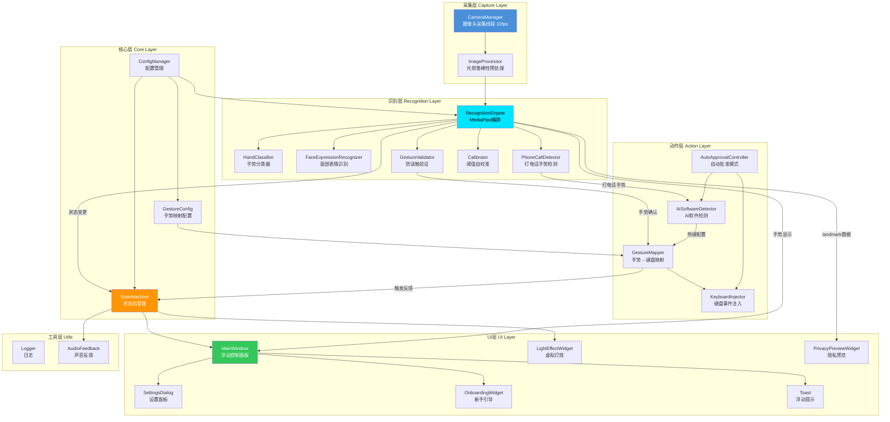
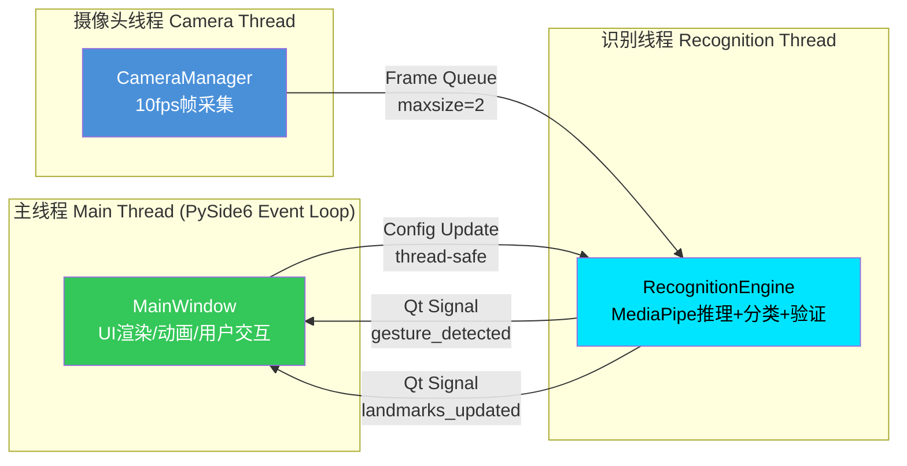
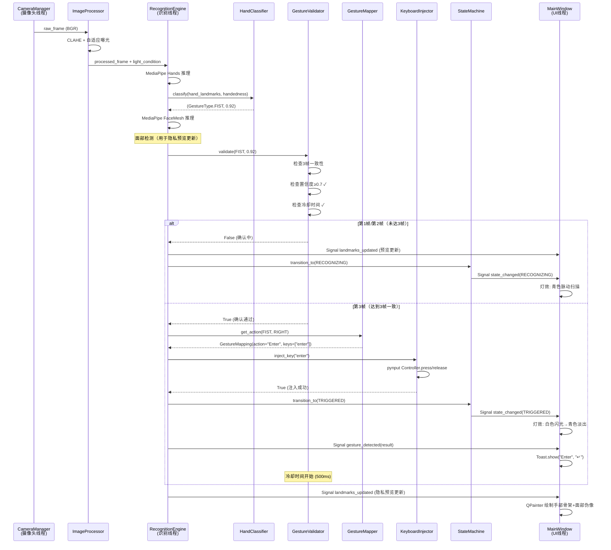
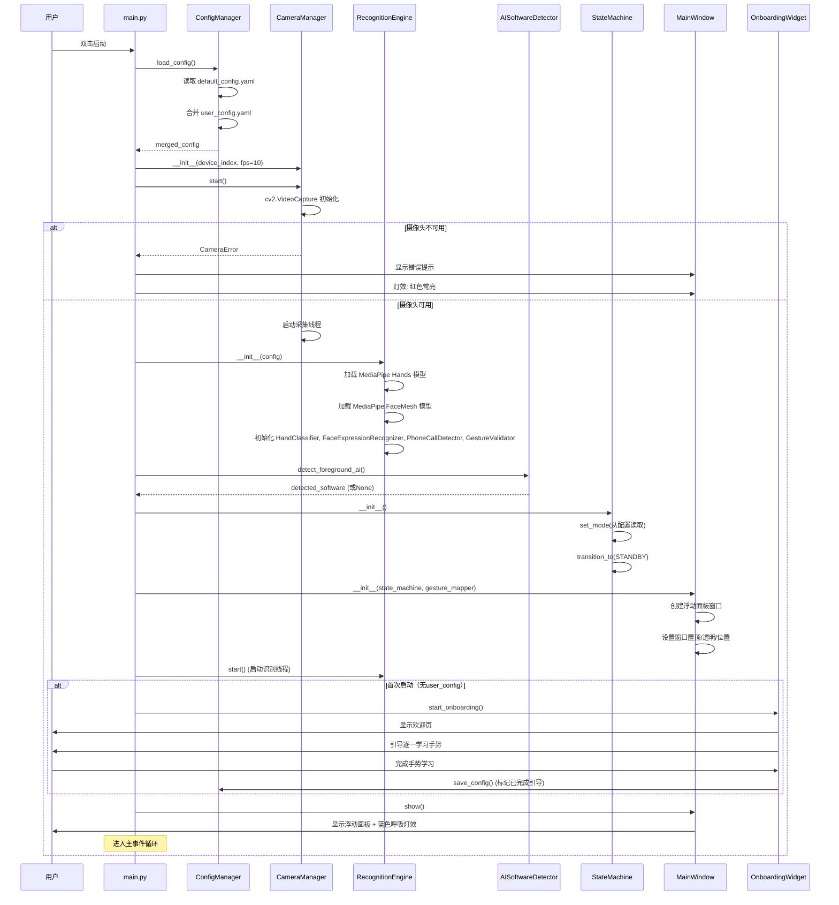
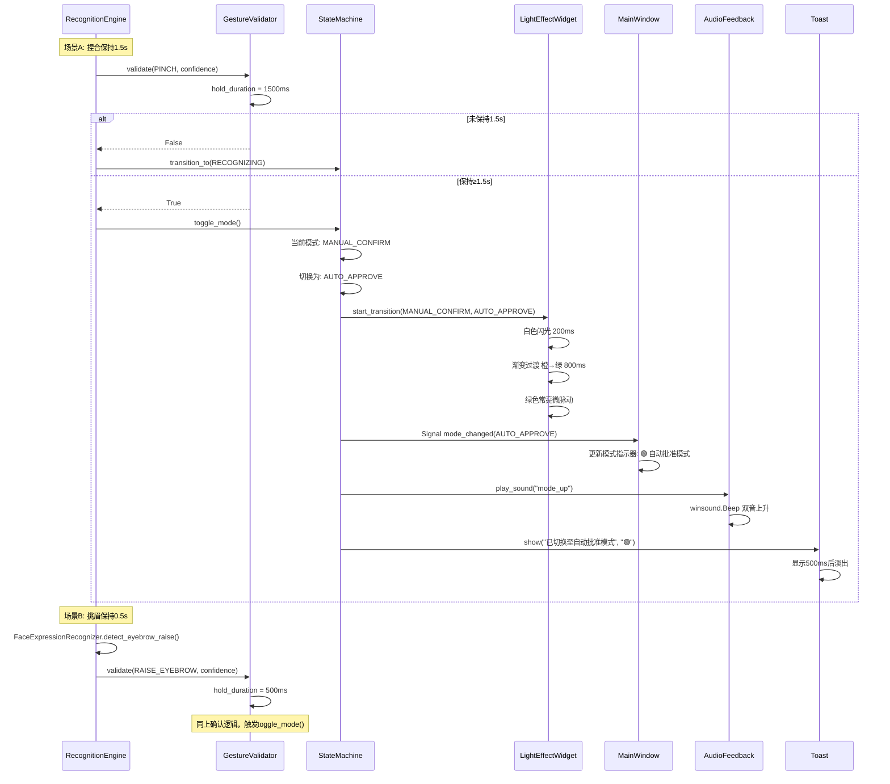
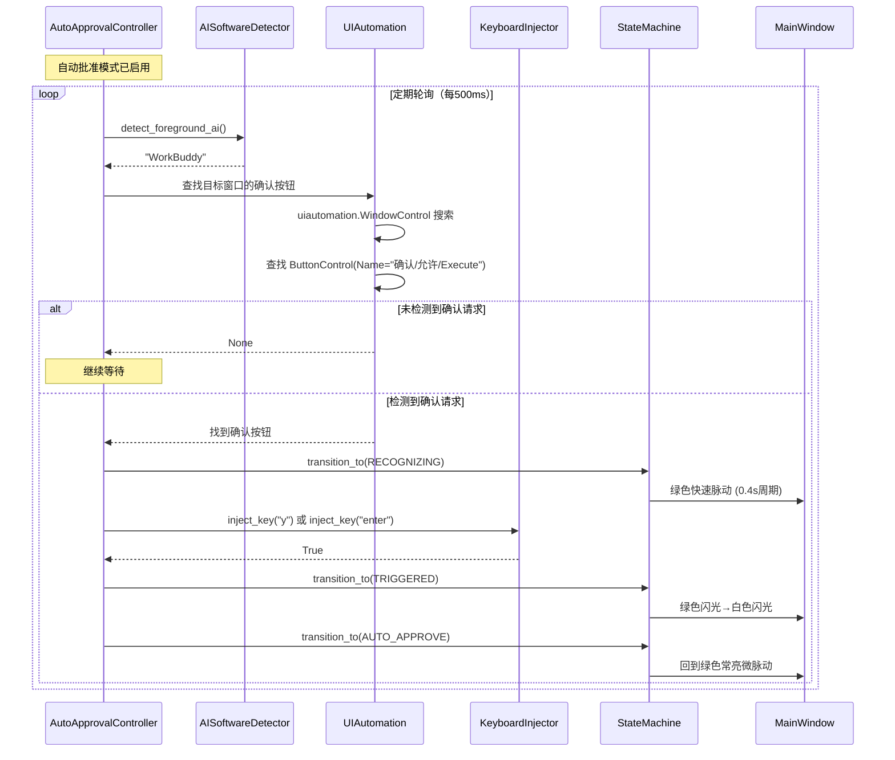
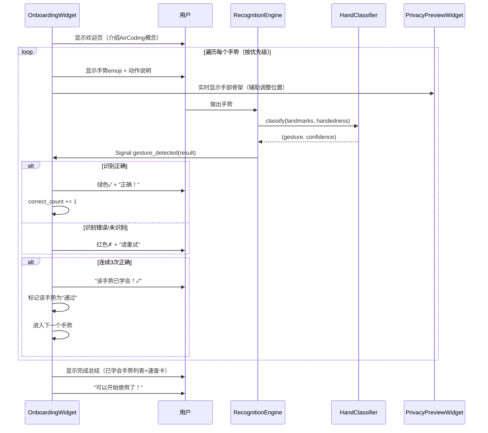
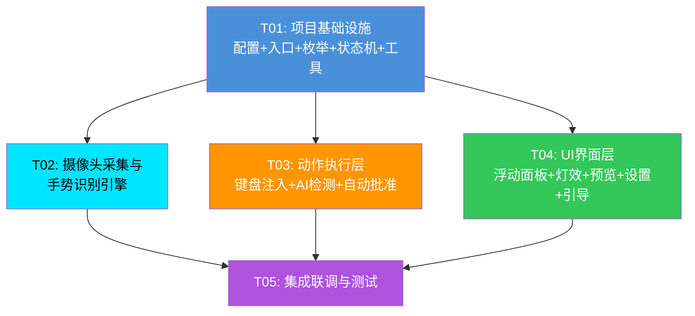

# AirCoding系统架构设计

> **版本**: v1.0 | **日期**: 2025-07-27 | **作者**: 高见远（架构师）
>
> **基于PRD**: v3.1 | **技术栈**: Python + MediaPipe + PySide6 + pynput

---

## 目录

- [1. 实现方案与框架选型](#1-实现方案与框架选型)
- [2. 文件列表及相对路径](#2-文件列表及相对路径)
- [3. 数据结构和接口（类图）](#3-数据结构和接口类图)
- [4. 程序调用流程（时序图）](#4-程序调用流程时序图)
- [5. 任务列表](#5-任务列表)
- [6. 依赖包列表](#6-依赖包列表)
- [7. 共享知识（跨文件约定）](#7-共享知识跨文件约定)
- [8. 待明确事项](#8-待明确事项)

---

## 1. 实现方案与框架选型

### 1.1 核心技术挑战

| 挑战                 | 难点                                        | 解决方案                                                                                          |
| ------------------ | ----------------------------------------- | --------------------------------------------------------------------------------------------- |
| **打电话手势检测**        | 需手脸联合检测：拇指贴耳+小指贴嘴，需同时运行 Hands 和 Face Mesh | MediaPipe Hands + Face Mesh 并行推理，PhoneCallDetector 融合手部 landmark 和面部 landmark 的空间关系判定         |
| **10fps 低帧率下的防误触** | 帧率低意味着确认窗口短（3帧=300ms），需平衡响应速度与误触率         | GestureValidator 实现3帧一致性+保持时间+冷却时间三级防误触；打电话/模式切换用保持时间替代帧数确认                                   |
| **光照鲁棒性**          | 白天/黑夜/背光/逆光场景下 MediaPipe 检测率差异大           | ImageProcessor 在送入 MediaPipe 前做直方图均衡化+自适应曝光补偿+CLAHE，根据光照条件动态调整预处理参数                           |
| **隐私预览**           | 不能显示真实视频，但需实时反馈手部/面部位置                    | PrivacyPreviewWidget 用 QPainter 绘制 schematic avatar（圆点眼睛+线条眉嘴）和手部骨架连线（21点），完全基于 landmark 坐标渲染 |
| **AI软件自动检测**       | 需检测前台窗口所属进程并匹配预设AI软件列表                    | AISoftwareDetector 用 win32gui 获取前台窗口→psutil 获取进程名→匹配注册表，支持"跟随前台窗口"模式                          |
| **自动批准UI监听**       | 需检测AI软件弹出的确认对话框，非定时注入                     | AutoApprovalController 用 uiautomation 库监听目标AI软件窗口的UI元素变化，检测到确认按钮时自动注入                         |
| **端到端延迟≤400ms**    | 3帧确认(300ms)+处理(100ms)的预算极紧                | 摄像头线程与识别线程分离，帧队列长度=2（丢弃旧帧），MediaPipe 处理在独立线程，键盘注入同步执行(μs级)                                    |
| **CPU≤10%单核**      | MediaPipe 推理+UI渲染+摄像头采集需控制总负载             | 10fps低帧率+单手优先模式（仅处理先检测到的手）+ QImage 高效渲染+动画用 QTimer 而非独立线程                                     |

### 1.2 整体架构图



### 1.3 技术栈选型理由

| 技术               | 版本    | 选型理由                                                                          |
| ---------------- | ----- | ----------------------------------------------------------------------------- |
| **Python**       | 3.10+ | MediaPipe 原生支持；PySide6 绑定成熟；快速原型开发；PRD指定                                      |
| **MediaPipe**    | 0.10+ | Google 开源，21点手部landmark + 468点面部landmark；本地推理无需网络；CPU友好；PRD指定                 |
| **PySide6**      | 6.5+  | Qt for Python，LGPL许可（商用友好）；QPainter 高效绘制隐私预览；QTimer 动画系统；窗口置顶/透明/拖拽原生支持；PRD指定 |
| **pynput**       | 1.7+  | 跨平台键盘事件注入，Windows底层封装 SendInput；API简洁；PRD指定                                   |
| **OpenCV**       | 4.8+  | 摄像头采集（cv2.VideoCapture）；图像预处理（直方图均衡化、CLAHE）；与 MediaPipe 无缝集成                  |
| **pywin32**      | 306+  | win32gui 获取前台窗口句柄；Win32 API 交互；比 pygetwindow 更可靠                              |
| **psutil**       | 5.9+  | 进程信息获取，辅助AI软件检测；跨平台进程管理                                                       |
| **uiautomation** | 2.0+  | Windows UIAutomation 封装，用于自动批准模式监听AI软件UI元素；比 pywinauto 更轻量                    |
| **NumPy**        | 1.24+ | landmark 坐标计算（距离、角度）；图像数组操作；MediaPipe 依赖                                      |
| **PyYAML**       | 6.0+  | 配置文件序列化；人类可读；支持复杂嵌套结构                                                         |

### 1.4 线程模型



**线程分工说明：**

| 线程           | 职责                                                                       | 通信方式                  | 频率       |
| ------------ | ------------------------------------------------------------------------ | --------------------- | -------- |
| **主线程 (UI)** | PySide6 事件循环；QPainter 渲染灯效和隐私预览；QTimer 驱动动画；处理用户交互（拖拽/设置/引导）             | Qt Signal/Slot 接收识别结果 | 60fps 动画 |
| **摄像头线程**    | cv2.VideoCapture 按10fps采集帧；放入 `queue.Queue(maxsize=2)`，满则丢弃最旧帧           | 帧队列（线程安全）             | 10fps    |
| **识别线程**     | 从帧队列取帧→ImageProcessor预处理→MediaPipe推理→手势分类→防误触验证→触发动作；通过 Qt Signal 通知UI更新 | 帧队列输入；Qt Signal 输出    | 10fps    |

**关键设计决策：**

- 帧队列 `maxsize=2`：确保识别线程总是处理最新帧，避免积压导致延迟
- 键盘注入在识别线程同步执行：SendInput 调用耗时<1ms，无需独立线程
- UI更新通过 Qt Signal（自动跨线程安全），避免直接操作Widget
- 配置更新通过线程安全的方式（`threading.Lock` 保护 ConfigManager）

### 1.5 数据流设计

```
[摄像头] → raw_frame (BGR, 720p)
    ↓
[ImageProcessor] → processed_frame (预处理后BGR)
    ├── 直方图均衡化 (CLAHE)
    ├── 自适应曝光补偿
    └── 光照条件判定 → 返回光照等级
    ↓
[RecognitionEngine] → RecognitionResult
    ├── MediaPipe Hands → hand_landmarks (21点×3D坐标), handedness, hand_confidence
    ├── MediaPipe FaceMesh → face_landmarks (468点×3D坐标), face_detected
    ├── HandClassifier → (GestureType, confidence)
    ├── FaceExpressionRecognizer → eyebrow_raised (bool), face_position (dict)
    ├── PhoneCallDetector → phone_call_detected (bool), phone_confidence (float)
    └── GestureValidator → confirmed (bool)
    ↓
[分支1: 手势确认] → GestureMapper → action_name → KeyboardInjector → keys_sequence → SendInput
[分支2: 状态更新] → StateMachine → LightState变更 → MainWindow.update_light_effect()
[分支3: 预览更新] → PrivacyPreviewWidget.update_landmarks(hand_lm, face_lm)
[分支4: 提示显示] → Toast.show(message, icon)
```

### 1.6 架构模式

采用 **事件驱动 + 分层架构** 模式：

- **分层**：采集层 → 识别层 → 动作层 → 核心层 → UI层，层间通过接口调用，单向依赖
- **事件驱动**：识别线程通过 Qt Signal 发布事件（手势检测、状态变更），UI层订阅并响应
- **状态机**：StateMachine 作为中央状态管理器，所有状态变更经其统一调度，确保灯效/模式/录音状态的 一致性
- **策略模式**：手势分类、图像预处理、防误触验证均可通过配置切换策略（如单手/双手模式、不同光照预处理）

---

## 2. 文件列表及相对路径

```
aircoding/
├── main.py                              # 应用入口：初始化各模块、启动线程、加载配置
├── requirements.txt                      # Python依赖包列表及版本约束
│
├── models/                               # MediaPipe模型文件（预打包，支持离线安装）
│   ├── hand_landmarker.task              # MediaPipe Hands模型
│   └── face_landmarker.task              # MediaPipe Face Mesh模型
│
├── config/
│   ├── default_config.yaml               # 默认配置（手势映射、阈值、灯效参数、AI软件注册表）
│   └── user_config.yaml                  # 用户配置（运行时持久化到%APPDATA%/AirCoding/，覆盖默认值）
│
├── src/
│   ├── __init__.py
│   │
│   ├── core/                             # 核心层：枚举、配置、状态机
│   │   ├── __init__.py
│   │   ├── enums.py                      # 枚举定义：GestureType, LightState, SystemMode, HandSide, LightCondition
│   │   ├── config_manager.py             # 配置管理：加载/合并/保存/持久化；线程安全访问
│   │   ├── gesture_config.py             # 手势-动作-键盘映射配置数据结构及默认映射表
│   │   └── state_machine.py              # 状态机：7种灯效状态流转、模式管理、状态回调注册
│   │
│   ├── camera/                           # 采集层：摄像头与图像预处理
│   │   ├── __init__.py
│   │   ├── camera_manager.py             # 摄像头采集线程：cv2.VideoCapture封装、10fps节流、帧队列
│   │   └── image_processor.py            # 图像预处理：CLAHE直方图均衡化、自适应曝光补偿、光照等级检测
│   │
│   ├── recognition/                      # 识别层：MediaPipe编排与手势分析
│   │   ├── __init__.py
│   │   ├── recognition_engine.py         # MediaPipe编排器：Hands+FaceMesh并行推理、结果聚合、Qt Signal发射
│   │   ├── hand_classifier.py            # 手势分类器：21点landmark解析，6种手势判定（握拳/张开/竖拇指/拇指朝下/剪刀/捏合）
│   │   ├── face_expression.py            # 面部表情识别：挑眉检测（基准+自适应）、面部关键点定位（耳/嘴/鼻）
│   │   ├── phone_call_detector.py        # 打电话手势检测：手形判定+手脸相对位置判定（拇指贴耳+小指贴嘴）
│   │   ├── gesture_validator.py          # 防误触验证：3帧一致性确认、保持时间确认、冷却时间、置信度阈值
│   │   └── calibrator.py                 # 阈值自校准：采集用户基准数据、计算均值±2σ、生成专属配置
│   │
│   ├── action/                           # 动作层：键盘注入与AI软件交互
│   │   ├── __init__.py
│   │   ├── keyboard_injector.py          # 键盘事件注入：pynput封装、组合键注入、SendInput底层备份
│   │   ├── gesture_mapper.py             # 手势→键盘映射：查映射表、左右手分流、自定义快捷键支持
│   │   ├── ai_software_detector.py       # AI软件检测：前台窗口扫描、进程名匹配、热键配置管理、目标切换
│   │   └── auto_approval.py              # 自动批准模式：uiautomation监听AI软件UI元素、检测确认请求、自动注入
│   │
│   ├── ui/                               # UI层：PySide6界面组件
│   │   ├── __init__.py
│   │   ├── main_window.py                # 浮动控制面板：窗口置顶/透明/拖拽、组件编排、信号路由
│   │   ├── light_effect_widget.py        # 虚拟灯效组件：7种状态动画（呼吸/脉动/闪光/闪烁/波形/常亮）、QPainter渲染
│   │   ├── privacy_preview.py            # 隐私预览组件：人脸五官伪像绘制、手部21点骨架连线、手势emoji标注
│   │   ├── settings_dialog.py            # 设置面板：灵敏度/延迟/灯效/位置/透明度/AI热键/校准入口
│   │   ├── onboarding.py                 # 新手引导：欢迎页→逐一学习手势→完成总结，实时反馈
│   │   └── toast.py                      # 浮动提示：操作确认/错误/模式切换提示，500ms淡出动画
│   │
│   └── utils/                            # 工具层
│       ├── __init__.py
│       ├── logger.py                     # 日志工具：分级日志、文件轮转、控制台输出
│       └── audio.py                      # 声音反馈：模式切换音效、错误蜂鸣、触发提示音
│
└── tests/                                # 测试
    ├── __init__.py
    ├── test_hand_classifier.py           # 手势分类器单元测试（各手势landmark mock数据验证）
    ├── test_gesture_validator.py         # 防误触验证单元测试（3帧确认/保持时间/冷却逻辑）
    └── test_state_machine.py             # 状态机单元测试（状态流转/模式切换/回调触发）
```

**各文件职责说明：**

| 文件                        | 核心职责                                                                                                                     | 依赖模块                            |
| ------------------------- | ------------------------------------------------------------------------------------------------------------------------ | ------------------------------- |
| `main.py`                 | 应用入口；创建 QApplication；初始化 ConfigManager → CameraManager → RecognitionEngine → StateMachine → MainWindow；启动摄像头和识别线程；处理退出清理 | 所有模块                            |
| `enums.py`                | 定义全部枚举类型，供跨模块共享                                                                                                          | 无                               |
| `config_manager.py`       | 加载 default_config.yaml 并与 user_config.yaml 合并；提供线程安全的 get/set 接口；自动持久化用户配置                                               | PyYAML                          |
| `gesture_config.py`       | 定义手势→动作→键盘按键的映射数据结构；内置11种手势的默认映射表                                                                                        | enums                           |
| `state_machine.py`        | 管理 LightState（7种）和 SystemMode（2种）的状态流转；注册状态变更回调；确保灯效与模式一致性                                                               | enums                           |
| `camera_manager.py`       | 独立线程运行 cv2.VideoCapture；10fps 节流；帧队列（maxsize=2）；摄像头异常检测与自动恢复                                                             | OpenCV                          |
| `image_processor.py`      | CLAHE 直方图均衡化；自适应曝光补偿（Gamma校正）；光照等级检测（LOW/NORMAL/HIGH/BACKLIT）；根据光照等级动态调整预处理参数                                            | OpenCV, NumPy                   |
| `recognition_engine.py`   | 编排 MediaPipe Hands + FaceMesh；调用 HandClassifier/FaceExpression/PhoneCallDetector；通过 GestureValidator 确认后发射 Qt Signal     | MediaPipe, 全部 recognition 子模块   |
| `hand_classifier.py`      | 基于21点 landmark 计算指尖-掌心距离、拇指方向向量、手指夹角；分类6种基础手势；返回 (GestureType, confidence)                                               | NumPy                           |
| `face_expression.py`      | 采集挑眉基准（双眉4个 landmark 纵坐标均值）；实时检测双眉上移量；每5分钟自动更新基准；提供耳部/嘴部/鼻尖 landmark 坐标供 PhoneCallDetector 使用                            | NumPy                           |
| `phone_call_detector.py`  | 融合手部+面部 landmark：手形判定（拇指小指伸直、其余弯曲）+ 手脸位置判定（拇指尖near耳、小指尖near嘴、手掌中心near面部中心）；左右手兼容                                         | NumPy                           |
| `gesture_validator.py`    | 维护帧历史滑动窗口（3帧）；按手势类型应用不同确认策略（3帧一致/0.5s保持/1.5s保持）；冷却时间500ms；置信度≥0.7门控                                                      | enums                           |
| `calibrator.py`           | 引导用户逐一做出手势（各3秒）；采集多帧 landmark 数据；计算各距离/角度的均值±2σ；生成用户专属阈值配置                                                               | NumPy                           |
| `keyboard_injector.py`    | pynput Keyboard.Controller 封装；单键注入、组合键注入（依次按下再释放）；返回注入成功/失败状态                                                            | pynput                          |
| `gesture_mapper.py`       | 查询 GestureConfig 获取手势对应的键盘动作；左右手分流（右手→主操作，左手→辅助操作）；支持自定义快捷键覆盖                                                            | gesture_config, enums           |
| `ai_software_detector.py` | win32gui 获取前台窗口标题/进程；psutil 获取进程名；匹配预设注册表（WorkBuddy/豆包/自定义）；提供各软件语音输入热键配置                                                | pywin32, psutil                 |
| `auto_approval.py`        | uiautomation 监听目标AI软件窗口的UI元素变化；检测确认对话框/按钮出现；自动触发 KeyboardInjector 注入确认键                                                  | uiautomation, keyboard_injector |
| `main_window.py`          | 无边框置顶透明窗口；布局灯效环+手势显示+模式指示+功能按钮+隐私预览；接收 RecognitionEngine 的 Qt Signal 并路由到各子组件                                            | PySide6, 全部 ui 子组件              |
| `light_effect_widget.py`  | QPainter 自定义绘制；7种状态对应动画（呼吸/脉动/闪光/闪烁/波形/常亮微脉动）；QTimer 驱动动画帧；模式切换渐变过渡                                                      | PySide6                         |
| `privacy_preview.py`      | QPainter 绘制 schematic avatar（圆点眼睛+弧线眉毛+线条嘴巴）和手部骨架（21点连线+关节点）；位置随 landmark 实时更新；手势 emoji 标注                               | PySide6                         |
| `settings_dialog.py`      | 灵敏度滑块、确认帧数/保持时间配置、灯效开关、面板位置/透明度、AI软件热键配置、校准入口、左右手镜像、隐私声明                                                                 | PySide6                         |
| `onboarding.py`           | 欢迎页→逐一学习（显示emoji+说明+实时骨架反馈+通过判定）→完成总结；首次启动自动触发；可从设置重新进入                                                                  | PySide6, recognition_engine     |
| `toast.py`                | 居中偏下方浮动卡片；QPropertyAnimation 淡出；500ms显示后渐隐；支持图标+文字                                                                       | PySide6                         |
| `logger.py`               | logging 模块封装；DEBUG/INFO/WARNING/ERROR 分级；文件轮转（10MB×5）；控制台彩色输出                                                            | logging                         |
| `audio.py`                | winsound.Beep 封装；预定义音效（模式切换上升/下降双音、错误蜂鸣、触发提示音）；可配置开关                                                                     | winsound                        |

---

## 3. 数据结构和接口（类图）

### 3.1 枚举类型定义

```python
# src/core/enums.py

class GestureType(Enum):
    """手势/表情类型枚举"""
    NONE = "none"                    # 未检测到
    PHONE_CALL = "phone_call"        # 🤙 打电话（语音输入激活）
    THUMBS_UP = "thumbs_up"          # 👍 竖拇指（确认）
    THUMBS_DOWN = "thumbs_down"      # 👎 拇指朝下（拒绝）
    PINCH = "pinch"                  # 🤏 捏合（模式切换）
    FIST = "fist"                    # ✊ 握拳（Enter / 左手Ctrl+C）
    OPEN_PALM = "open_palm"          # ✋ 张开（Escape / 左手Ctrl+V）
    SCISSOR = "scissor"              # ✌️ 剪刀手（Ctrl+Z / 左手自定义）
    RAISE_EYEBROW = "raise_eyebrow"  # 🤨 挑眉（模式切换）

class LightState(Enum):
    """灯效状态枚举（7种核心状态）"""
    STANDBY = "standby"              # 待机：柔和蓝呼吸灯
    RECOGNIZING = "recognizing"      # 识别中：青色脉动扫描
    RECORDING = "recording"          # 录音中：紫红色波形脉动
    TRIGGERED = "triggered"          # 已触发：白色闪光→动作色
    ERROR = "error"                  # 错误：红色快速闪烁
    AUTO_APPROVE = "auto_approve"    # 自动批准待机：绿色常亮微脉动
    MANUAL_CONFIRM = "manual_confirm"# 手动确认待机：橙色常亮微脉动

class SystemMode(Enum):
    """系统模式枚举"""
    AUTO_APPROVE = "auto_approve"    # 自动批准模式
    MANUAL_CONFIRM = "manual_confirm"# 手动确认模式

class HandSide(Enum):
    """手部侧别枚举"""
    LEFT = "left"
    RIGHT = "right"

class LightCondition(Enum):
    """光照条件枚举"""
    LOW = "low"            # 低光照（<100 lux）
    NORMAL = "normal"      # 正常光照（100-1000 lux）
    HIGH = "high"          # 强光照（>1000 lux）
    BACKLIT = "backlit"    # 逆光
```

### 3.2 核心数据结构

```python
# 识别结果数据结构（RecognitionEngine 输出）
@dataclass
class RecognitionResult:
    gesture: GestureType            # 识别到的手势类型
    hand_side: HandSide              # 手部侧别（左/右）
    confidence: float                # 置信度 0.0~1.0
    hand_landmarks: Optional[list]   # 21点手部landmark坐标（未检测到为None）
    face_landmarks: Optional[list]   # 468点面部landmark坐标（未检测到为None）
    hand_detected: bool              # 是否检测到手
    face_detected: bool              # 是否检测到面部
    phone_call_detected: bool        # 打电话手势是否检测到（手脸联合）
    eyebrow_raised: bool             # 挑眉是否检测到
    light_condition: LightCondition  # 当前光照条件
    timestamp: float                 # 帧时间戳

# 手势映射配置项
@dataclass
class GestureMapping:
    gesture: GestureType             # 手势类型
    hand_side: HandSide              # 适用手侧
    action_name: str                 # 动作名称（如"语音输入激活"）
    key_sequence: list[str]          # 键盘按键序列（如["ctrl","z"]）
    emoji: str                       # 对应emoji
    confirm_frames: int              # 确认帧数（默认3）
    hold_duration_ms: int            # 保持时间（毫秒，0表示不需要保持）
    cooldown_ms: int                 # 冷却时间（毫秒，默认500）
    confidence_threshold: float      # 置信度阈值（默认0.7）
    action_color: str                # 动作触发色（十六进制色值）

# 灯效配置项
@dataclass
class LightEffectConfig:
    state: LightState                # 灯效状态
    color: str                       # 主色值（十六进制）
    animation: str                   # 动画类型（breathe/pulse/flash/flicker/wave/steady）
    duration_ms: int                 # 持续时间（0=持续直到状态变更）
    period_ms: int                   # 动画周期（毫秒）
```

### 3.3 类图（Mermaid）

```mermaid
classDiagram
    class GestureType {
        <<enumeration>>
        NONE
        PHONE_CALL
        THUMBS_UP
        THUMBS_DOWN
        PINCH
        FIST
        OPEN_PALM
        SCISSOR
        RAISE_EYEBROW
    }

    class LightState {
        <<enumeration>>
        STANDBY
        RECOGNIZING
        RECORDING
        TRIGGERED
        ERROR
        AUTO_APPROVE
        MANUAL_CONFIRM
    }

    class SystemMode {
        <<enumeration>>
        AUTO_APPROVE
        MANUAL_CONFIRM
    }

    class HandSide {
        <<enumeration>>
        LEFT
        RIGHT
    }

    class RecognitionResult {
        +GestureType gesture
        +HandSide hand_side
        +float confidence
        +Optional~list~ hand_landmarks
        +Optional~list~ face_landmarks
        +bool hand_detected
        +bool face_detected
        +bool phone_call_detected
        +bool eyebrow_raised
        +LightCondition light_condition
        +float timestamp
    }

    class GestureMapping {
        +GestureType gesture
        +HandSide hand_side
        +str action_name
        +list~str~ key_sequence
        +str emoji
        +int confirm_frames
        +int hold_duration_ms
        +int cooldown_ms
        +float confidence_threshold
        +str action_color
    }

    class ConfigManager {
        -dict _default_config
        -dict _user_config
        -str _config_path
        -Lock _lock
        +load_config() dict
        +save_config() void
        +get(key: str, default: Any) Any
        +set(key: str, value: Any) void
        +reset_to_default() void
        +get_thresholds() dict
        +get_light_effects() dict
        +get_ai_software_registry() dict
    }

    class StateMachine {
        -LightState _light_state
        -SystemMode _mode
        -bool _is_recording
        -dict _callbacks
        +transition_to(state: LightState) void
        +set_mode(mode: SystemMode) void
        +toggle_mode() void
        +start_recording() void
        +stop_recording() void
        +register_callback(state: LightState, callback: Callable) void
        +get_light_state() LightState
        +get_mode() SystemMode
        +is_recording() bool
    }

    class CameraManager {
        -int _device_index
        -int _fps
        -Queue _frame_queue
        -bool _running
        -Thread _thread
        -float _frame_interval
        +start() void
        +stop() void
        +get_frame() Optional~np.ndarray~
        -_capture_loop() void
        -_handle_camera_error() void
        +is_available() bool
    }

    class ImageProcessor {
        +preprocess(frame: np.ndarray) tuple~np.ndarray, LightCondition~
        -_apply_clahe(frame: np.ndarray) np.ndarray
        -_adaptive_exposure(frame: np.ndarray, condition: LightCondition) np.ndarray
        -_detect_light_condition(frame: np.ndarray) LightCondition
    }

    class RecognitionEngine {
        -Hands _hands_model
        -FaceMesh _face_model
        -HandClassifier _hand_classifier
        -FaceExpressionRecognizer _face_recognizer
        -PhoneCallDetector _phone_call_detector
        -GestureValidator _validator
        -ImageProcessor _image_processor
        -Signal gesture_detected
        -Signal landmarks_updated
        -Signal state_change_requested
        +process_frame(frame: np.ndarray) RecognitionResult
        -_process_hands(frame: np.ndarray) tuple
        -_process_face(frame: np.ndarray) tuple
        +update_config(config: dict) void
    }

    class HandClassifier {
        -dict _thresholds
        +classify(landmarks: list, handedness: str) tuple~GestureType, float~
        -_is_fist(landmarks: list) bool
        -_is_open_palm(landmarks: list) bool
        -_is_thumbs_up(landmarks: list) bool
        -_is_thumbs_down(landmarks: list) bool
        -_is_scissor(landmarks: list) bool
        -_is_pinch(landmarks: list) bool
        -_finger_extended(landmarks: list, tip_idx: int, mcp_idx: int) bool
        -_finger_distance(landmarks: list, idx_a: int, idx_b: int) float
        +update_thresholds(thresholds: dict) void
    }

    class FaceExpressionRecognizer {
        -dict _baseline
        -float _eyebrow_threshold
        -float _last_baseline_update
        +initialize_baseline(landmarks: list) void
        +detect_eyebrow_raise(landmarks: list) tuple~bool, float~
        +get_ear_landmarks(landmarks: list) dict
        +get_mouth_landmarks(landmarks: list) dict
        +get_nose_tip(landmarks: list) tuple
        -_auto_update_baseline(landmarks: list) void
    }

    class PhoneCallDetector {
        -float _hand_face_distance_threshold
        -float _palm_face_distance_range
        +detect(hand_landmarks: list, face_landmarks: list, handedness: str) tuple~bool, float~
        -_check_hand_shape(hand_landmarks: list) bool
        -_check_thumb_near_ear(hand_landmarks: list, face_landmarks: list, handedness: str) bool
        -_check_pinky_near_mouth(hand_landmarks: list, face_landmarks: list) bool
        -_check_palm_near_face(hand_landmarks: list, face_landmarks: list) bool
    }

    class GestureValidator {
        -int _confirm_frames
        -dict _hold_durations
        -int _cooldown_ms
        -deque _frame_history
        -dict _hold_start_time
        -float _last_trigger_time
        +validate(gesture: GestureType, confidence: float) bool
        -_check_frame_consistency(gesture: GestureType) bool
        -_check_hold_duration(gesture: GestureType) bool
        -_check_cooldown() bool
        -_check_confidence(confidence: float) bool
        +reset() void
        +update_config(config: dict) void
    }

    class Calibrator {
        -dict _collected_data
        -int _samples_needed
        -GestureType _current_gesture
        +start_calibration(gesture: GestureType) void
        +collect_sample(landmarks: list) void
        +compute_thresholds() dict
        +save_profile(name: str) void
        +load_profile(name: str) dict
        +is_complete() bool
        +get_progress() float
    }

    class KeyboardInjector {
        +inject_key(key: str) bool
        +inject_hotkey(*keys: str) bool
        +inject_text(text: str) bool
        -_key_down(key: str) void
        -_key_up(key: str) void
        +get_key_code(key: str) int
    }

    class GestureMapper {
        -dict _gesture_map
        +get_action(gesture: GestureType, hand_side: HandSide) Optional~GestureMapping~
        +get_key_sequence(gesture: GestureType, hand_side: HandSide) list~str~
        +get_emoji(gesture: GestureType) str
        +get_action_color(gesture: GestureType) str
        +update_mapping(gesture: GestureType, hand_side: HandSide, keys: list) void
        +get_all_mappings() dict
    }

    class AISoftwareDetector {
        -dict _software_registry
        -str _current_target
        -bool _follow_foreground
        +detect_foreground_ai() Optional~str~
        +get_hotkey(software_name: str) list~str~
        +set_target(software_name: str) void
        +get_available_software() list~dict~
        +add_custom_software(name: str, process_names: list, hotkey: list) void
        -_scan_foreground_process() str
        -_match_software(process_name: str) Optional~str~
    }

    class AutoApprovalController {
        -bool _enabled
        -AISoftwareDetector _detector
        -KeyboardInjector _injector
        -str _target_window
        +enable() void
        +disable() void
        +check_for_ai_request() bool
        +trigger_auto_approval() void
        -_monitor_ui_elements() bool
        +is_enabled() bool
    }

    class MainWindow {
        -LightEffectWidget _light_widget
        -PrivacyPreviewWidget _preview_widget
        -StateMachine _state_machine
        -GestureMapper _gesture_mapper
        +update_gesture_display(gesture: GestureType, confidence: float) void
        +update_light_effect(state: LightState) void
        +update_mode_indicator(mode: SystemMode) void
        +show_toast(message: str, icon: str) void
        +update_recording_status(is_recording: bool) void
        -_on_gesture_detected(result: RecognitionResult) void
        -_on_state_changed(state: LightState) void
    }

    class LightEffectWidget {
        -LightState _current_state
        -str _action_color
        -QTimer _animation_timer
        -float _animation_phase
        +set_state(state: LightState) void
        +set_action_color(color: str) void
        +start_transition(from_state: LightState, to_state: LightState) void
        -_paintEvent(event: QPaintEvent) void
        -_update_animation() void
    }

    class PrivacyPreviewWidget {
        -QPixmap _canvas
        -Optional~list~ _hand_landmarks
        -Optional~list~ _face_landmarks
        -GestureType _current_gesture
        +update_hand_landmarks(landmarks: list, gesture: GestureType) void
        +update_face_landmarks(landmarks: list) void
        +clear() void
        -_paintEvent(event: QPaintEvent) void
        -_draw_hand_skeleton(painter: QPainter, landmarks: list) void
        -_draw_face_avatar(painter: QPainter, landmarks: list) void
        -_draw_gesture_label(painter: QPainter, gesture: GestureType) void
    }

    %% 关系
    StateMachine --> LightState
    StateMachine --> SystemMode
    RecognitionEngine --> HandClassifier
    RecognitionEngine --> FaceExpressionRecognizer
    RecognitionEngine --> PhoneCallDetector
    RecognitionEngine --> GestureValidator
    RecognitionEngine --> ImageProcessor
    PhoneCallDetector --> FaceExpressionRecognizer : 获取耳/嘴/鼻坐标
    GestureValidator --> GestureType
    HandClassifier --> GestureType
    FaceExpressionRecognizer --> GestureType
    GestureMapper --> GestureType
    GestureMapper --> HandSide
    GestureMapper --> KeyboardInjector
    AISoftwareDetector --> KeyboardInjector
    AutoApprovalController --> AISoftwareDetector
    AutoApprovalController --> KeyboardInjector
    MainWindow --> LightEffectWidget
    MainWindow --> PrivacyPreviewWidget
    MainWindow --> StateMachine
    MainWindow --> GestureMapper
    CameraManager --> ImageProcessor
    RecognitionEngine ..> RecognitionResult : 产生
```



### 3.4 关键类关系说明

| 关系                                                                                                           | 说明                                                             |
| ------------------------------------------------------------------------------------------------------------ | -------------------------------------------------------------- |
| `RecognitionEngine` 聚合 `HandClassifier`, `FaceExpressionRecognizer`, `PhoneCallDetector`, `GestureValidator` | 识别引擎编排各子识别器，每帧调用它们完成完整识别流程                                     |
| `PhoneCallDetector` 依赖 `FaceExpressionRecognizer`                                                            | 打电话手势需面部关键点（耳/嘴/鼻），复用 FaceExpressionRecognizer 的 landmark 提取方法 |
| `GestureMapper` 依赖 `KeyboardInjector`                                                                        | 映射器查到键盘序列后，调用注入器执行实际按键                                         |
| `AutoApprovalController` 依赖 `AISoftwareDetector` 和 `KeyboardInjector`                                        | 自动批准需先检测AI软件窗口，再注入确认键                                          |
| `MainWindow` 聚合 `LightEffectWidget`, `PrivacyPreviewWidget`, `StateMachine`, `GestureMapper`                 | 主窗口编排UI子组件，订阅状态机变更和识别结果                                        |
| `StateMachine` 被识别引擎和动作层共同驱动                                                                                 | 识别引擎触发状态变更（如识别中→已触发），动作层触发模式切换                                 |

---

## 4. 程序调用流程（时序图）

### 4.1 手势识别→键盘注入流程（通用快捷操作）



### 4.2 语音输入激活流程（打电话手势 — 产品核心流程）

```mermaid
sequenceDiagram
    participant CM as CameraManager
    participant RE as RecognitionEngine
    participant PCD as PhoneCallDetector
    participant FE as FaceExpressionRecognizer
    participant GV as GestureValidator
    participant AID as AISoftwareDetector
    participant KI as KeyboardInjector
    participant SM as StateMachine
    participant MW as MainWindow

    CM->>RE: processed_frame

    RE->>RE: MediaPipe Hands + FaceMesh 并行推理
    RE->>FE: 获取耳/嘴/鼻 landmark坐标
    FE-->>RE: {ear_left, ear_right, mouth, nose}

    RE->>PCD: detect(hand_landmarks, face_landmarks, "Right")
    PCD->>PCD: 手形判定: 拇指(4)+小指(20)伸直, 其余弯曲 ✓
    PCD->>>PCD: 拇指尖(4)与右耳(454)距离 < 0.10 ✓
    PCD->>PCD: 小指尖(20)与嘴部(13)距离 < 0.10 ✓
    PCD->>PCD: 手掌中心(0)与鼻尖(1)距离 0.15~0.40 ✓
    PCD-->>RE: (True, 0.88)

    RE->>GV: validate(PHONE_CALL, 0.88)

    alt 未保持0.5s
        GV->>GV: 记录hold_start_time
        GV-->>RE: False (保持中)
        RE->>SM: transition_to(RECOGNIZING)
        SM->>MW: 灯效: 青色脉动扫描
    else 保持≥0.5s
        GV-->>RE: True (确认通过)

        RE->>AID: detect_foreground_ai()
        AID->>AID: win32gui 获取前台窗口
        AID->>AID: psutil 获取进程名
        AID->>AID: 匹配注册表
        AID-->>RE: "WorkBuddy"

        RE->>AID: get_hotkey("WorkBuddy")
        AID-->>RE: ["ctrl", "alt", "w"]

        RE->>KI: inject_hotkey("ctrl", "alt", "w")
        KI->>KI: 依次按下 Ctrl→Alt→W→释放W→Alt→Ctrl
        KI-->>RE: True (注入成功)

        RE->>SM: start_recording()
        SM->>SM: _is_recording = True
        SM->>SM: transition_to(RECORDING)
        SM->>MW: Signal state_changed(RECORDING)
        MW->>MW: 灯效: 紫红色波形脉动
        MW->>MW: 显示 "🎙️ 语音输入已激活 [WorkBuddy]"

        Note over RE,SM: 等待用户放下手或再次做出手势
        RE->>SM: stop_recording()
        SM->>SM: _is_recording = False
        SM->>MW: 恢复待机灯效
        MW->>MW: 显示 "语音输入已停止"
    end
```

### 4.3 应用启动流程



### 4.4 模式切换流程



### 4.5 自动批准模式流程



### 4.6 新手引导流程



---

## 5. 任务列表

### 5.1 任务概览

| 任务ID | 任务名称         | 文件数 | 依赖                 | 优先级 |
| ---- | ------------ | --- | ------------------ | --- |
| T01  | 项目基础设施       | 18  | 无                  | P0  |
| T02  | 摄像头采集与手势识别引擎 | 8   | T01                | P0  |
| T03  | 动作执行层        | 4   | T01                | P0  |
| T04  | UI界面层        | 6   | T01                | P0  |
| T05  | 集成联调与测试      | 4   | T01, T02, T03, T04 | P0  |

### 5.2 任务依赖图



### 5.3 任务详细分解

#### T01: 项目基础设施

| 项目       | 内容                                     |
| -------- | -------------------------------------- |
| **任务ID** | T01                                    |
| **任务名称** | 项目基础设施（配置文件 + 入口文件 + 依赖声明 + 核心层 + 工具层） |
| **优先级**  | P0                                     |
| **依赖**   | 无                                      |

**源文件列表：**

| 文件                            | 职责                                                                    |
| ----------------------------- | --------------------------------------------------------------------- |
| `requirements.txt`            | Python 依赖包及版本约束                                                       |
| `main.py`                     | 应用入口：创建 QApplication，初始化各模块，启动线程，事件循环                                 |
| `config/default_config.yaml`  | 默认配置：手势映射表、识别阈值、灯效参数、AI软件注册表                                          |
| `config/user_config.yaml`     | 用户配置（首次启动从默认创建，运行时持久化）                                                |
| `src/__init__.py`             | 包初始化                                                                  |
| `src/core/__init__.py`        | 核心层包初始化                                                               |
| `src/core/enums.py`           | 全部枚举定义（GestureType, LightState, SystemMode, HandSide, LightCondition） |
| `src/core/config_manager.py`  | 配置管理：加载/合并/保存/持久化；线程安全 get/set                                        |
| `src/core/gesture_config.py`  | 手势-动作-键盘映射数据结构 + 11种手势默认映射表 + GestureMapping dataclass                |
| `src/core/state_machine.py`   | 状态机：7种灯效状态流转、模式管理、录音状态、回调注册                                           |
| `src/camera/__init__.py`      | 采集层包初始化                                                               |
| `src/recognition/__init__.py` | 识别层包初始化                                                               |
| `src/action/__init__.py`      | 动作层包初始化                                                               |
| `src/ui/__init__.py`          | UI层包初始化                                                               |
| `src/utils/__init__.py`       | 工具层包初始化                                                               |
| `src/utils/logger.py`         | 日志工具：分级日志、文件轮转、控制台输出                                                  |
| `src/utils/audio.py`          | 声音反馈：winsound 封装，预定义音效                                                |
| `tests/__init__.py`           | 测试包初始化                                                                |

**实现要点：**

- `default_config.yaml` 必须包含完整的11种手势映射、6个可调阈值参数、7种灯效配置、AI软件注册表（WorkBuddy/豆包）
- `state_machine.py` 需定义清晰的状态流转规则：STANDBY↔RECOGNIZING→TRIGGERED→STANDBY，STANDBY↔AUTO_APPROVE/MANUAL_CONFIRM
- `config_manager.py` 使用 `threading.Lock` 保证线程安全，配置变更时通知相关模块
- `main.py` 需处理异常退出清理（停止线程、释放摄像头、保存配置）

---

#### T02: 摄像头采集与手势识别引擎

| 项目       | 内容                                    |
| -------- | ------------------------------------- |
| **任务ID** | T02                                   |
| **任务名称** | 摄像头采集与手势识别引擎（采集层 + 识别层全部文件）           |
| **优先级**  | P0                                    |
| **依赖**   | T01（需要 enums, config_manager, logger） |

**源文件列表：**

| 文件                                       | 职责                                                                              |
| ---------------------------------------- | ------------------------------------------------------------------------------- |
| `src/camera/camera_manager.py`           | 摄像头采集线程：cv2.VideoCapture 封装、10fps 节流、帧队列(maxsize=2)、异常检测与自动恢复                   |
| `src/camera/image_processor.py`          | 图像预处理：CLAHE 直方图均衡化、自适应曝光补偿(Gamma)、光照等级检测(LOW/NORMAL/HIGH/BACKLIT)               |
| `src/recognition/recognition_engine.py`  | MediaPipe 编排器：Hands+FaceMesh 并行推理、结果聚合为 RecognitionResult、Qt Signal 发射、配置热更新    |
| `src/recognition/hand_classifier.py`     | 手势分类器：21点 landmark 解析，6种手势判定（握拳/张开/竖拇指/拇指朝下/剪刀/捏合），返回 (GestureType, confidence) |
| `src/recognition/face_expression.py`     | 面部表情识别：挑眉基准采集+自适应更新(5分钟)、双眉上移检测、耳/嘴/鼻 landmark 提取                               |
| `src/recognition/phone_call_detector.py` | 打电话手势检测：手形判定(拇指小指伸直) + 手脸位置判定(拇指贴耳+小指贴嘴+手掌近脸)，左右手兼容                             |
| `src/recognition/gesture_validator.py`   | 防误触验证：3帧一致性(deque)、保持时间确认(0.5s/1.5s)、500ms冷却、0.7置信度门控                           |
| `src/recognition/calibrator.py`          | 阈值自校准：采集多帧 landmark 数据、计算均值±2σ、生成用户专属阈值配置                                       |

**实现要点：**

- `recognition_engine.py` 继承 `QObject`，定义 `gesture_detected`, `landmarks_updated`, `state_change_requested` 三个 Signal
- `hand_classifier.py` 的6个判定方法基于归一化 landmark 坐标（MediaPipe 输出的 normalized landmarks），距离计算用欧氏距离
- `phone_call_detector.py` 需融合 `face_expression.py` 提取的耳部(234/454)、嘴部(13/14)、鼻尖(1)坐标
- `gesture_validator.py` 用 `collections.deque(maxlen=3)` 维护帧历史，保持时间用 `time.monotonic()` 计时
- `image_processor.py` 根据光照条件动态选择预处理强度：LOW→CLAHE+Gamma1.5，BACKLIT→CLAHE+Gamma0.7
- `camera_manager.py` 摄像头断开时自动重试（间隔2秒），连续失败5次后发射错误信号

---

#### T03: 动作执行层

| 项目       | 内容                                            |
| -------- | --------------------------------------------- |
| **任务ID** | T03                                           |
| **任务名称** | 动作执行层（键盘注入 + 手势映射 + AI软件检测 + 自动批准）            |
| **优先级**  | P0                                            |
| **依赖**   | T01（需要 enums, gesture_config, config_manager） |

**源文件列表：**

| 文件                                   | 职责                                                     |
| ------------------------------------ | ------------------------------------------------------ |
| `src/action/keyboard_injector.py`    | 键盘事件注入：pynput Controller 封装、单键/组合键注入、注入成功状态返回          |
| `src/action/gesture_mapper.py`       | 手势→键盘映射：查 GestureConfig、左右手分流、自定义快捷键支持、emoji/动作色查询     |
| `src/action/ai_software_detector.py` | AI软件检测：win32gui 前台窗口+psutil 进程名匹配、热键配置管理、目标切换、"跟随前台"模式 |
| `src/action/auto_approval.py`        | 自动批准模式：uiautomation 监听AI软件UI元素、检测确认对话框、自动注入确认键         |

**实现要点：**

- `keyboard_injector.py` 组合键注入：依次按下所有键→等待10ms→逆序释放所有键；pynput 不支持时降级到 ctypes SendInput
- `gesture_mapper.py` 右手手势映射为主操作（语音输入/确认/拒绝/Enter/Escape/Ctrl+Z/模式切换），左手映射为辅助操作（Ctrl+C/Ctrl+V/自定义）
- `ai_software_detector.py` 内置注册表：WorkBuddy（进程名匹配 workbuddy/WorkBuddy，热键 ctrl+alt+w）、豆包（进程名匹配 Doubao/doubao，热键 alt+d）；支持用户添加自定义软件
- `auto_approval.py` 用 `uiautomation` 库的 `WindowControl` 搜索目标AI软件窗口下的 `ButtonControl`，匹配"确认/允许/Execute/Run"等关键词；轮询间隔500ms
- `ai_software_detector.py` 的"跟随前台窗口"模式：每次手势触发时实时检测前台窗口所属AI软件

---

#### T04: UI界面层

| 项目       | 内容                                                           |
| -------- | ------------------------------------------------------------ |
| **任务ID** | T04                                                          |
| **任务名称** | UI界面层（浮动面板 + 灯效 + 隐私预览 + 设置 + 引导 + 提示）                       |
| **优先级**  | P0                                                           |
| **依赖**   | T01（需要 enums, state_machine, config_manager, gesture_config） |

**源文件列表：**

| 文件                              | 职责                                                          |
| ------------------------------- | ----------------------------------------------------------- |
| `src/ui/main_window.py`         | 浮动控制面板主窗口：无边框置顶透明窗口、组件布局编排、Qt Signal 路由、拖拽/缩放/透明度           |
| `src/ui/light_effect_widget.py` | 虚拟灯效组件：QPainter 自定义绘制7种状态动画（呼吸/脉动/闪光/闪烁/波形/常亮）、模式切换渐变过渡     |
| `src/ui/privacy_preview.py`     | 隐私预览组件：QPainter 绘制人脸五官伪像（圆点眼+弧线眉+线条嘴）和手部21点骨架连线、手势emoji标注   |
| `src/ui/settings_dialog.py`     | 设置面板：灵敏度滑块、确认帧数/保持时间配置、灯效开关、面板位置/透明度、AI热键配置、校准入口、左右手镜像、隐私声明 |
| `src/ui/onboarding.py`          | 新手引导：欢迎页→逐一学习（emoji+说明+实时骨架反馈+通过判定）→完成总结                    |
| `src/ui/toast.py`               | 浮动提示通知：居中偏下方卡片、QPropertyAnimation 淡出、500ms显示后渐隐             |

**实现要点：**

- `main_window.py` 继承 `QWidget`，设置 `Qt.FramelessWindowHint | Qt.WindowStaysOnTopHint | Qt.Tool`；`setAttribute(Qt.WA_TranslucentBackground)` 实现透明
- `light_effect_widget.py` 用 `QTimer` 以30fps驱动动画；根据 LightState 选择动画函数（正弦波呼吸、线性脉动、阶跃闪光等）；颜色用 `QColor` 插值实现渐变
- `privacy_preview.py` 手部骨架需绘制21个 landmark 连线（MediaPipe HAND_CONNECTIONS 定义的连接关系）+ 关节点圆点；面部伪像用5个关键点（双眼/双眉/嘴）绘制简化 avatar
- `settings_dialog.py` 修改配置后调用 `ConfigManager.set()` 并触发 `config_changed` 信号通知识别引擎热更新
- `onboarding.py` 订阅 `RecognitionEngine.gesture_detected` 信号实现实时反馈；连续3次正确识别标记通过
- `toast.py` 用 `QGraphicsOpacityEffect` + `QPropertyAnimation` 实现淡出效果

---

#### T05: 集成联调与测试

| 项目       | 内容                    |
| -------- | --------------------- |
| **任务ID** | T05                   |
| **任务名称** | 集成联调与测试（全模块接线 + 单元测试） |
| **优先级**  | P0                    |
| **依赖**   | T01, T02, T03, T04    |

**源文件列表：**

| 文件                                | 职责                                         |
| --------------------------------- | ------------------------------------------ |
| `tests/test_hand_classifier.py`   | 手势分类器单元测试：mock 21点 landmark 数据验证6种手势判定逻辑   |
| `tests/test_gesture_validator.py` | 防误触验证单元测试：3帧一致性/保持时间/冷却时间/置信度门控逻辑          |
| `tests/test_state_machine.py`     | 状态机单元测试：7种灯效状态流转/模式切换/录音状态/回调触发            |
| `main.py` (更新)                    | 集成接线：创建各模块实例、连接 Qt Signal/Slot、启动线程、处理退出清理 |

**实现要点：**

- `main.py` 集成更新：实例化 CameraManager → RecognitionEngine → StateMachine → GestureMapper → KeyboardInjector → AISoftwareDetector → AutoApprovalController → MainWindow；连接 RecognitionEngine 的 Signal 到 MainWindow 的 Slot
- `test_hand_classifier.py` 为每种手势构造模拟 landmark 数据（伸手/握拳/竖拇指等），验证分类结果和置信度
- `test_gesture_validator.py` 模拟连续帧序列，验证3帧确认逻辑、保持时间计时、冷却时间阻断
- `test_state_machine.py` 验证所有合法状态转换路径、非法转换拒绝、模式切换正确性、回调触发
- 测试使用 `pytest` 框架，mock 数据用固定 landmark 坐标数组

---

## 6. 依赖包列表

```
# ==========================================
# AirCoding - Python Dependencies
# ==========================================

# === 核心识别 ===
mediapipe>=0.10.0,<0.11.0      # Google手势/面部landmark识别（Hands + Face Mesh）
opencv-python>=4.8.0,<4.10.0    # 摄像头采集 + 图像预处理
numpy>=1.24.0,<2.0.0            # landmark坐标计算 + 图像数组操作

# === UI框架 ===
PySide6>=6.5.0,<6.8.0           # Qt for Python（浮动面板/灯效/隐私预览/设置/引导）

# === 键盘注入 ===
pynput>=1.7.6,<2.0.0            # 跨平台键盘事件注入（Windows底层封装SendInput）

# === 系统交互 ===
pywin32>=306                    # win32gui 前台窗口检测（AI软件检测）
psutil>=5.9.0                   # 进程信息获取（AI软件进程名匹配）
uiautomation>=2.0.0             # Windows UIAutomation（自动批准模式UI监听）

# === 配置 ===
PyYAML>=6.0,<7.0                # YAML配置文件读写

# === 测试（开发依赖） ===
pytest>=7.0.0                   # 单元测试框架
pytest-cov>=4.0.0               # 测试覆盖率
```

**依赖说明：**

| 包             | 用途         | 必需性  | 备注                           |
| ------------- | ---------- | ---- | ---------------------------- |
| mediapipe     | 手势/面部识别核心  | 必需   | 首次运行需下载模型文件（~10MB），后续本地加载    |
| opencv-python | 摄像头采集+图像处理 | 必需   | 仅用 cv2.VideoCapture 和图像处理函数  |
| numpy         | 数值计算       | 必需   | mediapipe 间接依赖，显式声明版本        |
| PySide6       | GUI框架      | 必需   | LGPL许可，商用友好                  |
| pynput        | 键盘注入       | 必需   | Windows底层调用 SendInput API    |
| pywin32       | 窗口管理       | 必需   | win32gui.GetForegroundWindow |
| psutil        | 进程管理       | 必需   | 进程名获取                        |
| uiautomation  | UI自动化      | 必需   | 自动批准模式核心依赖                   |
| PyYAML        | 配置文件       | 必需   | YAML格式读写                     |
| pytest        | 测试框架       | 开发依赖 | 仅测试时需要                       |

---

## 7. 共享知识（跨文件约定）

### 7.1 命名规范

| 类别            | 规范                      | 示例                                                                      |
| ------------- | ----------------------- | ----------------------------------------------------------------------- |
| **文件名**       | 全小写 + 下划线               | `hand_classifier.py`, `main_window.py`                                  |
| **类名**        | PascalCase              | `RecognitionEngine`, `MainWindow`                                       |
| **函数/方法**     | snake_case              | `process_frame()`, `detect_foreground_ai()`                             |
| **常量**        | 全大写 + 下划线               | `MAX_FRAME_QUEUE_SIZE`, `DEFAULT_FPS`                                   |
| **枚举值**       | 全大写 + 下划线               | `PHONE_CALL`, `AUTO_APPROVE`                                            |
| **私有成员**      | 前缀下划线                   | `_frame_queue`, `_current_state`                                        |
| **Qt Signal** | snake_case + 名词         | `gesture_detected`, `landmarks_updated`                                 |
| **Qt Slot**   | `on_` + 组件名 + `_` + 信号名 | `on_gesture_detected`, `on_state_changed`                               |
| **配置键**       | 点分路径式                   | `recognition.thresholds.finger_extended`, `light_effects.standby.color` |

### 7.2 配置文件格式

**`default_config.yaml` 结构：**

```yaml
# 识别参数
recognition:
  fps: 10
  single_hand_mode: true          # 单手识别优先
  thresholds:
    finger_extended: 0.5          # 手指伸直判定阈值
    finger_curled: 0.3            # 手指弯曲判定阈值
    thumb_direction: 0.15         # 拇指朝向判定阈值
    hand_face_distance: 0.10      # 打电话手脸距离阈值
    confidence: 0.7               # 置信度阈值

# 防误触参数
validation:
  confirm_frames: 3               # 连续确认帧数
  hold_durations:                 # 保持时间（毫秒）
    phone_call: 500
    pinch: 1500
    raise_eyebrow: 500
  cooldown_ms: 500                # 冷却时间

# 手势映射
gesture_mappings:
  - gesture: phone_call
    hand_side: right
    action_name: "语音输入激活"
    key_sequence: ["ctrl", "d"]   # 运行时由AISoftwareDetector动态覆盖
    emoji: "🤙"
    confirm_frames: 3
    hold_duration_ms: 500
    action_color: "#FF2D55"
  - gesture: thumbs_up
    hand_side: right
    action_name: "确认"
    key_sequence: ["y"]
    emoji: "👍"
    confirm_frames: 3
    hold_duration_ms: 0
    action_color: "#34C759"
  # ... 其余9种手势映射

# 灯效配置
light_effects:
  standby:
    color: "#4A90D9"
    animation: breathe
    period_ms: 3000
  recognizing:
    color: "#00E5FF"
    animation: pulse
    period_ms: 800
  recording:
    color: "#FF2D55"
    animation: wave
    period_ms: 600
  triggered:
    color: "#FFFFFF"
    animation: flash
    duration_ms: 600
  error:
    color: "#FF3B30"
    animation: flicker
    duration_ms: 1200
  auto_approve:
    color: "#34C759"
    animation: steady_pulse
    period_ms: 4000
  manual_confirm:
    color: "#FF9500"
    animation: steady_pulse
    period_ms: 4000

# AI软件注册表
ai_software:
  workbuddy:
    process_names: ["workbuddy", "WorkBuddy"]
    voice_input_hotkey: ["ctrl", "d"]
    window_title_keywords: ["WorkBuddy"]
  doubao:
    process_names: ["Doubao", "doubao"]
    voice_input_hotkey: ["alt", "d"]
    window_title_keywords: ["豆包", "Doubao"]

# UI配置
ui:
  panel_position: "bottom_right"
  panel_opacity: 0.85
  panel_size: "medium"
  light_effect_enabled: true
  auto_hide_timeout_ms: 300000
  sound_feedback_enabled: true

# 面部表情
face_expression:
  eyebrow_raise_threshold: 1.5    # 标准差倍数
  baseline_update_interval_s: 300 # 5分钟更新基准

# 引导
onboarding:
  completed: false
```

### 7.3 日志规范

```python
# 日志格式
# [时间] [级别] [模块名] 消息
# [2025-07-27 14:30:15] [INFO] [RecognitionEngine] 手势识别: FIST, 置信度: 0.92

# 日志级别使用规范
DEBUG   # landmark坐标值、帧处理时间、队列状态（仅开发模式）
INFO    # 手势识别结果、状态变更、模式切换、AI软件检测
WARNING # 置信度低于阈值、光照条件差、帧丢弃
ERROR   # 摄像头异常、MediaPipe推理失败、键盘注入失败、配置加载失败

# 日志文件
# 位置: logs/aircoding.log
# 轮转: 10MB × 5个文件
# 控制台: 开发模式输出彩色日志，生产模式仅ERROR
```

### 7.4 错误处理策略

| 错误类型           | 处理策略                                     | 用户反馈           |
| -------------- | ---------------------------------------- | -------------- |
| 摄像头不可用         | 启动时检测，不可用则阻止启动；运行中断开自动重试(2s间隔×5次)        | 红色常亮灯效 + 错误提示  |
| MediaPipe 推理失败 | 跳过当前帧，记录日志，连续失败10帧则暂停识别线程并重试             | 红色闪烁灯效         |
| 键盘注入失败         | 记录日志，不阻塞识别流程；pynput失败时降级ctypes SendInput | 静默失败（注入通常不会失败） |
| 配置文件损坏         | 回退到 default_config.yaml，记录 WARNING       | 启动时提示"配置已重置"   |
| AI软件未检测到       | 语音输入手势触发时提示"未检测到AI软件"，不注入热键              | Toast提示        |
| UI渲染异常         | 捕获异常，记录日志，不影响识别线程运行                      | 静默恢复           |
| 线程异常           | 各线程try-except包裹主循环，异常后通过Signal通知主线程      | 错误灯效 + 提示      |

### 7.5 线程安全约定

| 共享资源                   | 保护机制                 | 访问规则                          |
| ---------------------- | -------------------- | ----------------------------- |
| `ConfigManager` 配置     | `threading.Lock`     | 所有 get/set 经过锁保护              |
| `StateMachine` 状态      | `threading.Lock`     | 识别线程写，UI线程读                   |
| 帧队列 `Queue`            | `queue.Queue` 内置线程安全 | 摄像头线程 put，识别线程 get            |
| `GestureValidator` 帧历史 | 仅识别线程访问              | 无需锁（单线程访问）                    |
| UI Widget              | Qt Signal/Slot 跨线程安全 | 识别线程只通过 Signal 通知，不直接操作Widget |

### 7.6 Qt Signal/Slot 通信约定

```python
# RecognitionEngine 定义的 Signal（识别线程 → UI线程）
gesture_detected = Signal(RecognitionResult)       # 手势确认触发
landmarks_updated = Signal(list, list, GestureType) # 每帧landmark更新（用于预览）
state_change_requested = Signal(LightState)         # 请求状态机变更
config_changed = Signal(dict)                        # 配置更新通知

# MainWindow 定义的 Slot（接收识别线程信号）
@Slot(RecognitionResult)
def on_gesture_detected(self, result: RecognitionResult): ...

@Slot(list, list, GestureType)
def on_landmarks_updated(self, hand_lm, face_lm, gesture): ...

# StateMachine 定义的 Signal（状态变更 → UI线程）
state_changed = Signal(LightState)
mode_changed = Signal(SystemMode)
recording_state_changed = Signal(bool)
```

---

## 8. 待明确事项（已全部确认）

| #  | 事项                        | 决策                                                         | 说明                                                      |
| -- | ------------------------- | ---------------------------------------------------------- | ------------------------------------------------------- |
| 1  | **WorkBuddy 语音输入热键**      | **Ctrl+D**                                                 | 已确认；其他 AI 软件兼容性问题由用户自行配置                                |
| 2  | **自动批准模式 AI 软件 UI 结构**     | **按架构师建议**                                                 | UI 监听方案，需采集各 AI 软件确认对话框 UI 元素匹配规则                       |
| 3  | **打电话手势停止录音机制**           | **放下手则停止**                                                 | 手势消失（手部 landmark 丢失）超过阈值时间 → 自动停止录音；无需 toggle            |
| 4  | **多 AI 软件同时运行优先级**        | **纯按前台窗口自动切换**                                             | 每次手势触发时实时检测前台窗口所属 AI 软件，无需用户手动指定                        |
| 5  | **uiautomation 库兼容性**     | **同意**                                                     | 在目标系统实测，若不稳定则降级                                         |
| 6  | **MediaPipe 10fps CPU 占用** | **可靠性导向优先**                                                | 若超 10% 单核，通过其他方式优化（如隔帧推理 FaceMesh、降低分辨率），不牺牲识别可靠性       |
| 7  | **多显示器面板位置**              | **跟随前台 AI 软件所在显示器**                                       | 面板自动显示在前台 AI 窗口所在的显示器上                                  |
| 8  | **声音反馈实现**                | **系统 Beep 暂时够用**                                           | 使用 winsound.Beep，后续可升级为音频文件                             |
| 9  | **用户配置文件路径**              | **%APPDATA%/AirCoding/**                                 | 符合 Windows 应用规范                                         |
| 10 | **MediaPipe 模型文件分发**      | **需要能离线安装**                                                | 预打包模型文件到 `models/` 目录，支持无网络环境安装                          |

---

> **文档结束**
>
> 本架构设计基于 PRD v3.1，覆盖AirCoding全部模块的系统设计。核心架构：**3线程模型**（摄像头采集/识别推理/UI渲染）+ **事件驱动**（Qt Signal/Slot跨线程通信）+ **分层架构**（采集→识别→动作→核心→UI）。任务分解为5个任务（T01-T05），T02/T03/T04可并行开发，T05集成联调。关键技术难点：打电话手势的手脸联合检测、光照鲁棒性预处理、隐私预览的schematic渲染、自动批准的UI监听。
