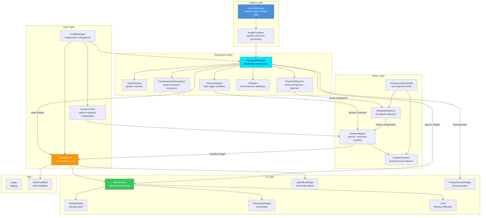
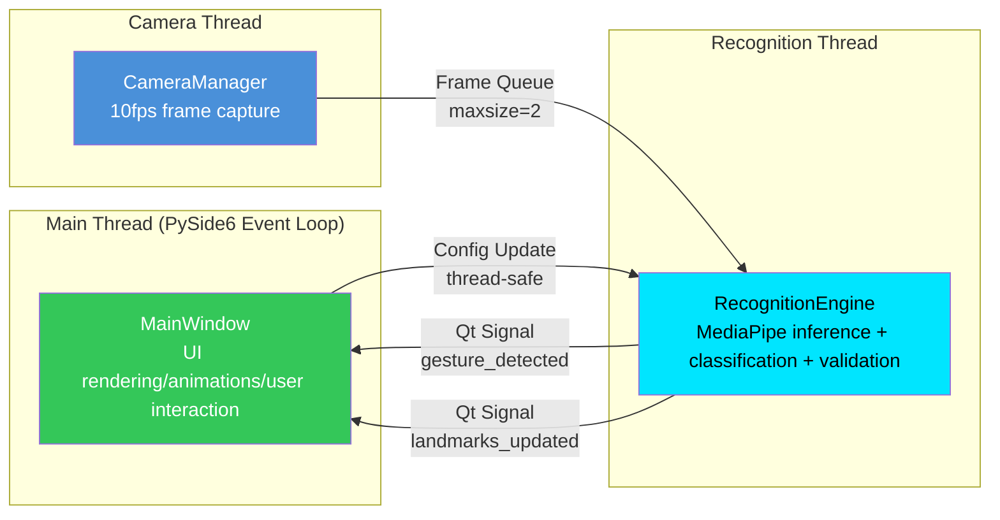
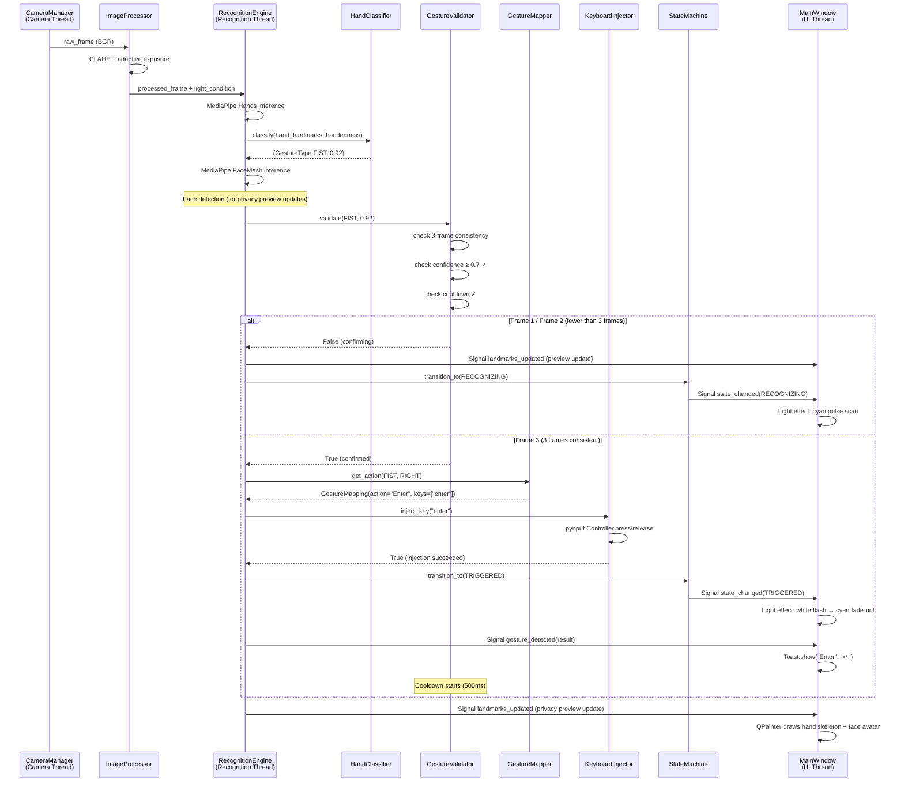
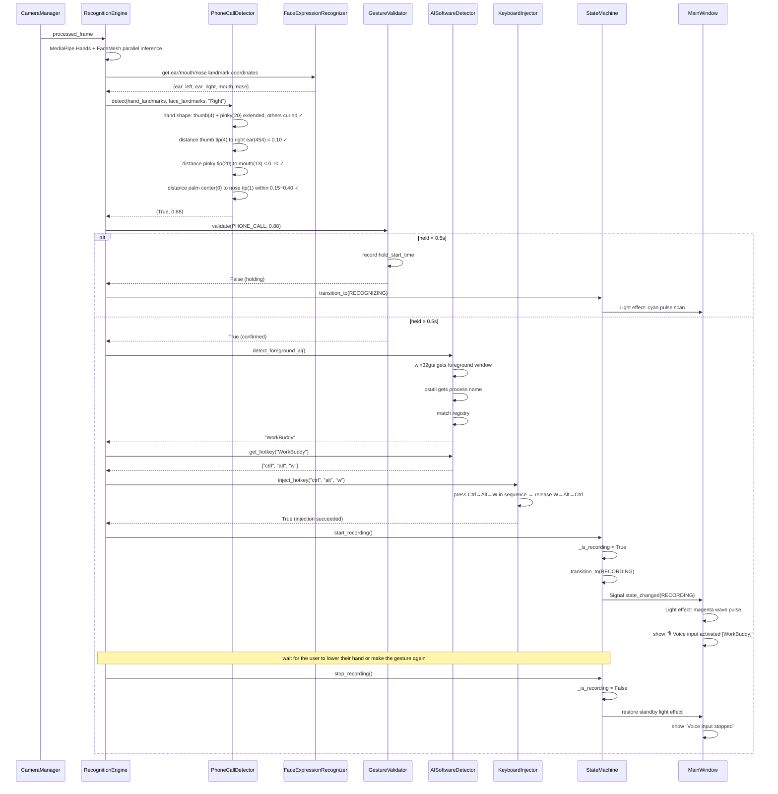
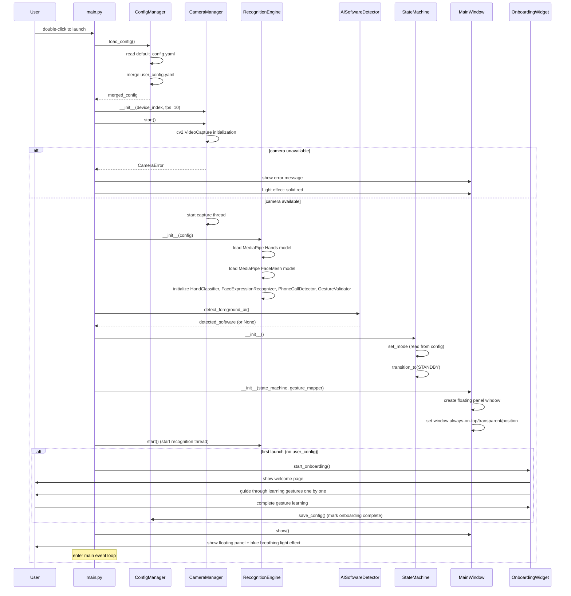
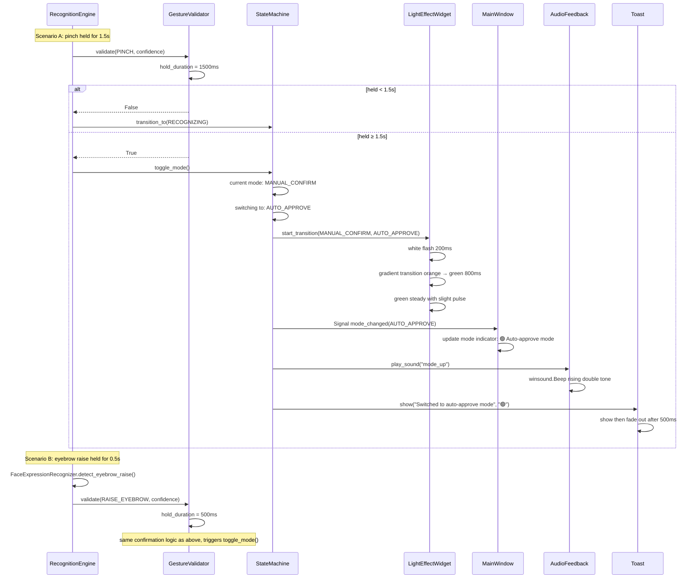
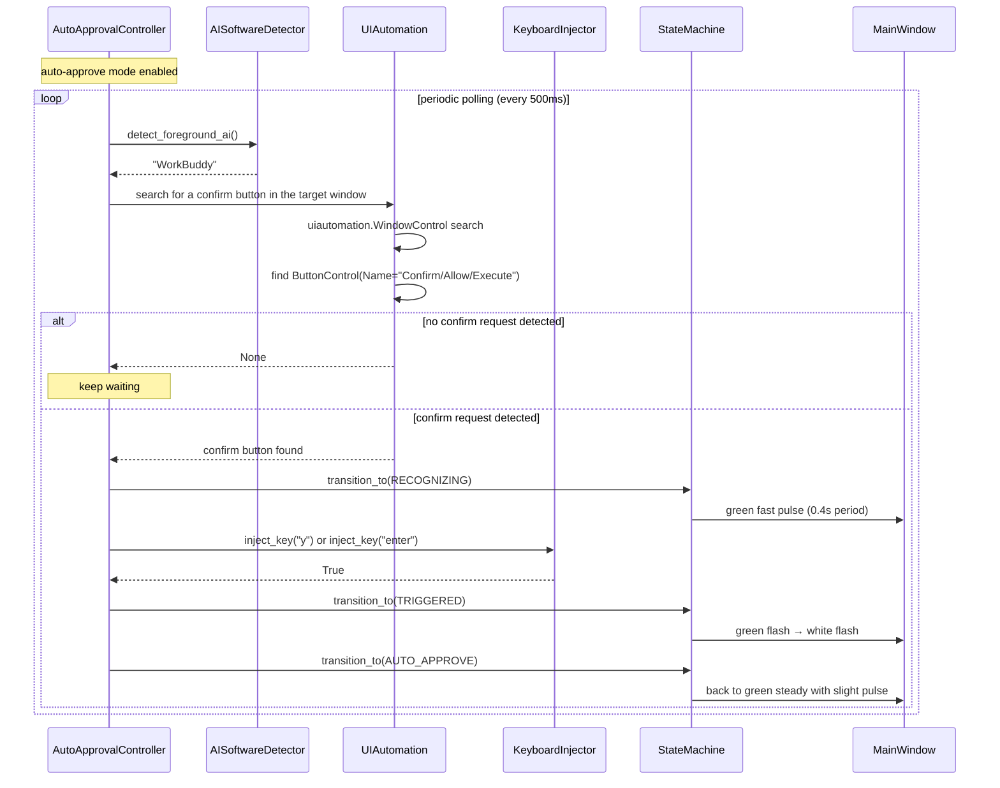
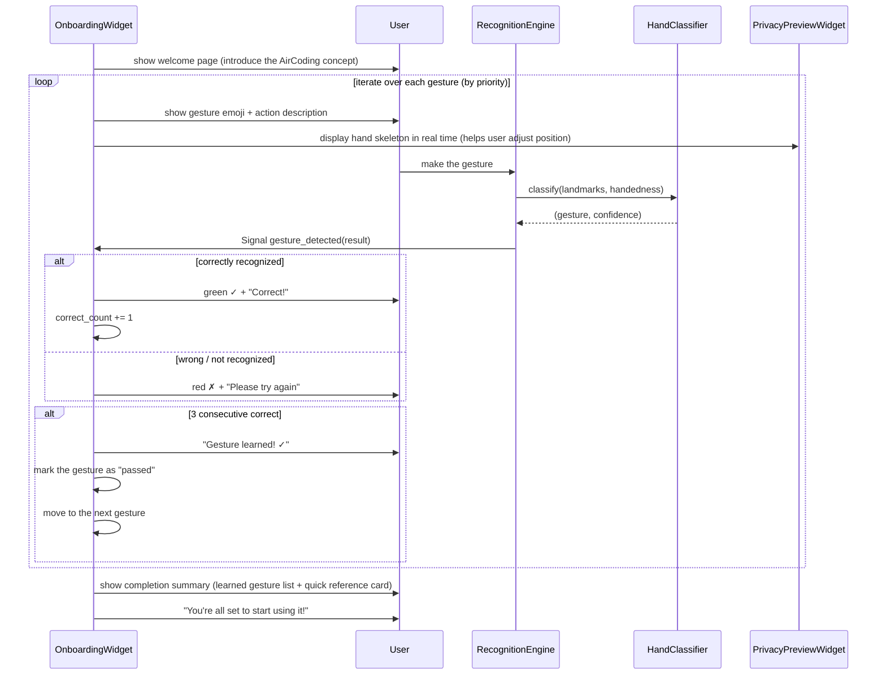
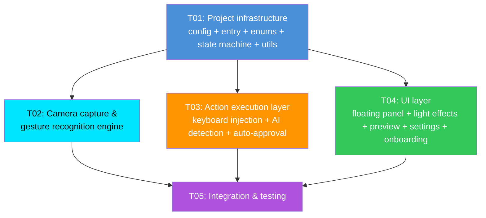

# AirCoding System Architecture

> **Version**: v1.0 | **Date**: 2025-07-27 | **Author**: Gao Jianyuan (Architect)
>
> **Based on PRD**: v3.1 | **Tech Stack**: Python + MediaPipe + PySide6 + pynput

---

## Table of Contents

- [1. Implementation Approach and Framework Selection](#1-implementation-approach-and-framework-selection)
- [2. File Layout and Relative Paths](#2-file-layout-and-relative-paths)
- [3. Data Structures and Interfaces (Class Diagram)](#3-data-structures-and-interfaces-class-diagram)
- [4. Program Call Flow (Sequence Diagrams)](#4-program-call-flow-sequence-diagrams)
- [5. Task List](#5-task-list)
- [6. Dependency List](#6-dependency-list)
- [7. Shared Knowledge (Cross-File Conventions)](#7-shared-knowledge-cross-file-conventions)
- [8. Open Items](#8-open-items)

---

## 1. Implementation Approach and Framework Selection

### 1.1 Core Technical Challenges

| Challenge | Difficulty | Solution |
| ------------------ | ----------------------------------------- | --------------------------------------------------------------------------------------------- |
| **Phone-call gesture detection** | Requires combined hand + face detection: thumb near ear + pinky near mouth, requiring Hands and Face Mesh to run simultaneously | MediaPipe Hands + Face Mesh run inference in parallel; PhoneCallDetector fuses hand landmarks and face landmarks to determine the spatial relationship |
| **False-trigger prevention at 10fps** | The low frame rate means a short confirmation window (3 frames = 300ms); response speed must be balanced against the false-trigger rate | GestureValidator implements a 3-tier false-trigger prevention: 3-frame consistency + hold duration + cooldown; phone-call and mode-switch use hold duration instead of frame counting |
| **Lighting robustness** | MediaPipe detection rates vary widely across day/night/backlight/reverse-light scenarios | ImageProcessor applies histogram equalization + adaptive exposure compensation + CLAHE before feeding frames to MediaPipe, dynamically adjusting pre-processing parameters based on lighting conditions |
| **Privacy preview** | Cannot display real video, but must give real-time feedback on hand/face position | PrivacyPreviewWidget uses QPainter to render a schematic avatar (dot eyes + line eyebrows/mouth) and hand skeleton connections (21 points), rendered entirely from landmark coordinates |
| **AI software auto-detection** | Must detect the process of the foreground window and match it against a preset AI software list | AISoftwareDetector uses win32gui to get the foreground window → psutil to get the process name → match against the registry; supports "follow foreground window" mode |
| **Auto-approval UI monitoring** | Must detect confirmation dialogs popped up by AI software, not timed injection | AutoApprovalController uses the uiautomation library to listen for UI element changes in the target AI software window and auto-injects when a confirm button is detected |
| **End-to-end latency ≤ 400ms** | Budget of 3-frame confirmation (300ms) + processing (100ms) is extremely tight | Camera thread and recognition thread are separated; frame queue length = 2 (drops stale frames); MediaPipe processing runs on a dedicated thread; keyboard injection executes synchronously (μs-level) |
| **CPU ≤ 10% single core** | MediaPipe inference + UI rendering + camera capture must keep total load under control | 10fps low frame rate + single-hand priority mode (only processes the first detected hand) + efficient QImage rendering + animations driven by QTimer rather than dedicated threads |

### 1.2 Overall Architecture Diagram



### 1.3 Tech Stack Selection Rationale

| Technology | Version | Rationale |
| ---------------- | ----- | ----------------------------------------------------------------------------- |
| **Python** | 3.10+ | Native MediaPipe support; mature PySide6 bindings; rapid prototyping; mandated by the PRD |
| **MediaPipe** | 0.10+ | Google open-source; 21-point hand landmarks + 468-point face landmarks; local inference with no network required; CPU-friendly; mandated by the PRD |
| **PySide6** | 6.5+ | Qt for Python, LGPL licensed (commercial-friendly); QPainter efficiently renders the privacy preview; QTimer animation system; native always-on-top/transparent/draggable window support; mandated by the PRD |
| **pynput** | 1.7+ | Cross-platform keyboard event injection; wraps Windows SendInput under the hood; clean API; mandated by the PRD |
| **OpenCV** | 4.8+ | Camera capture (cv2.VideoCapture); image pre-processing (histogram equalization, CLAHE); seamless MediaPipe integration |
| **pywin32** | 306+ | win32gui to get the foreground window handle; Win32 API interaction; more reliable than pygetwindow |
| **psutil** | 5.9+ | Process information retrieval, assists AI software detection; cross-platform process management |
| **uiautomation** | 2.0+ | Windows UIAutomation wrapper; used in auto-approval mode to monitor AI software UI elements; lighter than pywinauto |
| **NumPy** | 1.24+ | Landmark coordinate computation (distances, angles); image array operations; MediaPipe dependency |
| **PyYAML** | 6.0+ | Config file serialization; human-readable; supports complex nested structures |

### 1.4 Thread Model



**Thread responsibilities:**

| Thread | Responsibility | Communication | Frequency |
| ------------ | ------------------------------------------------------------------------ | --------------------- | -------- |
| **Main Thread (UI)** | PySide6 event loop; QPainter renders light effects and privacy preview; QTimer drives animations; handles user interaction (drag/settings/onboarding) | Receives recognition results via Qt Signal/Slot | 60fps animations |
| **Camera Thread** | cv2.VideoCapture captures frames at 10fps; puts them into `queue.Queue(maxsize=2)`, dropping the oldest frame when full | Frame queue (thread-safe) | 10fps |
| **Recognition Thread** | Takes frames from the queue → ImageProcessor pre-processing → MediaPipe inference → gesture classification → false-trigger validation → trigger actions; notifies the UI via Qt Signal | Frame queue input; Qt Signal output | 10fps |

**Key design decisions:**

- Frame queue `maxsize=2`: ensures the recognition thread always processes the latest frame, avoiding latency from backlog
- Keyboard injection executes synchronously in the recognition thread: the SendInput call takes < 1ms, no dedicated thread needed
- UI updates go through Qt Signal (automatically cross-thread safe), avoiding direct widget manipulation
- Config updates use a thread-safe mechanism (`threading.Lock` protects ConfigManager)

### 1.5 Data Flow Design

```
[Camera] → raw_frame (BGR, 720p)
    ↓
[ImageProcessor] → processed_frame (pre-processed BGR)
    ├── Histogram equalization (CLAHE)
    ├── Adaptive exposure compensation
    └── Lighting condition detection → returns light level
    ↓
[RecognitionEngine] → RecognitionResult
    ├── MediaPipe Hands → hand_landmarks (21 points × 3D coords), handedness, hand_confidence
    ├── MediaPipe FaceMesh → face_landmarks (468 points × 3D coords), face_detected
    ├── HandClassifier → (GestureType, confidence)
    ├── FaceExpressionRecognizer → eyebrow_raised (bool), face_position (dict)
    ├── PhoneCallDetector → phone_call_detected (bool), phone_confidence (float)
    └── GestureValidator → confirmed (bool)
    ↓
[Branch 1: gesture confirmed] → GestureMapper → action_name → KeyboardInjector → keys_sequence → SendInput
[Branch 2: state update] → StateMachine → LightState change → MainWindow.update_light_effect()
[Branch 3: preview update] → PrivacyPreviewWidget.update_landmarks(hand_lm, face_lm)
[Branch 4: notification] → Toast.show(message, icon)
```

### 1.6 Architecture Pattern

Uses the **event-driven + layered architecture** pattern:

- **Layered**: Capture Layer → Recognition Layer → Action Layer → Core Layer → UI Layer; layers interact through interfaces with single-direction dependencies
- **Event-driven**: The recognition thread publishes events via Qt Signal (gesture detection, state changes); the UI layer subscribes and responds
- **State machine**: StateMachine acts as the central state manager; all state changes are routed through it, ensuring consistency of light effects, modes, and recording state
- **Strategy pattern**: Gesture classification, image pre-processing, and false-trigger validation can all switch strategies via configuration (e.g., single-hand/two-hand mode, different lighting pre-processing)

---

## 2. File Layout and Relative Paths

```
aircoding/
├── main.py                              # Application entry: initializes modules, starts threads, loads config
├── requirements.txt                      # Python dependency list with version constraints
│
├── models/                               # MediaPipe model files (pre-packaged for offline install)
│   ├── hand_landmarker.task              # MediaPipe Hands model
│   └── face_landmarker.task              # MediaPipe Face Mesh model
│
├── config/
│   ├── default_config.yaml               # Default config (gesture mappings, thresholds, light effect params, AI software registry)
│   └── user_config.yaml                  # User config (persisted at runtime to %APPDATA%/AirCoding/, overrides defaults)
│
├── src/
│   ├── __init__.py
│   │
│   ├── core/                             # Core layer: enums, config, state machine
│   │   ├── __init__.py
│   │   ├── enums.py                      # Enum definitions: GestureType, LightState, SystemMode, HandSide, LightCondition
│   │   ├── config_manager.py             # Config management: load/merge/save/persist; thread-safe access
│   │   ├── gesture_config.py             # Gesture-action-keyboard mapping data structures and default mapping table
│   │   └── state_machine.py              # State machine: 7 light effect state transitions, mode management, state callback registration
│   │
│   ├── camera/                           # Capture layer: camera and image pre-processing
│   │   ├── __init__.py
│   │   ├── camera_manager.py             # Camera capture thread: cv2.VideoCapture wrapper, 10fps throttling, frame queue
│   │   └── image_processor.py            # Image pre-processing: CLAHE histogram equalization, adaptive exposure compensation, light level detection
│   │
│   ├── recognition/                      # Recognition layer: MediaPipe orchestration and gesture analysis
│   │   ├── __init__.py
│   │   ├── recognition_engine.py         # MediaPipe orchestrator: Hands + FaceMesh parallel inference, result aggregation, Qt Signal emission
│   │   ├── hand_classifier.py            # Gesture classifier: 21-point landmark parsing, 6 gesture detection (fist/open palm/thumbs up/thumbs down/scissor/pinch)
│   │   ├── face_expression.py            # Facial expression recognition: eyebrow raise detection (baseline + adaptive), face landmark localization (ears/mouth/nose)
│   │   ├── phone_call_detector.py        # Phone-call gesture detection: hand shape + hand-face relative position (thumb near ear + pinky near mouth)
│   │   ├── gesture_validator.py          # False-trigger validation: 3-frame consistency confirmation, hold duration confirmation, cooldown, confidence threshold
│   │   └── calibrator.py                 # Threshold auto-calibration: collects user baseline data, computes mean ± 2σ, generates personalized config
│   │
│   ├── action/                           # Action layer: keyboard injection and AI software interaction
│   │   ├── __init__.py
│   │   ├── keyboard_injector.py          # Keyboard event injection: pynput wrapper, combo key injection, SendInput low-level fallback
│   │   ├── gesture_mapper.py             # Gesture→keyboard mapping: mapping table lookup, left/right hand routing, custom shortcut support
│   │   ├── ai_software_detector.py       # AI software detection: foreground window scan, process name matching, hotkey config management, target switching
│   │   └── auto_approval.py              # Auto-approval mode: uiautomation monitors AI software UI elements, detects confirm requests, auto-injects
│   │
│   ├── ui/                               # UI layer: PySide6 interface components
│   │   ├── __init__.py
│   │   ├── main_window.py                # Floating control panel: always-on-top/transparent/draggable window, component layout, signal routing
│   │   ├── light_effect_widget.py        # Virtual light effect component: 7 state animations (breathe/pulse/flash/flicker/wave/steady), QPainter rendering
│   │   ├── privacy_preview.py            # Privacy preview component: face schematic avatar drawing, hand 21-point skeleton lines, gesture emoji labels
│   │   ├── settings_dialog.py            # Settings panel: sensitivity/delay/light effects/position/opacity/AI hotkeys/calibration entry
│   │   ├── onboarding.py                 # Onboarding: welcome page → learn gestures one by one → completion summary, real-time feedback
│   │   └── toast.py                      # Floating notification: operation confirmation/error/mode-switch prompts, 500ms fade-out animation
│   │
│   └── utils/                            # Utility layer
│       ├── __init__.py
│       ├── logger.py                     # Logging utility: leveled logging, file rotation, console output
│       └── audio.py                      # Audio feedback: mode-switch sounds, error beeps, trigger cues
│
└── tests/                                # Tests
    ├── __init__.py
    ├── test_hand_classifier.py           # Gesture classifier unit tests (landmark mock data validation for each gesture)
    ├── test_gesture_validator.py         # False-trigger validation unit tests (3-frame confirm/hold duration/cooldown logic)
    └── test_state_machine.py             # State machine unit tests (state transitions/mode switching/callback triggers)
```

**File responsibility details:**

| File | Core Responsibility | Dependent Modules |
| ------------------------- | ------------------------------------------------------------------------------------------------------------------------ | ------------------------------- |
| `main.py` | Application entry; creates QApplication; initializes ConfigManager → CameraManager → RecognitionEngine → StateMachine → MainWindow; starts the camera and recognition threads; handles exit cleanup | All modules |
| `enums.py` | Defines all enum types, shared across modules | None |
| `config_manager.py` | Loads default_config.yaml and merges it with user_config.yaml; provides thread-safe get/set interfaces; auto-persists user config | PyYAML |
| `gesture_config.py` | Defines the gesture→action→keyboard mapping data structures; built-in default mapping table for 11 gestures | enums |
| `state_machine.py` | Manages LightState (7 types) and SystemMode (2 types) transitions; registers state change callbacks; ensures consistency between light effects and modes | enums |
| `camera_manager.py` | Runs cv2.VideoCapture on a dedicated thread; 10fps throttling; frame queue (maxsize=2); camera error detection and auto-recovery | OpenCV |
| `image_processor.py` | CLAHE histogram equalization; adaptive exposure compensation (Gamma correction); light level detection (LOW/NORMAL/HIGH/BACKLIT); dynamically adjusts pre-processing parameters based on light level | OpenCV, NumPy |
| `recognition_engine.py` | Orchestrates MediaPipe Hands + FaceMesh; calls HandClassifier/FaceExpression/PhoneCallDetector; emits Qt Signal after GestureValidator confirmation | MediaPipe, all recognition submodules |
| `hand_classifier.py` | Computes fingertip-to-palm distances, thumb direction vectors, and finger angles from 21-point landmarks; classifies 6 base gestures; returns (GestureType, confidence) | NumPy |
| `face_expression.py` | Captures eyebrow baseline (mean y-coordinate of 4 eyebrow landmarks); detects eyebrow raise in real time; auto-updates baseline every 5 minutes; provides ear/mouth/nose tip landmark coordinates for PhoneCallDetector | NumPy |
| `phone_call_detector.py` | Fuses hand + face landmarks: hand shape check (thumb and pinky extended, others curled) + hand-face position check (thumb tip near ear, pinky tip near mouth, palm center near face center); left/right hand compatible | NumPy |
| `gesture_validator.py` | Maintains a frame history sliding window (3 frames); applies different confirmation strategies per gesture type (3-frame consistency/0.5s hold/1.5s hold); 500ms cooldown; confidence ≥ 0.7 gate | enums |
| `calibrator.py` | Guides the user through each gesture one by one (3s each); collects multi-frame landmark data; computes mean ± 2σ for each distance/angle; generates a user-specific threshold config | NumPy |
| `keyboard_injector.py` | pynput Keyboard.Controller wrapper; single-key injection and combo key injection (press in sequence, then release); returns injection success/failure status | pynput |
| `gesture_mapper.py` | Looks up GestureConfig to get the keyboard action for a gesture; left/right hand routing (right hand → primary actions, left hand → auxiliary actions); supports custom shortcut overrides | gesture_config, enums |
| `ai_software_detector.py` | Uses win32gui to get the foreground window title/process; psutil to get the process name; matches against a preset registry (WorkBuddy/Doubao/custom); provides per-software voice input hotkey configuration | pywin32, psutil |
| `auto_approval.py` | Uses uiautomation to monitor UI element changes in the target AI software window; detects confirmation dialogs/buttons; triggers KeyboardInjector to inject the confirm key | uiautomation, keyboard_injector |
| `main_window.py` | Borderless always-on-top transparent window; lays out light effect ring + gesture display + mode indicator + function buttons + privacy preview; receives RecognitionEngine Qt Signals and routes them to subcomponents | PySide6, all ui subcomponents |
| `light_effect_widget.py` | Custom QPainter drawing; 7 state animations (breathe/pulse/flash/flicker/wave/steady with slight pulse); QTimer drives animation frames; gradient transition on mode switch | PySide6 |
| `privacy_preview.py` | QPainter draws a schematic avatar (dot eyes + arc eyebrows + line mouth) and hand skeleton (21-point connections + joints); positions update in real time with landmarks; gesture emoji labels | PySide6 |
| `settings_dialog.py` | Sensitivity slider; confirmation frames/hold duration config; light effect toggle; panel position/opacity; AI software hotkey config; calibration entry; left/right hand mirroring; privacy statement | PySide6 |
| `onboarding.py` | Welcome page → learn one by one (emoji + description + real-time skeleton feedback + pass/fail) → completion summary; auto-triggered on first launch; can be re-entered from settings | PySide6, recognition_engine |
| `toast.py` | Floating card centered slightly below the middle; QPropertyAnimation fade-out; fades out after 500ms; supports icon + text | PySide6 |
| `logger.py` | logging module wrapper; DEBUG/INFO/WARNING/ERROR levels; file rotation (10MB × 5); colored console output | logging |
| `audio.py` | winsound.Beep wrapper; predefined sounds (mode-switch rising/falling double tones, error beep, trigger cue); configurable on/off | winsound |

---

## 3. Data Structures and Interfaces (Class Diagram)

### 3.1 Enum Type Definitions

```python
# src/core/enums.py

class GestureType(Enum):
    """Gesture / expression type enum"""
    NONE = "none"                    # not detected
    PHONE_CALL = "phone_call"        # 🤙 phone call (voice input activate)
    THUMBS_UP = "thumbs_up"          # 👍 thumbs up (confirm)
    THUMBS_DOWN = "thumbs_down"      # 👎 thumbs down (reject)
    PINCH = "pinch"                  # 🤏 pinch (mode switch)
    FIST = "fist"                    # ✊ fist (Enter / left-hand Ctrl+C)
    OPEN_PALM = "open_palm"          # ✋ open palm (Escape / left-hand Ctrl+V)
    SCISSOR = "scissor"              # ✌️ scissor (Ctrl+Z / left-hand custom)
    RAISE_EYEBROW = "raise_eyebrow"  # 🤨 eyebrow raise (mode switch)

class LightState(Enum):
    """Light effect state enum (7 core states)"""
    STANDBY = "standby"              # standby: soft blue breathing
    RECOGNIZING = "recognizing"      # recognizing: cyan pulse scan
    RECORDING = "recording"          # recording: magenta wave pulse
    TRIGGERED = "triggered"          # triggered: white flash → action color
    ERROR = "error"                  # error: red fast flicker
    AUTO_APPROVE = "auto_approve"    # auto-approve standby: green steady micro-pulse
    MANUAL_CONFIRM = "manual_confirm"# manual confirm standby: orange steady micro-pulse

class SystemMode(Enum):
    """System mode enum"""
    AUTO_APPROVE = "auto_approve"    # auto-approve mode
    MANUAL_CONFIRM = "manual_confirm"# manual confirm mode

class HandSide(Enum):
    """Hand side enum"""
    LEFT = "left"
    RIGHT = "right"

class LightCondition(Enum):
    """Lighting condition enum"""
    LOW = "low"            # low light (<100 lux)
    NORMAL = "normal"      # normal light (100-1000 lux)
    HIGH = "high"          # strong light (>1000 lux)
    BACKLIT = "backlit"    # backlight
```

### 3.2 Core Data Structures

```python
# recognition result data structure (RecognitionEngine output)
@dataclass
class RecognitionResult:
    gesture: GestureType            # recognized gesture type
    hand_side: HandSide              # hand side (left/right)
    confidence: float                # confidence 0.0~1.0
    hand_landmarks: Optional[list]   # 21-point hand landmark coords (None if not detected)
    face_landmarks: Optional[list]   # 468-point face landmark coords (None if not detected)
    hand_detected: bool              # hand detected
    face_detected: bool              # face detected
    phone_call_detected: bool        # phone-call gesture detected (hand+face joint)
    eyebrow_raised: bool             # eyebrow raise detected
    light_condition: LightCondition  # current lighting condition
    timestamp: float                 # frame timestamp

# gesture mapping config items
@dataclass
class GestureMapping:
    gesture: GestureType             # gesture type
    hand_side: HandSide              # applicable hand side
    action_name: str                 # action name (e.g. "voice input activate")
    key_sequence: list[str]          # key sequence (e.g. ["ctrl","z"])
    emoji: str                       # matching emoji
    confirm_frames: int              # confirm frames (default 3)
    hold_duration_ms: int            # hold duration (ms; 0 = no hold needed)
    cooldown_ms: int                 # cooldown (ms, default 500)
    confidence_threshold: float      # confidence threshold (default 0.7)
    action_color: str                # action trigger color (hex)

# light effect config items
@dataclass
class LightEffectConfig:
    state: LightState                # light effect state
    color: str                       # primary color (hex)
    animation: str                   # animation type (breathe/pulse/flash/flicker/wave/steady)
    duration_ms: int                 # duration (0 = persist until state change)
    period_ms: int                   # animation period (ms)
```

### 3.3 Class Diagram (Mermaid)

```mermaid
classDiagram
    class GestureType {
        <<enumeration>>
        NONE
        PHONE_CALL
        THUMBS_UP
        THUMBS_DOWN
        PINCH
        FIST
        OPEN_PALM
        SCISSOR
        RAISE_EYEBROW
    }

    class LightState {
        <<enumeration>>
        STANDBY
        RECOGNIZING
        RECORDING
        TRIGGERED
        ERROR
        AUTO_APPROVE
        MANUAL_CONFIRM
    }

    class SystemMode {
        <<enumeration>>
        AUTO_APPROVE
        MANUAL_CONFIRM
    }

    class HandSide {
        <<enumeration>>
        LEFT
        RIGHT
    }

    class RecognitionResult {
        +GestureType gesture
        +HandSide hand_side
        +float confidence
        +Optional~list~ hand_landmarks
        +Optional~list~ face_landmarks
        +bool hand_detected
        +bool face_detected
        +bool phone_call_detected
        +bool eyebrow_raised
        +LightCondition light_condition
        +float timestamp
    }

    class GestureMapping {
        +GestureType gesture
        +HandSide hand_side
        +str action_name
        +list~str~ key_sequence
        +str emoji
        +int confirm_frames
        +int hold_duration_ms
        +int cooldown_ms
        +float confidence_threshold
        +str action_color
    }

    class ConfigManager {
        -dict _default_config
        -dict _user_config
        -str _config_path
        -Lock _lock
        +load_config() dict
        +save_config() void
        +get(key: str, default: Any) Any
        +set(key: str, value: Any) void
        +reset_to_default() void
        +get_thresholds() dict
        +get_light_effects() dict
        +get_ai_software_registry() dict
    }

    class StateMachine {
        -LightState _light_state
        -SystemMode _mode
        -bool _is_recording
        -dict _callbacks
        +transition_to(state: LightState) void
        +set_mode(mode: SystemMode) void
        +toggle_mode() void
        +start_recording() void
        +stop_recording() void
        +register_callback(state: LightState, callback: Callable) void
        +get_light_state() LightState
        +get_mode() SystemMode
        +is_recording() bool
    }

    class CameraManager {
        -int _device_index
        -int _fps
        -Queue _frame_queue
        -bool _running
        -Thread _thread
        -float _frame_interval
        +start() void
        +stop() void
        +get_frame() Optional~np.ndarray~
        -_capture_loop() void
        -_handle_camera_error() void
        +is_available() bool
    }

    class ImageProcessor {
        +preprocess(frame: np.ndarray) tuple~np.ndarray, LightCondition~
        -_apply_clahe(frame: np.ndarray) np.ndarray
        -_adaptive_exposure(frame: np.ndarray, condition: LightCondition) np.ndarray
        -_detect_light_condition(frame: np.ndarray) LightCondition
    }

    class RecognitionEngine {
        -Hands _hands_model
        -FaceMesh _face_model
        -HandClassifier _hand_classifier
        -FaceExpressionRecognizer _face_recognizer
        -PhoneCallDetector _phone_call_detector
        -GestureValidator _validator
        -ImageProcessor _image_processor
        -Signal gesture_detected
        -Signal landmarks_updated
        -Signal state_change_requested
        +process_frame(frame: np.ndarray) RecognitionResult
        -_process_hands(frame: np.ndarray) tuple
        -_process_face(frame: np.ndarray) tuple
        +update_config(config: dict) void
    }

    class HandClassifier {
        -dict _thresholds
        +classify(landmarks: list, handedness: str) tuple~GestureType, float~
        -_is_fist(landmarks: list) bool
        -_is_open_palm(landmarks: list) bool
        -_is_thumbs_up(landmarks: list) bool
        -_is_thumbs_down(landmarks: list) bool
        -_is_scissor(landmarks: list) bool
        -_is_pinch(landmarks: list) bool
        -_finger_extended(landmarks: list, tip_idx: int, mcp_idx: int) bool
        -_finger_distance(landmarks: list, idx_a: int, idx_b: int) float
        +update_thresholds(thresholds: dict) void
    }

    class FaceExpressionRecognizer {
        -dict _baseline
        -float _eyebrow_threshold
        -float _last_baseline_update
        +initialize_baseline(landmarks: list) void
        +detect_eyebrow_raise(landmarks: list) tuple~bool, float~
        +get_ear_landmarks(landmarks: list) dict
        +get_mouth_landmarks(landmarks: list) dict
        +get_nose_tip(landmarks: list) tuple
        -_auto_update_baseline(landmarks: list) void
    }

    class PhoneCallDetector {
        -float _hand_face_distance_threshold
        -float _palm_face_distance_range
        +detect(hand_landmarks: list, face_landmarks: list, handedness: str) tuple~bool, float~
        -_check_hand_shape(hand_landmarks: list) bool
        -_check_thumb_near_ear(hand_landmarks: list, face_landmarks: list, handedness: str) bool
        -_check_pinky_near_mouth(hand_landmarks: list, face_landmarks: list) bool
        -_check_palm_near_face(hand_landmarks: list, face_landmarks: list) bool
    }

    class GestureValidator {
        -int _confirm_frames
        -dict _hold_durations
        -int _cooldown_ms
        -deque _frame_history
        -dict _hold_start_time
        -float _last_trigger_time
        +validate(gesture: GestureType, confidence: float) bool
        -_check_frame_consistency(gesture: GestureType) bool
        -_check_hold_duration(gesture: GestureType) bool
        -_check_cooldown() bool
        -_check_confidence(confidence: float) bool
        +reset() void
        +update_config(config: dict) void
    }

    class Calibrator {
        -dict _collected_data
        -int _samples_needed
        -GestureType _current_gesture
        +start_calibration(gesture: GestureType) void
        +collect_sample(landmarks: list) void
        +compute_thresholds() dict
        +save_profile(name: str) void
        +load_profile(name: str) dict
        +is_complete() bool
        +get_progress() float
    }

    class KeyboardInjector {
        +inject_key(key: str) bool
        +inject_hotkey(*keys: str) bool
        +inject_text(text: str) bool
        -_key_down(key: str) void
        -_key_up(key: str) void
        +get_key_code(key: str) int
    }

    class GestureMapper {
        -dict _gesture_map
        +get_action(gesture: GestureType, hand_side: HandSide) Optional~GestureMapping~
        +get_key_sequence(gesture: GestureType, hand_side: HandSide) list~str~
        +get_emoji(gesture: GestureType) str
        +get_action_color(gesture: GestureType) str
        +update_mapping(gesture: GestureType, hand_side: HandSide, keys: list) void
        +get_all_mappings() dict
    }

    class AISoftwareDetector {
        -dict _software_registry
        -str _current_target
        -bool _follow_foreground
        +detect_foreground_ai() Optional~str~
        +get_hotkey(software_name: str) list~str~
        +set_target(software_name: str) void
        +get_available_software() list~dict~
        +add_custom_software(name: str, process_names: list, hotkey: list) void
        -_scan_foreground_process() str
        -_match_software(process_name: str) Optional~str~
    }

    class AutoApprovalController {
        -bool _enabled
        -AISoftwareDetector _detector
        -KeyboardInjector _injector
        -str _target_window
        +enable() void
        +disable() void
        +check_for_ai_request() bool
        +trigger_auto_approval() void
        -_monitor_ui_elements() bool
        +is_enabled() bool
    }

    class MainWindow {
        -LightEffectWidget _light_widget
        -PrivacyPreviewWidget _preview_widget
        -StateMachine _state_machine
        -GestureMapper _gesture_mapper
        +update_gesture_display(gesture: GestureType, confidence: float) void
        +update_light_effect(state: LightState) void
        +update_mode_indicator(mode: SystemMode) void
        +show_toast(message: str, icon: str) void
        +update_recording_status(is_recording: bool) void
        -_on_gesture_detected(result: RecognitionResult) void
        -_on_state_changed(state: LightState) void
    }

    class LightEffectWidget {
        -LightState _current_state
        -str _action_color
        -QTimer _animation_timer
        -float _animation_phase
        +set_state(state: LightState) void
        +set_action_color(color: str) void
        +start_transition(from_state: LightState, to_state: LightState) void
        -_paintEvent(event: QPaintEvent) void
        -_update_animation() void
    }

    class PrivacyPreviewWidget {
        -QPixmap _canvas
        -Optional~list~ _hand_landmarks
        -Optional~list~ _face_landmarks
        -GestureType _current_gesture
        +update_hand_landmarks(landmarks: list, gesture: GestureType) void
        +update_face_landmarks(landmarks: list) void
        +clear() void
        -_paintEvent(event: QPaintEvent) void
        -_draw_hand_skeleton(painter: QPainter, landmarks: list) void
        -_draw_face_avatar(painter: QPainter, landmarks: list) void
        -_draw_gesture_label(painter: QPainter, gesture: GestureType) void
    }

    %% Relationships
    StateMachine --> LightState
    StateMachine --> SystemMode
    RecognitionEngine --> HandClassifier
    RecognitionEngine --> FaceExpressionRecognizer
    RecognitionEngine --> PhoneCallDetector
    RecognitionEngine --> GestureValidator
    RecognitionEngine --> ImageProcessor
    PhoneCallDetector --> FaceExpressionRecognizer : fetch ear/mouth/nose coordinates
    GestureValidator --> GestureType
    HandClassifier --> GestureType
    FaceExpressionRecognizer --> GestureType
    GestureMapper --> GestureType
    GestureMapper --> HandSide
    GestureMapper --> KeyboardInjector
    AISoftwareDetector --> KeyboardInjector
    AutoApprovalController --> AISoftwareDetector
    AutoApprovalController --> KeyboardInjector
    MainWindow --> LightEffectWidget
    MainWindow --> PrivacyPreviewWidget
    MainWindow --> StateMachine
    MainWindow --> GestureMapper
    CameraManager --> ImageProcessor
    RecognitionEngine ..> RecognitionResult : produces
```



### 3.4 Key Class Relationships

| Relationship | Description |
| ------------------------------------------------------------------------------------------------------------ | -------------------------------------------------------------- |
| `RecognitionEngine` aggregates `HandClassifier`, `FaceExpressionRecognizer`, `PhoneCallDetector`, `GestureValidator` | The recognition engine orchestrates the sub-recognizers, calling them on every frame to complete the full recognition pipeline |
| `PhoneCallDetector` depends on `FaceExpressionRecognizer` | The phone-call gesture needs face landmarks (ears/mouth/nose), reusing the landmark extraction methods from FaceExpressionRecognizer |
| `GestureMapper` depends on `KeyboardInjector` | After looking up the keyboard sequence, the mapper calls the injector to perform the actual key press |
| `AutoApprovalController` depends on `AISoftwareDetector` and `KeyboardInjector` | Auto-approval must first detect the AI software window, then inject the confirm key |
| `MainWindow` aggregates `LightEffectWidget`, `PrivacyPreviewWidget`, `StateMachine`, `GestureMapper` | The main window orchestrates UI subcomponents, subscribing to state machine changes and recognition results |
| `StateMachine` is driven by both the recognition engine and the action layer | The recognition engine triggers state changes (e.g., recognizing → triggered), while the action layer triggers mode switches |

---

## 4. Program Call Flow (Sequence Diagrams)

### 4.1 Gesture Recognition → Keyboard Injection Flow (General Shortcut Operations)



### 4.2 Voice Input Activation Flow (Phone-Call Gesture — Core Product Flow)



### 4.3 Application Startup Flow



### 4.4 Mode Switch Flow



### 4.5 Auto-Approval Mode Flow



### 4.6 Onboarding Flow



---

## 5. Task List

### 5.1 Task Overview

| Task ID | Task Name | Files | Depends On | Priority |
| ---- | ------------ | --- | ------------------ | --- |
| T01  | Project infrastructure | 18  | None | P0  |
| T02  | Camera capture & gesture recognition engine | 8   | T01 | P0  |
| T03  | Action execution layer | 4   | T01 | P0  |
| T04  | UI layer | 6   | T01 | P0  |
| T05  | Integration & testing | 4   | T01, T02, T03, T04 | P0  |

### 5.2 Task Dependency Graph



### 5.3 Detailed Task Breakdown

#### T01: Project Infrastructure

| Item | Content |
| -------- | -------------------------------------- |
| **Task ID** | T01 |
| **Task Name** | Project infrastructure (config files + entry file + dependency declaration + core layer + utility layer) |
| **Priority** | P0 |
| **Dependencies** | None |

**Source files:**

| File | Responsibility |
| ----------------------------- | --------------------------------------------------------------------- |
| `requirements.txt` | Python dependencies with version constraints |
| `main.py` | Application entry: creates QApplication, initializes modules, starts threads, event loop |
| `config/default_config.yaml` | Default config: gesture mapping table, recognition thresholds, light effect params, AI software registry |
| `config/user_config.yaml` | User config (created from defaults on first launch, persisted at runtime) |
| `src/__init__.py` | Package initialization |
| `src/core/__init__.py` | Core layer package initialization |
| `src/core/enums.py` | All enum definitions (GestureType, LightState, SystemMode, HandSide, LightCondition) |
| `src/core/config_manager.py` | Config management: load/merge/save/persist; thread-safe get/set |
| `src/core/gesture_config.py` | Gesture-action-keyboard mapping data structures + default mapping table for 11 gestures + GestureMapping dataclass |
| `src/core/state_machine.py` | State machine: 7 light effect state transitions, mode management, recording state, callback registration |
| `src/camera/__init__.py` | Capture layer package initialization |
| `src/recognition/__init__.py` | Recognition layer package initialization |
| `src/action/__init__.py` | Action layer package initialization |
| `src/ui/__init__.py` | UI layer package initialization |
| `src/utils/__init__.py` | Utility layer package initialization |
| `src/utils/logger.py` | Logging utility: leveled logging, file rotation, console output |
| `src/utils/audio.py` | Audio feedback: winsound wrapper, predefined sounds |
| `tests/__init__.py` | Test package initialization |

**Implementation notes:**

- `default_config.yaml` must include the complete 11-gesture mapping, 6 tunable threshold parameters, 7 light effect configs, and the AI software registry (WorkBuddy/Doubao)
- `state_machine.py` must define clear transition rules: STANDBY↔RECOGNIZING→TRIGGERED→STANDBY, STANDBY↔AUTO_APPROVE/MANUAL_CONFIRM
- `config_manager.py` uses `threading.Lock` for thread safety and notifies relevant modules when config changes
- `main.py` must handle abnormal exit cleanup (stop threads, release the camera, save config)

---

#### T02: Camera Capture & Gesture Recognition Engine

| Item | Content |
| -------- | ------------------------------------- |
| **Task ID** | T02 |
| **Task Name** | Camera capture & gesture recognition engine (all capture layer + recognition layer files) |
| **Priority** | P0 |
| **Dependencies** | T01 (needs enums, config_manager, logger) |

**Source files:**

| File | Responsibility |
| ---------------------------------------- | ------------------------------------------------------------------------------- |
| `src/camera/camera_manager.py` | Camera capture thread: cv2.VideoCapture wrapper, 10fps throttling, frame queue (maxsize=2), error detection and auto-recovery |
| `src/camera/image_processor.py` | Image pre-processing: CLAHE histogram equalization, adaptive exposure compensation (Gamma), light level detection (LOW/NORMAL/HIGH/BACKLIT) |
| `src/recognition/recognition_engine.py` | MediaPipe orchestrator: Hands + FaceMesh parallel inference, aggregates results into RecognitionResult, Qt Signal emission, hot config reload |
| `src/recognition/hand_classifier.py` | Gesture classifier: 21-point landmark parsing, 6 gesture detection (fist/open palm/thumbs up/thumbs down/scissor/pinch), returns (GestureType, confidence) |
| `src/recognition/face_expression.py` | Facial expression recognition: eyebrow baseline capture + adaptive update (5 min), eyebrow raise detection, ear/mouth/nose landmark extraction |
| `src/recognition/phone_call_detector.py` | Phone-call gesture detection: hand shape check (thumb + pinky extended) + hand-face position check (thumb near ear + pinky near mouth + palm near face), left/right hand compatible |
| `src/recognition/gesture_validator.py` | False-trigger validation: 3-frame consistency (deque), hold duration confirmation (0.5s/1.5s), 500ms cooldown, 0.7 confidence gate |
| `src/recognition/calibrator.py` | Threshold auto-calibration: collects multi-frame landmark data, computes mean ± 2σ, generates user-specific threshold config |

**Implementation notes:**

- `recognition_engine.py` inherits from `QObject` and defines three Signals: `gesture_detected`, `landmarks_updated`, `state_change_requested`
- The 6 detection methods in `hand_classifier.py` are based on normalized landmark coordinates (MediaPipe normalized landmarks); distances use Euclidean distance
- `phone_call_detector.py` must fuse the ear (234/454), mouth (13/14), and nose tip (1) coordinates extracted by `face_expression.py`
- `gesture_validator.py` uses `collections.deque(maxlen=3)` to maintain frame history; hold duration is timed with `time.monotonic()`
- `image_processor.py` dynamically selects pre-processing intensity based on lighting condition: LOW → CLAHE + Gamma 1.5, BACKLIT → CLAHE + Gamma 0.7
- `camera_manager.py` auto-retries when the camera disconnects (2s interval) and emits an error signal after 5 consecutive failures

---

#### T03: Action Execution Layer

| Item | Content |
| -------- | --------------------------------------------- |
| **Task ID** | T03 |
| **Task Name** | Action execution layer (keyboard injection + gesture mapping + AI software detection + auto-approval) |
| **Priority** | P0 |
| **Dependencies** | T01 (needs enums, gesture_config, config_manager) |

**Source files:**

| File | Responsibility |
| ------------------------------------ | ------------------------------------------------------ |
| `src/action/keyboard_injector.py` | Keyboard event injection: pynput Controller wrapper, single/combo key injection, injection success status return |
| `src/action/gesture_mapper.py` | Gesture→keyboard mapping: GestureConfig lookup, left/right hand routing, custom shortcut support, emoji/action color lookup |
| `src/action/ai_software_detector.py` | AI software detection: win32gui foreground window + psutil process name matching, hotkey config management, target switching, "follow foreground" mode |
| `src/action/auto_approval.py` | Auto-approval mode: uiautomation monitors AI software UI elements, detects confirmation dialogs, auto-injects confirm key |

**Implementation notes:**

- `keyboard_injector.py` combo key injection: press all keys in sequence → wait 10ms → release all keys in reverse order; falls back to ctypes SendInput when pynput is unsupported
- In `gesture_mapper.py`, right-hand gestures map to primary actions (voice input/confirm/reject/Enter/Escape/Ctrl+Z/mode switch); left-hand gestures map to auxiliary actions (Ctrl+C/Ctrl+V/custom)
- `ai_software_detector.py` built-in registry: WorkBuddy (process name match workbuddy/WorkBuddy, hotkey ctrl+alt+w), Doubao (process name match Doubao/doubao, hotkey alt+d); supports user-defined custom software
- `auto_approval.py` uses the `uiautomation` library's `WindowControl` to search for `ButtonControl` under the target AI software window, matching keywords such as "Confirm/Allow/Execute/Run"; polling interval 500ms
- `ai_software_detector.py` "follow foreground window" mode: re-detects the foreground window's AI software on every gesture trigger

---

#### T04: UI Layer

| Item | Content |
| -------- | ------------------------------------------------------------ |
| **Task ID** | T04 |
| **Task Name** | UI layer (floating panel + light effects + privacy preview + settings + onboarding + notifications) |
| **Priority** | P0 |
| **Dependencies** | T01 (needs enums, state_machine, config_manager, gesture_config) |

**Source files:**

| File | Responsibility |
| ------------------------------- | ----------------------------------------------------------- |
| `src/ui/main_window.py` | Floating control panel main window: borderless always-on-top transparent window, component layout, Qt Signal routing, drag/resize/opacity |
| `src/ui/light_effect_widget.py` | Virtual light effect component: QPainter custom-draws 7 state animations (breathe/pulse/flash/flicker/wave/steady), gradient transition on mode switch |
| `src/ui/privacy_preview.py` | Privacy preview component: QPainter draws face schematic avatar (dot eyes + arc eyebrows + line mouth) and hand 21-point skeleton connections, gesture emoji labels |
| `src/ui/settings_dialog.py` | Settings panel: sensitivity slider, confirmation frames/hold duration config, light effect toggle, panel position/opacity, AI hotkey config, calibration entry, left/right hand mirroring, privacy statement |
| `src/ui/onboarding.py` | Onboarding: welcome page → learn one by one (emoji + description + real-time skeleton feedback + pass/fail) → completion summary |
| `src/ui/toast.py` | Floating notification: card centered slightly below the middle, QPropertyAnimation fade-out, fades out after 500ms |

**Implementation notes:**

- `main_window.py` inherits from `QWidget` and sets `Qt.FramelessWindowHint | Qt.WindowStaysOnTopHint | Qt.Tool`; `setAttribute(Qt.WA_TranslucentBackground)` for transparency
- `light_effect_widget.py` uses `QTimer` at 30fps to drive animations; picks the animation function based on LightState (sine-wave breathing, linear pulse, stepped flash, etc.); colors interpolated via `QColor` for gradients
- `privacy_preview.py` must draw the 21 landmark connections for the hand skeleton (as defined by MediaPipe HAND_CONNECTIONS) plus joint dots; the face avatar uses 5 key points (two eyes/two eyebrows/mouth) as a simplified avatar
- After config changes, `settings_dialog.py` calls `ConfigManager.set()` and emits the `config_changed` signal to hot-reload the recognition engine
- `onboarding.py` subscribes to the `RecognitionEngine.gesture_detected` signal for real-time feedback; 3 consecutive correct detections mark a gesture as passed
- `toast.py` uses `QGraphicsOpacityEffect` + `QPropertyAnimation` for the fade-out effect

---

#### T05: Integration & Testing

| Item | Content |
| -------- | --------------------- |
| **Task ID** | T05 |
| **Task Name** | Integration & testing (full-module wiring + unit tests) |
| **Priority** | P0 |
| **Dependencies** | T01, T02, T03, T04 |

**Source files:**

| File | Responsibility |
| --------------------------------- | ------------------------------------------ |
| `tests/test_hand_classifier.py` | Gesture classifier unit tests: mock 21-point landmark data to validate the 6 gesture detection logic |
| `tests/test_gesture_validator.py` | False-trigger validation unit tests: 3-frame consistency/hold duration/cooldown/confidence gate logic |
| `tests/test_state_machine.py` | State machine unit tests: 7 light effect state transitions/mode switching/recording state/callback triggers |
| `main.py` (updated) | Integration wiring: creates module instances, connects Qt Signal/Slot, starts threads, handles exit cleanup |

**Implementation notes:**

- `main.py` integration update: instantiate CameraManager → RecognitionEngine → StateMachine → GestureMapper → KeyboardInjector → AISoftwareDetector → AutoApprovalController → MainWindow; connect RecognitionEngine Signals to MainWindow Slots
- `test_hand_classifier.py` constructs mock landmark data for each gesture (open hand/fist/thumbs up, etc.) and validates classification results and confidence
- `test_gesture_validator.py` simulates continuous frame sequences to validate the 3-frame confirmation logic, hold duration timing, and cooldown blocking
- `test_state_machine.py` validates all legal state transition paths, rejection of illegal transitions, mode switching correctness, and callback triggers
- Tests use the `pytest` framework; mock data uses fixed landmark coordinate arrays

---

## 6. Dependency List

```
# ==========================================
# AirCoding - Python Dependencies
# ==========================================

# === Core Recognition ===
mediapipe>=0.10.0,<0.11.0      # Google hand/face landmark recognition (Hands + Face Mesh)
opencv-python>=4.8.0,<4.10.0    # camera capture + image preprocessing
numpy>=1.24.0,<2.0.0            # landmark coordinate computation + image array ops

# === UI Framework ===
PySide6>=6.5.0,<6.8.0           # Qt for Python (floating panel/effects/privacy preview/settings/onboarding)

# === Keyboard Injection ===
pynput>=1.7.6,<2.0.0            # cross-platform keyboard injection (SendInput on Windows)

# === System Interaction ===
pywin32>=306                    # win32gui foreground window detection (AI app detection)
psutil>=5.9.0                   # process info lookup (AI app process-name matching)
uiautomation>=2.0.0             # Windows UIAutomation (auto-approval UI monitoring)

# === Configuration ===
PyYAML>=6.0,<7.0                # YAML config read/write

# === Testing (dev dependency) ===
pytest>=7.0.0                   # unit test framework
pytest-cov>=4.0.0               # test coverage
```

**Dependency notes:**

| Package | Purpose | Required | Notes |
| ------------- | ---------- | ---- | ---------------------------- |
| mediapipe | Core hand/face recognition | Required | Model files need downloading on first run (~10MB), then loaded locally |
| opencv-python | Camera capture + image processing | Required | Uses only cv2.VideoCapture and image processing functions |
| numpy | Numeric computation | Required | Indirect dependency of mediapipe; version pinned explicitly |
| PySide6 | GUI framework | Required | LGPL licensed, commercial-friendly |
| pynput | Keyboard injection | Required | Uses the Windows SendInput API under the hood |
| pywin32 | Window management | Required | win32gui.GetForegroundWindow |
| psutil | Process management | Required | Process name retrieval |
| uiautomation | UI automation | Required | Core dependency of auto-approval mode |
| PyYAML | Config files | Required | YAML format read/write |
| pytest | Test framework | Dev dependency | Only needed for testing |

---

## 7. Shared Knowledge (Cross-File Conventions)

### 7.1 Naming Conventions

| Category | Convention | Example |
| ------------- | ----------------------- | ----------------------------------------------------------------------- |
| **File names** | All lowercase + underscores | `hand_classifier.py`, `main_window.py` |
| **Class names** | PascalCase | `RecognitionEngine`, `MainWindow` |
| **Functions/methods** | snake_case | `process_frame()`, `detect_foreground_ai()` |
| **Constants** | ALL CAPS + underscores | `MAX_FRAME_QUEUE_SIZE`, `DEFAULT_FPS` |
| **Enum values** | ALL CAPS + underscores | `PHONE_CALL`, `AUTO_APPROVE` |
| **Private members** | Underscore prefix | `_frame_queue`, `_current_state` |
| **Qt Signals** | snake_case + noun | `gesture_detected`, `landmarks_updated` |
| **Qt Slots** | `on_` + component name + `_` + signal name | `on_gesture_detected`, `on_state_changed` |
| **Config keys** | Dot-path style | `recognition.thresholds.finger_extended`, `light_effects.standby.color` |

### 7.2 Config File Format

**Structure of `default_config.yaml`:**

```yaml
# recognition params
recognition:
  fps: 10
  single_hand_mode: true          # single-hand mode priority
  thresholds:
    finger_extended: 0.5          # finger extended threshold
    finger_curled: 0.3            # finger curled threshold
    thumb_direction: 0.15         # thumb direction threshold
    hand_face_distance: 0.10      # phone-call hand-face distance threshold
    confidence: 0.7               # confidence threshold

# false-trigger prevention params
validation:
  confirm_frames: 3               # consecutive confirm frames
  hold_durations:                 # hold duration (ms)
    phone_call: 500
    pinch: 1500
    raise_eyebrow: 500
  cooldown_ms: 500                # cooldown

# gesture mapping
gesture_mappings:
  - gesture: phone_call
    hand_side: right
    action_name: "Voice Input Activate"
    key_sequence: ["ctrl", "d"]   # dynamically overridden at runtime by AISoftwareDetector
    emoji: "🤙"
    confirm_frames: 3
    hold_duration_ms: 500
    action_color: "#FF2D55"
  - gesture: thumbs_up
    hand_side: right
    action_name: "Confirm"
    key_sequence: ["y"]
    emoji: "👍"
    confirm_frames: 3
    hold_duration_ms: 0
    action_color: "#34C759"
  # ... remaining 9 gesture mappings

# light effect config
light_effects:
  standby:
    color: "#4A90D9"
    animation: breathe
    period_ms: 3000
  recognizing:
    color: "#00E5FF"
    animation: pulse
    period_ms: 800
  recording:
    color: "#FF2D55"
    animation: wave
    period_ms: 600
  triggered:
    color: "#FFFFFF"
    animation: flash
    duration_ms: 600
  error:
    color: "#FF3B30"
    animation: flicker
    duration_ms: 1200
  auto_approve:
    color: "#34C759"
    animation: steady_pulse
    period_ms: 4000
  manual_confirm:
    color: "#FF9500"
    animation: steady_pulse
    period_ms: 4000

# AI software registry
ai_software:
  workbuddy:
    process_names: ["workbuddy", "WorkBuddy"]
    voice_input_hotkey: ["ctrl", "d"]
    window_title_keywords: ["WorkBuddy"]
  doubao:
    process_names: ["Doubao", "doubao"]
    voice_input_hotkey: ["alt", "d"]
    window_title_keywords: ["豆包", "Doubao"]

# UI config
ui:
  panel_position: "bottom_right"
  panel_opacity: 0.85
  panel_size: "medium"
  light_effect_enabled: true
  auto_hide_timeout_ms: 300000
  sound_feedback_enabled: true

# facial expression
face_expression:
  eyebrow_raise_threshold: 1.5    # std-dev multiplier
  baseline_update_interval_s: 300 # update baseline every 5 minutes

# onboarding
onboarding:
  completed: false
```

### 7.3 Logging Conventions

```python
# log format
# [time] [level] [module] message
# [2025-07-27 14:30:15] [INFO] [RecognitionEngine] Gesture: FIST, confidence: 0.92

# log level conventions
DEBUG   # landmark coords, frame processing time, queue state (dev only)
INFO    # gesture results, state changes, mode switches, AI app detection
WARNING # confidence below threshold, poor lighting, dropped frames
ERROR   # camera errors, MediaPipe inference failures, keyboard injection failures, config load failures

# log file
# location: logs/aircoding.log
# rotation: 10MB × 5 files
# console: colored logs in dev, ERROR only in production
```

### 7.4 Error Handling Strategy

| Error Type | Handling Strategy | User Feedback |
| -------------- | ---------------------------------------- | -------------- |
| Camera unavailable | Detected at startup; blocks startup if unavailable; auto-retries on runtime disconnect (2s interval × 5 attempts) | Solid red light effect + error message |
| MediaPipe inference failure | Skip the current frame and log; after 10 consecutive failures, pause the recognition thread and retry | Red flicker light effect |
| Keyboard injection failure | Log it without blocking the recognition flow; falls back to ctypes SendInput when pynput fails | Silent failure (injection rarely fails) |
| Corrupted config file | Fall back to default_config.yaml and log a WARNING | "Config reset" prompt at startup |
| AI software not detected | When the voice-input gesture triggers, show "No AI software detected" and don't inject the hotkey | Toast notification |
| UI rendering exception | Catch the exception, log it, without affecting the recognition thread | Silent recovery |
| Thread exception | Each thread wraps its main loop in try-except; notifies the main thread via Signal on exception | Error light effect + notification |

### 7.5 Thread Safety Conventions

| Shared Resource | Protection | Access Rules |
| ---------------------- | -------------------- | ----------------------------- |
| `ConfigManager` config | `threading.Lock` | All get/set go through the lock |
| `StateMachine` state | `threading.Lock` | Recognition thread writes, UI thread reads |
| Frame queue `Queue` | `queue.Queue` built-in thread safety | Camera thread puts, recognition thread gets |
| `GestureValidator` frame history | Accessed only by the recognition thread | No lock needed (single-thread access) |
| UI Widget | Qt Signal/Slot cross-thread safety | The recognition thread only notifies via Signal and never manipulates widgets directly |

### 7.6 Qt Signal/Slot Communication Conventions

```python
# Signals defined by RecognitionEngine (recognition thread → UI thread)
gesture_detected = Signal(RecognitionResult)       # gesture confirmed trigger
landmarks_updated = Signal(list, list, GestureType) # per-frame landmark update (for preview)
state_change_requested = Signal(LightState)         # request state machine change
config_changed = Signal(dict)                        # config update notification

# Slots defined by MainWindow (receiving recognition-thread signals)
@Slot(RecognitionResult)
def on_gesture_detected(self, result: RecognitionResult): ...

@Slot(list, list, GestureType)
def on_landmarks_updated(self, hand_lm, face_lm, gesture): ...

# Signals defined by StateMachine (state change → UI thread)
state_changed = Signal(LightState)
mode_changed = Signal(SystemMode)
recording_state_changed = Signal(bool)
```

---

## 8. Open Items (All Resolved)

| # | Item | Decision | Notes |
| -- | ------------------------- | ---------------------------------------------------------- | ------------------------------------------------------- |
| 1 | **WorkBuddy voice input hotkey** | **Ctrl+D** | Confirmed; compatibility issues with other AI software are handled by user configuration |
| 2 | **AI software UI structure for auto-approval mode** | **Per the architect's recommendation** | UI monitoring approach; requires collecting UI element matching rules for each AI software's confirmation dialog |
| 3 | **Phone-call gesture stop-recording mechanism** | **Stop when the hand is lowered** | When the gesture disappears (hand landmarks lost) beyond a threshold time → auto-stop recording; no toggle needed |
| 4 | **Priority when multiple AI software run simultaneously** | **Auto-switch purely by foreground window** | Re-detects the foreground window's AI software on every gesture trigger; no manual selection needed |
| 5 | **uiautomation library compatibility** | **Agreed** | Test on the target system; degrade gracefully if unstable |
| 6 | **MediaPipe CPU usage at 10fps** | **Reliability-first** | If exceeding 10% of a single core, optimize through other means (e.g., FaceMesh inference every other frame, lower resolution) without sacrificing recognition reliability |
| 7 | **Panel position on multi-monitor setups** | **Follow the display of the foreground AI software** | The panel auto-shows on the display where the foreground AI window resides |
| 8 | **Audio feedback implementation** | **System Beep sufficient for now** | Uses winsound.Beep; can be upgraded to audio files later |
| 9 | **User config file path** | **%APPDATA%/AirCoding/** | Follows Windows application conventions |
| 10 | **MediaPipe model file distribution** | **Must support offline install** | Pre-package model files into the `models/` directory to support installs without a network |

---

> **End of Document**
>
> This architecture design is based on PRD v3.1 and covers the system design of all AirCoding modules. Core architecture: **3-thread model** (camera capture / recognition inference / UI rendering) + **event-driven** (Qt Signal/Slot cross-thread communication) + **layered architecture** (capture → recognition → action → core → UI). The work is decomposed into 5 tasks (T01-T05); T02/T03/T04 can be developed in parallel, with T05 for integration and testing. Key technical challenges: combined hand-face detection for the phone-call gesture, lighting-robust pre-processing, schematic rendering for the privacy preview, and UI monitoring for auto-approval.
