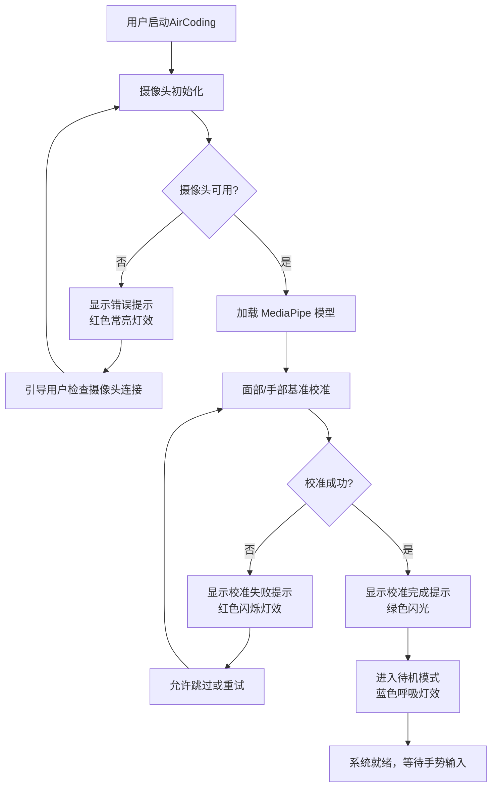
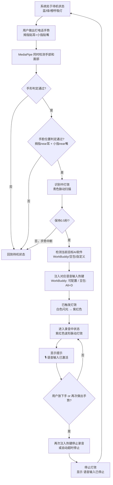
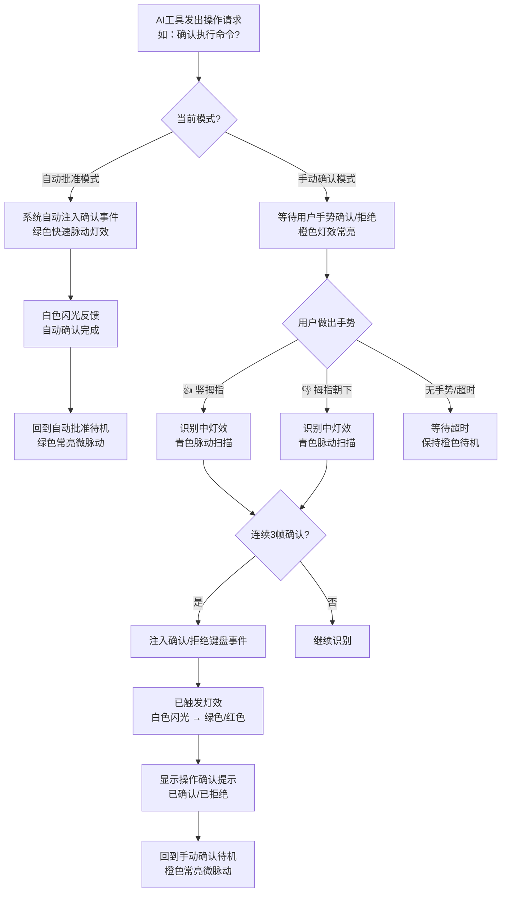
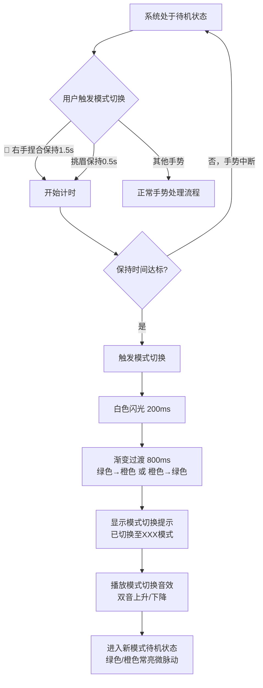
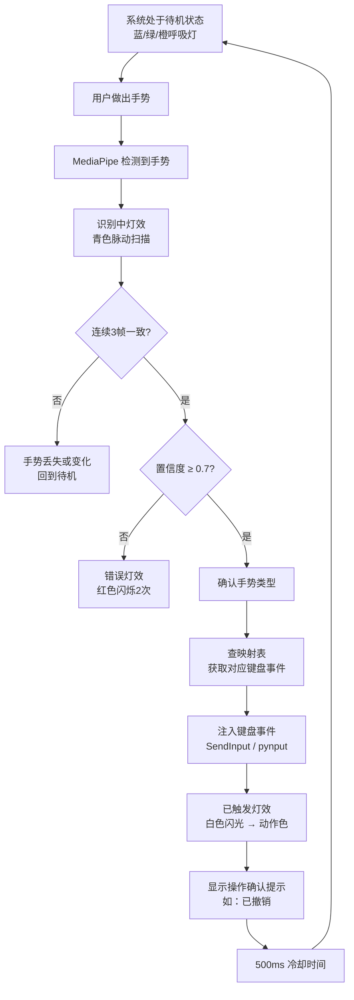
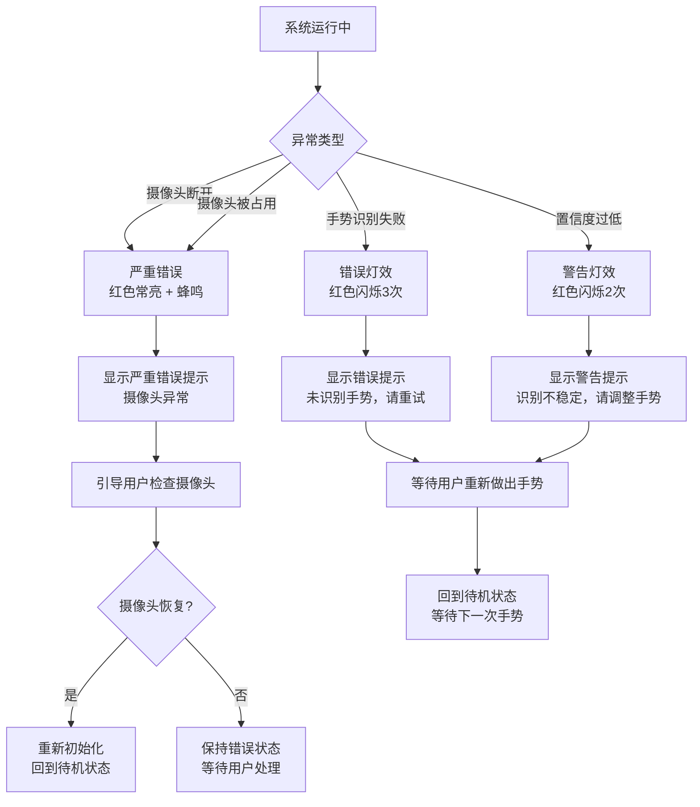

# AirCoding产品需求文档

> **版本**: v3.1 | **日期**: 2025-07-27 | **状态**: 精简版（聚焦 Vibe Coding + 语音输入核心）
>
> **核心定位**：AirCoding的**核心功能**是通过"打电话"手势（拇指贴耳、小指贴嘴）激活当前 AI 软件的语音输入，让用户隔空一键开口对 AI 说话。此外提供确认/拒绝/模式切换等 AI 交互控制功能，配以屏幕灯效和视觉反馈。完整文本输入仍由实体键盘完成。
>
> **首发兼容**：WorkBuddy、豆包（Doubao）

---

## 目录

- [1. 项目信息](#1-项目信息)
- [2. 产品定义](#2-产品定义)
- [3. 需求拆解](#3-需求拆解)
- [4. 手势与表情映射设计](#4-手势与表情映射设计核心交付物)
- [5. 灯效与信息提示设计](#5-灯效与信息提示设计重点章节)
- [6. 交互流程定义](#6-交互流程定义)
- [7. 功能边界说明](#7-功能边界说明)
- [8. 非功能需求](#8-非功能需求)
- [9. 开放问题](#9-开放问题)

---

## 1. 项目信息

| 项目 | 内容 |
|------|------|
| **Language** | 中文 |
| **Programming Language** | Python（MediaPipe + PySide6 + pynput） |
| **Project Name** | `aircoding` |
| **平台** | Windows 10 (1903+) / Windows 11 |
| **参照产品** | OpenAI AhaKey-X1（AI交互专用硬件键盘） |
| **原始需求复述** | 用户受 OpenAI vibe coding AI 键盘（AhaKey-X1）启发，希望设计一个 Windows 系统上的纯软件虚拟应用「AirCoding」。AirCoding不是全键盘替代品，而是 AI 交互控制面板——通过摄像头识别少量手势和表情，触发 AI 交互专用功能（确认/拒绝/模式切换/快捷操作等），配以屏幕灯效和视觉反馈。完整文本输入仍由实体键盘完成。 |

### 1.1 与 AhaKey-X1 的对照

| 维度 | AhaKey-X1（硬件） | AirCoding（软件） |
|------|-------------------|------------------|
| **形态** | 物理硬件（4键+1拨杆+麦克风） | 纯软件应用 |
| **输入方式** | 物理按键/拨杆 | 摄像头识别手势和表情 |
| **反馈方式** | LED 灯效 | 屏幕虚拟灯效 + 视觉反馈 |
| **功能触发** | 按键电信号 | 系统级键盘事件注入（SendInput） |
| **核心功能** | 说话键（按下对AI说话）| 打电话手势→激活AI语音输入热键 |
| **其他功能** | 确认/拒绝/自动批准切换/自定义 | 确认/拒绝/自动批准切换/自定义 + 扩展快捷键 |
| **语音能力** | 内置麦克风，硬件级语音录入 | 不自建语音识别，激活AI软件自身的语音输入功能 |
| **兼容性** | 需AI软件支持 | 兼容WorkBuddy、豆包等所有支持热键的AI软件 |
| **定位** | AI 交互专用控制设备 | AI 交互专用控制面板（无需额外硬件） |

---

## 2. 产品定义

### 2.1 Product Goals

1. **隔空激活语音输入（核心）**：用户做出"打电话"手势（拇指贴耳、小指贴嘴），即可激活当前 AI 软件的语音输入热键，实现零接触、零硬件的"开口对AI说话"体验——这是AirCoding的灵魂功能，对应 AhaKey-X1 的"说话键"
2. **零硬件门槛的AI交互控制**：无需购买额外硬件，仅凭电脑自带摄像头即可实现 AhaKey-X1 级别的 AI 交互控制体验（确认/拒绝/模式切换/快捷操作）
3. **沉浸式灯效反馈体验**：通过精心设计的屏幕虚拟灯效系统，提供即时、直观、有仪式感的状态反馈，让用户"看见"每一次交互
4. **Vibe Coding 效率提升**：在 AI 协作开发场景中，减少手在键盘和鼠标之间的频繁切换，用隔空手势快速完成语音输入、确认/拒绝/撤销等高频操作

### 2.2 User Stories

| # | 角色 | 故事 |
|---|------|------|
| US-1 | Vibe Coding 开发者 | 作为 Vibe Coding 开发者，我希望做出"打电话"手势就能激活 WorkBuddy/豆包的语音输入，这样我无需记住热键、无需移手到键盘，抬手就能开口对 AI 说话，保持 coding 心流 |
| US-2 | Vibe Coding 开发者 | 作为 Vibe Coding 开发者，我希望通过竖大拇指手势快速确认 AI 的操作请求，这样我无需移动手到键盘就能完成审批 |
| US-3 | AI 工具用户 | 作为 AI 工具用户，我希望通过挑眉表情切换自动批准/手动确认模式，这样在信任 AI 时可以批量快速批准，需要谨慎时切回逐一确认 |
| US-4 | 内容创作者 | 作为内容创作者，我希望通过手势触发常用快捷键（如 Ctrl+Z 撤销、Ctrl+C/V 复制粘贴），这样在演示或远距离操作时也能高效控制 |
| US-5 | 产品经理 | 作为产品经理，我希望通过视觉灯效直观了解系统当前状态（待机/识别中/录音中/已触发/错误），这样我能即时感知系统响应而无需盯着文字提示 |
| US-6 | 注重隐私的用户 | 作为注重隐私的用户，我希望所有摄像头数据都在本地处理且不外传，这样我可以放心使用而不用担心隐私泄露 |

---

## 3. 需求拆解

### 3.1 核心功能

#### 3.1.1 语音输入激活（产品灵魂，对应 AhaKey-X1 说话键）

| 功能 | 对应 AhaKey | 说明 | 优先级 |
|------|-------------|------|--------|
| **语音输入激活** | 说话键 | 用户做出"打电话"手势（拇指贴耳、小指贴嘴），系统注入当前 AI 软件的语音输入热键，激活语音录入。再次做出该手势或放下手则停止录音 | **P0** |

**首发兼容的 AI 软件及热键配置**：

| AI 软件 | 语音输入热键 | 热键来源 | 备注 |
|---------|-------------|----------|------|
| **WorkBuddy** | `Ctrl+D` | WorkBuddy 客户端 → 设置 → 快捷键 → 语音输入 | WorkBuddy 桌面端语音输入热键，用户可在设置中自定义 |
| **豆包（Doubao）** | `Alt+D` | 豆包客户端 → 设置 → 快捷键 → 语音对话 | 豆包桌面端内置语音对话功能，`Alt+D` 唤起语音聊天 |
| **通用模式** | 用户自定义 | 设置面板 → AI工具配置 | 用户可手动配置任意 AI 软件的语音输入热键 |

**自动检测机制**：
- 系统启动时扫描前台进程，匹配预设的 AI 软件列表（WorkBuddy、豆包等）
- 检测到多个 AI 软件同时运行时，使用最近活跃的前台 AI 窗口
- 用户可在设置面板中手动切换当前目标 AI 软件
- 支持"跟随前台窗口"模式：自动使用当前聚焦窗口对应的 AI 软件热键

#### 3.1.2 AI 交互控制（对应 AhaKey-X1 其他按键）

以下功能对应 AhaKey-X1 的确认键、拒绝键、拨杆和自定义键：

| 功能 | 对应 AhaKey | 说明 | 优先级 |
|------|-------------|------|--------|
| **确认操作** | 确认键 | AI 请求批准时，用户做出确认手势，注入 Y/Enter/确认按钮点击事件 | P0 |
| **拒绝操作** | 拒绝键 | AI 请求批准时，用户做出拒绝手势，注入 N/Escape/拒绝按钮事件 | P0 |
| **自动批准/手动确认切换** | 拨杆 | Toggle 模式：自动批准模式下系统自动注入确认事件；手动确认模式下每次操作需用户手势确认 | P0 |
| **自定义快捷操作** | 自定义键 | 用户可配置一个手势绑定为自定义键盘快捷键（如 Ctrl+S、Alt+Tab 等） | P1 |

### 3.2 扩展功能（Vibe Coding 常用快捷操作）

以下功能覆盖 Vibe Coding 和 AI 对话中的高频快捷键，通过手势直接触发，无需移手到实体键盘：

| 功能 | 键盘事件 | 使用场景 | 优先级 |
|------|----------|----------|--------|
| **Enter 确认** | `Enter` | 确认对话框、发送消息、提交输入 | P0 |
| **Escape 取消** | `Escape` | 取消对话框、关闭弹窗、中断 AI 生成 | P0 |
| **Ctrl+Z 撤销** | `Ctrl+Z` | 撤销 AI 修改、回退操作 | P0 |
| **Ctrl+C 复制** | `Ctrl+C` | 复制选中文本/代码 | P1 |
| **Ctrl+V 粘贴** | `Ctrl+V` | 粘贴剪贴板内容 | P1 |

### 3.3 灯效与信息提示（产品核心特色）

这是AirCoding区别于普通手势识别工具的核心差异化能力，详见 [第5章](#5-灯效与信息提示设计重点章节)。

| 功能 | 说明 | 优先级 |
|------|------|--------|
| **虚拟灯效系统** | 替代 AhaKey-X1 的 LED 灯效，在屏幕上实现呼吸灯、脉动、闪光、错误闪烁等效果 | P0 |
| **状态指示** | 待机、识别中、已触发、错误、模式状态的可视化指示 | P0 |
| **手势识别可视化** | 实时显示当前识别到的手势图标和名称 | P0 |
| **当前模式显示** | 醒目显示当前处于自动批准模式还是手动确认模式 | P0 |
| **操作确认提示** | 手势触发成功后显示对应的操作名称（如"已撤销"、"已复制"） | P1 |
| **置信度显示** | 显示当前手势识别的置信度百分比 | P2 |
| **隐私预览可视化** | 不显示真实视频，用人脸五官伪像 + 手部骨架示意图替代，辅助用户调整位置 | P0 |

### 3.4 使用场景

| 场景 | 描述 | 核心操作 |
|------|------|----------|
| **Vibe Coding** | 开发者对 Claude/Cursor/Copilot 等 AI 下指令，AI 生成代码后频繁请求批准操作（执行命令、修改文件），用户用手势快速确认/拒绝、用打电话手势激活语音输入 | 语音输入、确认、拒绝、模式切换、Ctrl+Z |
| **AI 对话交互** | 与 ChatGPT/DeepSeek/WorkBuddy/豆包 等 AI 对话时，用手势触发语音输入、Enter 发送、Escape 中断 | 语音输入、Enter、Escape |
| **远距离审核** | 用户在沙发上/走动时审核 AI 操作，无需回到电脑前 | 语音输入、确认、拒绝、模式切换 |

### 3.5 功能模块清单（按优先级）

| 优先级 | 模块 | 描述 |
|--------|------|------|
| **P0** | 摄像头管理与帧采集 | 摄像头初始化、分辨率配置（720p+）、帧循环（10fps，降低负载） |
| **P0** | 手势识别引擎 | MediaPipe Hands 集成、21点 landmark 解析、手势分类器（握拳/张开/竖拇指/捏合/剪刀手/打电话手形）；单手识别优先模式（仅识别先检测到的手） |
| **P0** | 面部表情识别引擎 | MediaPipe Face Mesh 集成、468点 landmark 解析、挑眉检测、耳部/嘴部定位（用于打电话手势的手脸位置判定） |
| **P0** | **语音输入激活模块** | 打电话手势检测（手形+手脸相对位置）、热键注入、录音状态管理 |
| **P0** | **AI软件检测与热键配置** | 前台进程扫描、AI软件匹配（WorkBuddy/豆包）、热键配置管理、目标软件切换 |
| **P0** | 手势-键盘映射引擎 | 手势/表情到键盘事件的映射配置、防误触逻辑（连续3帧确认@10fps约300ms） |
| **P0** | 键盘事件注入 | Windows SendInput 封装、单键与组合键注入（pynput/ctypes） |
| **P0** | 虚拟灯效系统 | 屏幕灯效渲染引擎、状态-灯效映射、动画系统（呼吸/脉动/闪光/闪烁/波形脉动） |
| **P0** | **隐私预览可视化** | 不显示真实视频画面，用人脸五官伪像（ schematic avatar）+ 手部骨架示意图替代，显示检测到的人脸位置和手势姿态 |
| **P0** | **手势阈值自校准** | 识别阈值参数可微调；支持自校准模式（采集用户基准数据自动设定阈值） |
| **P0** | **新手引导流程** | 首次使用时引导用户逐一学习每个手势，配合实时反馈和通过判定 |
| **P0** | **光照鲁棒性处理** | 针对白天/黑夜/背光/逆光场景的图像预处理（直方图均衡化、自适应曝光补偿） |
| **P0** | 浮动控制面板 | 屏幕叠加层 UI、虚拟灯效区域、状态指示器、手势可视化（emoji+名称）、模式指示器、录音状态指示 |
| **P0** | 状态机管理 | 待机/识别中/录音中/已触发/错误状态流转、模式状态（自动/手动）管理 |
| **P0** | 自动批准模式 | 自动确认模式下通过UI监听检测AI请求并自动注入确认事件 |
| **P1** | 自定义快捷操作配置 | 用户可配置一个手势绑定到自定义键盘快捷键 |
| **P1** | 操作确认提示 | 手势触发后显示操作名称的浮动提示 |
| **P1** | 设置面板 | 灵敏度调节、确认延迟配置、灯效开关、面板位置/透明度配置、AI软件热键配置 |
| **P1** | 校准流程 | 首次使用手势基准采集、光照适应 |
| **P2** | 置信度显示 | 手势识别置信度百分比显示 |
| **P0** | 隐私预览可视化 | 人脸五官伪像 + 手部骨架示意图（非真实视频） |
| **P2** | 灯效主题 | 多套灯效主题/配色方案选择 |
| **P2** | 手势统计 | 使用频率统计、识别准确率分析 |

---

## 4. 手势与表情映射设计（核心交付物）

### 4.1 设计原则

| 原则 | 说明 |
|------|------|
| **打电话手势 = 语音输入（核心）** | 拇指贴耳+小指贴嘴的"打电话"手势是AirCoding的灵魂手势，映射为激活当前AI软件的语音输入热键 |
| **手势触发动作** | 手势用于触发瞬时动作（如确认、撤销、语音输入），做出即触发 |
| **表情切换模式** | 面部表情用于模式切换和修饰（如自动/手动模式 toggle），需保持一定时间防误触 |
| **直观易记** | 每个手势与功能有直觉关联（如打电话=说话、竖拇指=确认、拇指朝下=拒绝、握拳=Enter"敲定"） |
| **左右手分工** | 右手负责主要操作（语音输入+AI交互+导航+编辑），左手负责辅助操作（复制/粘贴/自定义） |
| **防误触** | 手势需连续3帧一致（约300ms@10fps）才确认触发；打电话手势需保持0.5s；表情需保持0.5s |
| **单手识别优先** | 默认仅识别先检测到的手（单手模式），避免双手同时识别的干扰；可选开启双手模式 |
| **单手可用** | 所有 P0 核心功能均可单手完成，左手功能为增强项 |

### 4.2 映射架构总览

```
┌─────────────────────────────────────────────────────────────┐
│                    表情层（Mode Switch）                       │
│           挑眉保持0.5s → 切换 自动批准/手动确认 模式            │
└──────────────────────────┬──────────────────────────────────┘
                           │
┌──────────────────────────▼──────────────────────────────────┐
│           单手手势层 — 核心（Voice Input）                     │
│  🤙 打电话（拇指贴耳+小指贴嘴）→ 激活AI语音输入热键             │
└──────────────────────────┬──────────────────────────────────┘
                           │
┌──────────────────────────▼──────────────────────────────────┐
│              手势层 — 操作（Primary Actions）                  │
│  👍确认  👎拒绝  ✊Enter  ✋Escape  ✌️撤销                    │
│  🤏模式切换                                                  │
└──────────────────────────┬──────────────────────────────────┘
                           │
┌──────────────────────────▼──────────────────────────────────┐
│              左手手势层（Auxiliary Actions）                   │
│        ✊复制(Ctrl+C)  ✋粘贴(Ctrl+V)  ✌️自定义               │
└──────────────────────────┬──────────────────────────────────┘
                           │
┌──────────────────────────▼──────────────────────────────────┐
│              键盘事件注入（SendInput / pynput）                │
│   语音输入热键 / 单键 / 组合键 → Windows 系统级键盘事件注入     │
└─────────────────────────────────────────────────────────────┘
```

### 4.3 完整手势/表情映射表

#### 4.3.0 语音输入激活手势（产品核心 — 对应 AhaKey-X1 说话键）

| # | 功能 | 手势 | 手势详细描述 | 键盘事件 | 识别要点（landmark特征） | 防误触 | 优先级 |
|---|------|------|-------------|----------|------------------------|--------|--------|
| 0 | **语音输入激活** | 🤙 打电话 | 左手或右手做出"打电话"手势：大拇指贴在耳朵侧，小指贴在嘴巴旁。拇指和小指伸直，其余三指弯曲。手的位置需在面部附近（拇指尖near耳部landmark，小指尖near嘴部landmark） | 当前AI软件的语音输入热键（WorkBuddy: 可配置 / 豆包: `Alt+D`） | **手部**：拇指(4)和小指(20)伸直，食指(8)/中指(12)/无名指(16)弯曲；**面部定位**：拇指尖(4)与耳部landmark(234左耳/454右耳)距离 < 阈值，且小指尖(20)与嘴部landmark(13/14)距离 < 阈值；**手脸距离检测**：手掌中心(0)与鼻尖(1)距离在合理范围内 | 保持0.5s | **P0** |

> **识别算法详解**：
> 1. **同时追踪手部和面部**：MediaPipe Hands + Face Mesh 并行运行
> 2. **手形判定**：拇指和小指伸直（指尖到掌心距离 > 阈值），食指/中指/无名指弯曲
> 3. **手脸相对位置判定**：
>    - 拇指尖(landmark 4) 与耳部 landmark（左耳 234 / 右耳 454）的归一化距离 < 0.10
>    - 小指尖(landmark 20) 与嘴部 landmark（上唇 13 / 下唇 14）的归一化距离 < 0.10
>    - 手掌中心(landmark 0) 与面部中心距离在 0.15~0.40 范围内（确保手在脸旁而非其他位置）
> 4. **左右手兼容**：左手做时拇指贴左耳、右手做时拇指贴右耳；双手同时做时增强置信度
> 5. **持续确认**：手势保持0.5秒后触发，避免举手到面部过程中的误触
>
> **为什么选择"打电话"手势**：
> - 全球通用的"通话/说话"手势，直觉关联语音输入
> - 需要手部到达面部特定位置，自然防误触（不会在日常操作中意外做出）
> - 手势本身将手带到嘴边，视觉上形成"对AI说话"的身体语言
> - 对应 AhaKey-X1 的"说话键"——按下说话，AirCoding用"打电话"手势替代物理按键

#### 4.3.1 右手手势 — AI 交互核心（对应 AhaKey-X1 按键）

| # | 功能 | 手势 | 手势详细描述 | 键盘事件 | 识别要点（landmark特征） | 防误触 | 优先级 |
|---|------|------|-------------|----------|------------------------|--------|--------|
| 1 | **确认操作** | 👍 竖大拇指 | 右手握拳，大拇指竖直向上伸出 | `Y` 或 `Enter`（可配置） | 拇指尖(landmark 4)高于拇指掌指关节(landmark 2)，拇指方向向量y分量为负（朝上）；其余四指弯曲（指尖到掌心距离 < 阈值） | 连续3帧 | P0 |
| 2 | **拒绝操作** | 👎 大拇指朝下 | 右手握拳，大拇指向下伸出 | `N` 或 `Escape`（可配置） | 拇指尖(landmark 4)低于拇指掌指关节(landmark 2)，拇指方向向量y分量为正（朝下）；其余四指弯曲 | 连续3帧 | P0 |
| 3 | **自动批准/手动确认切换** | 🤏 捏合+保持 | 右手拇指与食指指尖捏合在一起，保持1.5秒 | Toggle 模式状态 | 拇指尖(landmark 4)与食指尖(landmark 8)距离 < 0.05（归一化坐标）；中指/无名指/小指自然弯曲或伸直 | 保持1.5s | P0 |

> **说明**：AhaKey-X1 用物理拨杆切换模式（推上=自动批准，推下=手动确认）。AirCoding用"捏合保持"手势 toggle 切换，通过灯效颜色变化（绿↔橙）明确提示当前模式。捏合保持1.5秒的设计既避免误触，又模拟了"拨动拨杆"的仪式感。

#### 4.3.2 右手手势 — 快捷操作

| # | 功能 | 手势 | 手势详细描述 | 键盘事件 | 识别要点（landmark特征） | 防误触 | 优先级 |
|---|------|------|-------------|----------|------------------------|--------|--------|
| 4 | **Enter** | ✊ 握拳 | 手五指全部弯曲握拳 | `Enter` | 五指尖(landmark 8,12,16,20)到掌心(landmark 0)距离均 < 阈值；无手指伸直 | 连续3帧 | P0 |
| 5 | **Escape** | ✋ 五指张开 | 手五指全部伸直张开，掌心朝向摄像头 | `Escape` | 五指均伸直（指尖到掌心距离 > 阈值）；掌心朝摄像头（法向量z分量为负） | 连续3帧 | P0 |
| 6 | **Ctrl+Z 撤销** | ✌️ 剪刀手 | 食指和中指伸直张开呈V形，其余手指弯曲 | `Ctrl` + `Z` | 食指(8)和中指(12)伸直，无名指(16)和小指(20)弯曲；食指与中指夹角 > 15° | 连续3帧 | P0 |

> **已移除的手势**：Ctrl+Y重做、方向键(↑↓←→)、Tab切换 — 聚焦 Vibe Coding 核心场景，减少手势学习成本。用户可通过"自定义快捷操作"手势槽位绑定任意快捷键。

#### 4.3.3 左手手势 — 辅助操作（双手模式时生效）

| # | 功能 | 手势 | 手势详细描述 | 键盘事件 | 识别要点（landmark特征） | 防误触 | 优先级 |
|---|------|------|-------------|----------|------------------------|--------|--------|
| 13 | **Ctrl+C 复制** | ✊ 左手握拳 | 左手五指全部弯曲握拳（"抓取"动作） | `Ctrl` + `C` | 检测到左手；五指尖到掌心距离均 < 阈值 | 连续3帧 | P1 |
| 14 | **Ctrl+V 粘贴** | ✋ 左手张开 | 左手五指伸直张开，掌心朝摄像头（"放下"动作） | `Ctrl` + `V` | 检测到左手；五指均伸直；掌心朝摄像头 | 连续3帧 | P1 |
| 15 | **自定义快捷操作** | ✌️ 左手剪刀手 | 左手食指和中指伸直呈V形 | 用户自定义 | 检测到左手；食指(8)/中指(12)伸直，其余弯曲 | 连续3帧 | P1 |

> **左右手检测**：MediaPipe Hands 支持 `multi_handedness` 属性，可区分左手/右手。系统默认追踪双手，右手手势优先级高于左手（双手同时做出手势时，以右手为准）。

#### 4.3.4 面部表情 — 模式切换

| # | 功能 | 表情 | 表情详细描述 | 效果 | 识别要点（landmark特征） | 防误触 | 优先级 |
|---|------|------|-------------|------|------------------------|--------|--------|
| 16 | **自动批准 ↔ 手动确认切换** | 挑眉 | 双眉同时上抬，保持0.5秒 | Toggle 模式 | 双眉内侧(landmark 55,285)和外侧(landmark 105,334)纵坐标相对基准位置上移 ≥ 阈值；持续 ≥ 0.5s | 保持0.5s | P0 |

> **挑眉检测算法**：启动时采集基准眉位 → 实时计算双眉 landmark 纵坐标相对基准的上移量 → 上移量超过阈值且持续0.5秒 → 触发模式切换。基准每5分钟自动更新以适应头部自然移动。

### 4.4 映射速查卡

为方便用户记忆，提供以下速查卡（可嵌入设置面板或打印贴在屏幕旁）：

```
┌─────────────────────────────────────────────────────┐
│                 AirCoding · 手势速查卡                   │
├──────────────────────┬──────────────────────────────┤
│  ★ 核心手势（语音输入） │    左手手势（辅助操作）      │
├──────────────────────┼──────────────────────────────┤
│  🤙 打电话  → 激活语音 │  ✊ 握拳    → Ctrl+C 复制     │
│    （拇指贴耳+小指贴嘴）│  ✋ 张开    → Ctrl+V 粘贴     │
├──────────────────────┤  ✌️ 剪刀手  → 自定义快捷      │
│    主手势（操作）      ├──────────────────────────────┤
├──────────────────────┤    面部表情（模式切换）        │
│  👍 竖拇指  → 确认    ├──────────────────────────────┤
│  👎 拇指朝下 → 拒绝   │  🤨 挑眉保持0.5s → 自动/手动  │
│  ✊ 握拳    → Enter  │                              │
│  ✋ 张开    → Escape │                              │
│  ✌️ 剪刀手  → Ctrl+Z │                              │
│  🤏 捏合保持 → 模式切换│                              │
└──────────────────────┴──────────────────────────────┘
```

### 4.5 防误触机制汇总

| 机制 | 参数 | 说明 |
|------|------|------|
| **帧间一致性** | 连续3帧一致（约300ms@10fps） | 手势需在连续3帧中被识别为同一类别才触发，过滤瞬时误识别 |
| **表情持续确认** | 保持0.5秒 | 挑眉表情需持续0.5秒才触发模式切换 |
| **捏合保持确认** | 保持1.5秒 | 模式切换的捏合手势需保持1.5秒，避免与快捷操作的捏合混淆 |
| **冷却时间** | 触发后500ms冷却 | 同一手势触发后500ms内不再重复触发，避免连发 |
| **置信度阈值** | ≥ 0.7 | 手势识别置信度低于0.7时不触发，显示"识别中"状态 |
| **打电话手势持续确认** | 保持0.5秒 | 语音输入激活的"打电话"手势需保持0.5秒，确保手到达面部位置后稳定再触发 |
| **基准自适应** | 每5分钟更新 | 面部表情基准每5分钟自动更新，适应头部自然移动 |

### 4.6 手势 Emoji 映射

每个手势/表情配备一个专属 emoji，用于 UI 面板显示、操作确认提示和隐私预览中的手势标注。风格保持一致（优先使用 Unicode 标准 emoji，无对应的使用自定义 SVG 图标）：

| # | 功能 | Emoji | 来源 | 备注 |
|---|------|-------|------|------|
| 0 | 语音输入激活 | 🤙 | Unicode 标准emoji | "打电话"手势，直觉关联语音输入 |
| 1 | 确认操作 | 👍 | Unicode 标准emoji | 竖大拇指，全球通用的"好/确认" |
| 2 | 拒绝操作 | 👎 | Unicode 标准emoji | 大拇指朝下，"不行/拒绝" |
| 3 | 模式切换（捏合） | 🤏 | Unicode 标准emoji | 捏合手势 |
| 4 | Enter | ✊ | Unicode 标准emoji | 握拳，"敲定/提交" |
| 5 | Escape | ✋ | Unicode 标准emoji | 张开手掌，"停止/取消" |
| 6 | Ctrl+Z 撤销 | ✌️ | Unicode 标准emoji | 剪刀手（V形），关联"Victory/回退" |
| 7 | Ctrl+C 复制 | ✊ | Unicode 标准emoji（左手） | 左手握拳，"抓取/提取" |
| 8 | Ctrl+V 粘贴 | ✋ | Unicode 标准emoji（左手） | 左手张开，"放下/释放" |
| 9 | 自定义快捷 | ✌️ | Unicode 标准emoji（左手） | 左手剪刀手 |
| 10 | 模式切换（挑眉） | 🤨 | Unicode 标准emoji | "挑眉"表情，直觉关联"切换/质疑" |

> **自定义图标**：当前所有手势均有对应的 Unicode 标准 emoji，暂无需新建自定义图标。如后续新增手势无对应 emoji，将使用风格一致的自定义 SVG 图标（线条风格，圆角端点，与系统 emoji 大小匹配）。

### 4.7 手势阈值自校准与新手引导

#### 4.7.1 阈值参数可微调

| 参数 | 默认值 | 可调范围 | 说明 |
|------|--------|----------|------|
| 手指伸直判定阈值 | 0.5 | 0.3~0.8 | 指尖到掌心归一化距离大于此值判定为伸直 |
| 手指弯曲判定阈值 | 0.3 | 0.2~0.5 | 指尖到掌心归一化距离小于此值判定为弯曲 |
| 拇指朝向判定阈值 | 0.15 | 0.10~0.25 | 拇指方向向量y分量绝对值大于此值判定为上/下 |
| 打电话手脸距离阈值 | 0.10 | 0.06~0.15 | 拇指尖与耳部、小指尖与嘴部的归一化距离阈值 |
| 挑眉上移阈值 | 动态 | 自适应 | 启动时采集基准，上移量超过基准+标准差×1.5时触发 |
| 置信度阈值 | 0.7 | 0.5~0.9 | MediaPipe 手势分类置信度低于此值不触发 |

#### 4.7.2 自校准模式

用户可在设置面板中启动自校准流程：
1. 系统引导用户依次做出每个手势（各保持3秒）
2. 采集多帧数据，计算各 landmark 距离/角度的均值和标准差
3. 自动设定各手势的识别阈值（均值 ± 2×标准差）
4. 保存为用户专属配置文件，覆盖默认阈值

#### 4.7.3 新手引导流程

首次启动时自动进入新手引导：
1. **欢迎页**：介绍AirCoding概念和核心手势（打电话→语音输入）
2. **逐一学习**：按优先级顺序引导用户学习每个手势
   - 屏幕显示手势 emoji + 动作说明 + 隐私预览中实时显示手部骨架
   - 用户做出手势后实时反馈（绿色✓通过 / 红色✗未识别）
   - 连续3次正确识别后该手势"通过"
3. **完成总结**：显示已学会的手势列表和速查卡，可随时在设置中重新学习

---

## 5. 灯效与信息提示设计（重点章节）

> 本章是AirCoding区别于普通手势识别工具的核心特色。AhaKey-X1 的 LED 灯效是其标志性体验，AirCoding需在屏幕上实现同等甚至更丰富的灯效反馈。

### 5.1 虚拟灯效设计

#### 5.1.1 灯效状态机

系统共有 **7 种核心灯效状态**，每种状态对应特定的颜色、动画和持续时间：

| 状态 | 触发条件 | 颜色 | 色值 | 动画效果 | 持续时间 |
|------|----------|------|------|----------|----------|
| **待机（STANDBY）** | 系统就绪，无手势输入 | 柔和蓝 | `#4A90D9` | 呼吸灯：亮度在20%→60%→20%间缓慢渐变，3秒一个周期 | 持续，直到检测到手势 |
| **识别中（RECOGNIZING）** | 检测到手势但尚未确认（3帧确认中） | 青色 | `#00E5FF` | 脉动扫描：灯带从中心向两侧快速扫描脉动，0.8秒一个周期 | 持续，直到手势确认或超时 |
| **语音录音中（RECORDING）** | 打电话手势已触发，AI语音输入已激活 | 紫红色 | `#FF2D55` | 波形脉动：模拟声波的脉动效果，灯带随节奏律动，0.6秒一个周期 | 持续，直到手势移开或再次做出停止 |
| **已触发（TRIGGERED）** | 手势确认通过，键盘事件已注入 | 白色闪光 → 动作色 | `#FFFFFF` → 动作色 | 闪光爆发：200ms全白高亮闪烁，随后渐变到动作色并淡出 | 600ms |
| **错误（ERROR）** | 识别失败、置信度过低、连续误触 | 红色 | `#FF3B30` | 快速闪烁：3次快速红闪，间隔200ms | 1.2秒 |
| **自动批准模式（AUTO）** | 处于自动批准模式时的待机状态 | 绿色 | `#34C759` | 常亮微脉动：保持60%亮度，轻微脉动（5%幅度），4秒一个周期 | 持续 |
| **手动确认模式（MANUAL）** | 处于手动确认模式时的待机状态 | 橙色 | `#FF9500` | 常亮微脉动：保持60%亮度，轻微脉动（5%幅度），4秒一个周期 | 持续 |

#### 5.1.2 动作触发色（已触发状态的后续色）

不同动作触发后，闪光淡出为对应的动作色，提供额外的语义反馈：

| 动作类型 | 动作色 | 色值 | 语义 |
|----------|--------|------|------|
| **语音输入激活** | 紫红色 | `#FF2D55` | 录音中/说话 |
| 确认操作 | 绿色 | `#34C759` | 通过/允许 |
| 拒绝操作 | 红色 | `#FF3B30` | 拒绝/禁止 |
| Enter | 青色 | `#00E5FF` | 确认/提交 |
| Escape | 橙色 | `#FF9500` | 取消/退出 |
| Ctrl+Z 撤销 | 紫色 | `#AF52DE` | 回退 |
| Ctrl+C 复制 | 黄色 | `#FFCC00` | 提取 |
| Ctrl+V 粘贴 | 黄绿 | `#30D158` | 放入 |
| 模式切换 | 渐变（橙↔绿） | — | 状态转换 |
| 自定义 | 灰白 | `#E5E5EA` | 通用 |

#### 5.1.3 模式切换灯效过渡

模式切换时的灯效过渡动画（仪式感设计）：

```
当前模式待机灯效（绿/橙常亮微脉动）
        ↓ 检测到模式切换手势（捏合保持1.5s / 挑眉保持0.5s）
    全白闪光（200ms）
        ↓
  渐变过渡（800ms）：旧色 → 新色
  绿色 ──→ 橙色（切到手动确认）
  橙色 ──→ 绿色（切到自动批准）
        ↓
  新模式待机灯效（橙/绿常亮微脉动）
```

#### 5.1.4 自动批准模式灯效

自动批准模式下，系统自动注入确认事件时，灯效有特殊表现：

| 子状态 | 灯效 | 说明 |
|--------|------|------|
| 等待AI请求 | 绿色常亮微脉动 | 系统处于自动批准模式，随时准备自动确认 |
| 检测到AI请求 | 绿色快速脉动（0.4s周期） | 系统检测到AI请求，即将自动确认 |
| 自动确认注入 | 绿色闪光 → 白色闪光 | 自动注入确认事件时的闪光反馈 |
| 自动确认完成 | 回到绿色常亮微脉动 | 完成后恢复待机 |

### 5.2 屏幕 UI 设计

#### 5.2.1 浮动控制面板布局

浮动控制面板是AirCoding的主界面，设计灵感来自 AhaKey-X1 的物理形态，映射为虚拟控件：

```
┌─────────────────────────────────────────────────────┐
│  ◉ 虚拟灯效环                    [—] 最小化  [×]关闭  │
│  ┌───────────────────────────────────────────────┐  │
│  │                                               │  │
│  │          🤙  ← 当前手势图标（大）                │  │
│  │     "打电话 · 语音输入 [WorkBuddy]"            │  │
│  │                                               │  │
│  │  置信度: ████████████░░░ 85%                  │  │
│  └───────────────────────────────────────────────┘  │
│                                                     │
│  ┌─────────┐  ┌─────────────────────────────────┐  │
│  │ 模式状态 │  │  🟢 自动批准模式  /  🟠 手动确认  │  │
│  └─────────┘  └─────────────────────────────────┘  │
│                                                     │
│  ┌─────────────────────────────────────────────┐    │
│  │  ★ 🤙 语音输入  [WorkBuddy ▼]  🎙️录音中     │    │
│  └─────────────────────────────────────────────┘    │
│                                                     │
│  [👍确认] [👎拒绝] [✊Enter] [✋Esc] [✌️撤销] [⚙️自定义] [⚙️设置] │
│                                                     │
│  🔒 隐私预览（人脸伪像 + 手部骨架示意，非真实视频）   │
└─────────────────────────────────────────────────────┘
```

> **语音输入区域**：面板中部有独立的语音输入区域，醒目展示当前目标 AI 软件（WorkBuddy/豆包，可下拉切换）、录音状态指示器（🎙️录音中/⏹️待机）。该区域在录音时显示紫红色波形动画背景。
>
> **隐私预览区域**：面板底部显示隐私安全的预览画面——**不显示真实摄像头视频**，而是用 schematic 可视化替代：
> - **人脸检测到时**：在画面中对应位置显示一个简化的人脸五官伪像（用圆点表示眼睛、线条表示眉毛和嘴巴），位置和大小随实际人脸移动而变化
> - **手部检测到时**：在画面中对应位置显示手部骨架示意图（21个 landmark 连线），标注当前识别到的手势 emoji 和名称
> - **未检测到时**：显示"请将手/面部移入摄像头范围"提示
> - 这种方式既提供了实时反馈帮助用户调整位置，又完全避免了真实视频画面的隐私泄露和图像优化需求

#### 5.2.2 面板组件说明

| 组件 | 描述 | 优先级 |
|------|------|--------|
| **虚拟灯效环** | 面板顶部的环形/条形灯效区域，根据系统状态显示对应灯效（呼吸/脉动/闪光/闪烁/常亮） | P0 |
| **当前手势图标** | 大尺寸图标显示当前识别到的手势（如 ✊ ✋ 👍），下方标注手势名称和对应功能 | P0 |
| **置信度进度条** | 水平进度条显示当前手势识别的置信度百分比，低于70%时显示橙色警告 | P2 |
| **模式状态指示器** | 醒目的模式标签：🟢自动批准模式（绿色背景）/ 🟠手动确认模式（橙色背景） | P0 |
| **功能按钮区** | 虚拟按钮网格，每个按钮显示对应的手势图标和功能名称；按钮在对应手势触发时高亮闪烁 | P0 |
| **隐私预览可视化** | 不显示真实摄像头画面，用人脸五官伪像（圆点眼睛+线条眉嘴）和手部骨架示意图（21点landmark连线）替代，位置随实际检测移动，辅助用户调整手势位置 | P0 |
| **设置入口** | 齿轮图标进入设置面板 | P1 |

#### 5.2.3 面板行为

| 行为 | 说明 |
|------|------|
| **默认位置** | 屏幕右下角，距离边缘20px |
| **可拖拽** | 用户可拖拽面板到任意位置，位置记忆 |
| **可缩放** | 支持小/中/大三种尺寸 |
| **透明度** | 默认85%不透明，可调节（50%-100%），鼠标悬停时恢复100% |
| **自动隐藏** | 可选：5分钟无操作后半透明隐藏为小图标，鼠标悬停或检测到手势时展开 |
| **置顶** | 始终置顶显示在其他窗口之上 |
| **多显示器** | 可选择在哪个显示器上显示 |

### 5.3 信息提示设计

#### 5.3.1 操作确认提示

手势触发成功后，在屏幕中央偏下方显示浮动提示卡片，500ms后淡出消失：

| 触发动作 | 提示内容 | 图标 |
|----------|----------|------|
| **语音输入激活** | 🎙️ 语音输入已激活 [WorkBuddy/豆包] | 🎙️ |
| **语音输入停止** | 语音输入已停止 | ⏹️ |
| 确认操作 | 已确认 | ✅ |
| 拒绝操作 | 已拒绝 | ❌ |
| Enter | Enter | ↵ |
| Escape | 已取消 | ✕ |
| Ctrl+Z | 已撤销 | ↶ |
| Ctrl+C | 已复制 | 📋 |
| Ctrl+V | 已粘贴 | 📋 |
| 模式切换 → 自动批准 | 已切换至自动批准模式 | 🟢 |
| 模式切换 → 手动确认 | 已切换至手动确认模式 | 🟠 |
| 自定义 | [自定义动作名称] | ⚙️ |

#### 5.3.2 错误提示

| 错误类型 | 提示内容 | 灯效 | 声音 |
|----------|----------|------|------|
| 手势识别失败 | 未识别手势，请重试 | 红色闪烁3次 | 低沉"嘟"声 |
| 置信度过低 | 识别不稳定，请调整手势 | 红色闪烁2次 | — |
| 摄像头未检测到 | 未检测到摄像头，请检查连接 | 红色常亮 | 错误蜂鸣 |
| 摄像头被占用 | 摄像头被其他应用占用 | 红色常亮 | 错误蜂鸣 |
| 校准失败 | 校准失败，请重试 | 红色闪烁3次 | 低沉"嘟"声 |

#### 5.3.3 模式切换提示

| 事件 | 提示内容 | 灯效 | 声音 |
|------|----------|------|------|
| 切换至自动批准 | 已切换至自动批准模式 — AI请求将自动确认 | 白色闪光 → 绿色渐变 | 双音上升提示音 |
| 切换至手动确认 | 已切换至手动确认模式 — 每次操作需手动确认 | 白色闪光 → 橙色渐变 | 双音下降提示音 |

#### 5.3.4 系统状态提示

| 事件 | 提示内容 | 灯效 |
|------|----------|------|
| 启动成功 | AirCoding已就绪 | 蓝色呼吸灯亮起 |
| 摄像头初始化中 | 正在初始化摄像头... | 蓝色慢闪 |
| 校准中 | 请保持自然坐姿，采集基准... | 蓝色脉动 |
| 校准完成 | 校准完成，可以开始使用 | 绿色闪光1次 |
| 暂停 | AirCoding已暂停 | 灯效熄灭 |
| 恢复 | AirCoding已恢复 | 蓝色呼吸灯亮起 |

---

## 6. 交互流程定义

### 6.1 启动流程



### 6.2 语音输入激活流程（产品核心流程）



### 6.3 AI 交互流程



### 6.4 模式切换流程



### 6.5 快捷操作流程



### 6.6 错误处理流程



---

## 7. 功能边界说明

### 7.1 做什么（In Scope）

| 类别 | 内容 |
|------|------|
| **语音输入激活（核心）** | 通过"打电话"手势激活当前AI软件的语音输入热键，首发兼容 WorkBuddy 和豆包 |
| **AI 交互控制** | 确认/拒绝 AI 操作请求、自动批准/手动确认模式切换 |
| **少量快捷键** | Enter、Escape、Ctrl+Z、Ctrl+C、Ctrl+V（共5个快捷键） |
| **自定义快捷操作** | 用户可配置1个手势绑定为自定义键盘快捷键 |
| **AI 软件热键配置** | 支持配置多个 AI 软件的语音输入热键，自动检测前台 AI 窗口 |
| **灯效反馈** | 7种核心灯效状态 + 12种动作触发色 + 模式切换过渡动画 + 录音中波形灯效 |
| **隐私预览** | 不显示真实视频，用人脸五官伪像 + 手部骨架示意图替代 |
| **手势阈值自校准** | 识别阈值可微调，支持自动校准和新手引导 |
| **光照鲁棒性** | 白天/黑夜/背光/逆光场景均支持，内置图像预处理 |
| **视觉反馈** | 浮动控制面板、手势emoji可视化、模式指示器、操作确认提示、录音状态指示 |
| **信息提示** | 操作确认、错误提示、模式切换提示、系统状态提示、语音输入状态提示 |

### 7.2 不做什么（Out of Scope）

| 类别 | 内容 | 原因 |
|------|------|------|
| **全键盘映射** | 不做 A-Z 字母、0-9 数字、F1-F12、符号的完整键盘映射 | AirCoding是 AI 交互控制面板，不是打字键盘；完整文本输入由实体键盘完成 |
| **文本输入** | 不做任何文字/字母/数字/符号的输入 | 同上，完整文本输入仍由实体键盘完成 |
| **鼠标控制** | 不做光标移动、点击、拖拽等鼠标操作 | 聚焦 AI 交互控制，避免功能蔓延；鼠标控制需完全不同的交互范式 |
| **语音识别引擎** | 不自建语音识别能力 | AirCoding只负责激活 AI 软件自身的语音输入功能（注入热键），语音转文字由 AI 软件完成 |
| **AI 代理功能** | 不做 AI 代码生成、AI 对话等 AI 能力本身 | AirCoding是控制面板，不是 AI 引擎；通过键盘事件与其他 AI 工具协作 |
| **手势自定义编辑器** | 不做让用户自行录制/训练新手势的功能 | P2 阶段可考虑；当前仅提供预定义手势集 + 自定义键盘映射 |

### 7.3 性能指标

| 指标 | 目标值 | 说明 |
|------|--------|------|
| **端到端延迟** | ≤ 400ms | 从用户做出手势到键盘事件注入完成的全链路延迟（含3帧确认@10fps=300ms + 处理100ms） |
| **识别准确率** | ≥ 90% | 各类光照条件下（白天/黑夜/背光/逆光），预定义手势的识别准确率 |
| **帧率** | 10 fps | 摄像头采集和 MediaPipe 处理帧率（低帧率降低负载，满足手势识别需求） |
| **手势确认时间** | ≤ 300ms | 连续3帧确认所需时间（3帧 / 10fps） |
| **CPU 占用** | ≤ 10% | 单核占用（不含 UI 渲染），10fps 低帧率显著降低 CPU 负载 |
| **内存占用** | ≤ 300MB | 包含 MediaPipe 模型和 UI |
| **启动时间** | ≤ 3秒 | 从启动到进入待机状态 |

### 7.4 环境约束

| 约束 | 要求 | 说明 |
|------|------|------|
| **光照条件** | 白天/黑夜/背光/逆光均需支持 | 系统内置光照鲁棒性处理（直方图均衡化、自适应曝光补偿），在 50~10000 lux 范围内均可工作；极端逆光时降级运行并提示 |
| **摄像头** | 720p 以上分辨率，支持 10fps 采集即可 | 内置或外接 USB 摄像头均可；分辨率优先于帧率 |
| **面部距离** | 40-80cm | 面部距摄像头的推荐距离范围 |
| **手部距离** | 30-60cm | 手部距摄像头的推荐距离范围 |
| **背景** | 尽量简洁 | 避免背景中有复杂手势图案或频繁移动物体 |
| **桌面空间** | 手势活动区域约 40cm × 30cm | 用户需有足够的桌面空间做出手势 |

### 7.5 兼容性

| 类别 | 兼容范围 |
|------|----------|
| **操作系统** | Windows 10 (1903+) / Windows 11 |
| **AI 工具（首发）** | **WorkBuddy**（可配置语音热键）、**豆包**（Alt+D 语音对话） |
| **AI 工具（兼容）** | 兼容所有通过键盘事件交互的 AI 工具：Claude（Web/Desktop）、ChatGPT（Web/Desktop）、DeepSeek、Cursor、GitHub Copilot、Windsurf 等（用户可自定义热键） |
| **标准应用** | 兼容所有接受键盘输入的 Windows 应用（通过 SendInput 键盘事件注入） |
| **多显示器** | 支持多显示器环境，可选择面板显示位置 |
| **高 DPI** | 支持 Windows 缩放设置（100%/125%/150%/200%） |

---

## 8. 非功能需求

### 8.1 性能

| 需求 | 指标 | 验收标准 |
|------|------|----------|
| 端到端延迟 | ≤ 400ms | 从手势做出到键盘事件注入完成的 P95 延迟（含3帧确认@10fps） |
| 识别准确率 | ≥ 90% | 白天/黑夜/背光/逆光4类场景下，预定义手势各做100次的识别正确率 |
| 处理帧率 | 10 fps | 摄像头采集 + MediaPipe 推理的持续帧率（低帧率降低负载） |
| CPU 占用 | ≤ 10%（单核） | 正常运行时的 CPU 占用峰值（10fps 低帧率显著降低 CPU 负载） |
| 内存占用 | ≤ 300MB | 包括 MediaPipe 模型加载和 UI 渲染 |
| 启动时间 | ≤ 3秒 | 从双击启动到进入待机状态 |

### 8.2 隐私

| 需求 | 说明 |
|------|------|
| **本地处理** | 所有摄像头视频帧的采集、处理、识别均在本地完成，不传输任何视频数据到网络 |
| **零网络依赖** | MediaPipe 模型本地加载，运行时不依赖任何网络连接（首次下载模型除外） |
| **无数据存储** | 摄像头帧仅存在于内存中，处理后立即丢弃；不保存任何视频、图片或帧数据 |
| **无云服务** | 不调用任何云端 API 进行手势/表情识别 |
| **隐私预览** | 预览面板不显示真实视频画面，用人脸五官伪像（schematic avatar）和手部骨架示意图替代，避免图像隐私泄露和额外图像优化需求 |
| **权限透明** | 启动时明确告知用户摄像头使用目的，提供随时暂停/退出摄像头的能力 |
| **隐私声明** | 设置面板中提供隐私声明，详细说明数据处理方式 |

### 8.3 可访问性

| 需求 | 说明 |
|------|------|
| **单手支持** | 所有 P0 核心功能（语音输入/确认/拒绝/Enter/Escape/Ctrl+Z/模式切换）均可通过单手完成；默认单手识别模式，仅识别先检测到的手 |
| **手势灵敏度可调** | 提供灵敏度调节滑块，适应不同用户的手部大小和动作幅度 |
| **阈值自校准** | 支持自动校准模式：采集用户基准数据后自动设定各手势识别阈值 |
| **新手引导** | 首次使用时引导用户逐一学习每个手势，配合实时反馈和通过判定 |
| **确认延迟可调** | 防误触的帧数确认（默认3帧）和保持时间（默认0.5s/1.5s）可自定义 |
| **左右手镜像** | 支持将左右手功能镜像互换，方便左撇子用户 |
| **灯效可关闭** | 允许关闭灯效动画，仅保留文字状态提示（对光敏感用户） |
| **声音反馈** | 关键操作提供声音反馈，作为视觉反馈的补充 |
| **高对比度** | UI 支持高对比度模式，确保在明亮环境下文字可读 |

### 8.4 可靠性

| 需求 | 说明 |
|------|------|
| **异常恢复** | 摄像头断开后自动检测，恢复后自动重新初始化 |
| **无崩溃** | 连续运行8小时无崩溃、无内存泄漏 |
| **优雅降级** | 光照不足时降低帧率但保持运行，显示警告而非崩溃 |
| **配置持久化** | 用户设置、自定义快捷键、面板位置等配置持久化保存 |

---

## 9. 开放问题（已确认）

| # | 问题 | 决策 | 说明 |
|---|------|------|------|
| Q1 | 确认/拒绝手势注入的具体按键应如何配置？ | **默认 Y/Enter + N/Escape** | 确认操作注入 `Y` 或 `Enter`，拒绝操作注入 `N` 或 `Escape`，用户可在设置中按 AI 工具自定义 |
| Q2 | 自动批准模式下如何检测 AI 请求？ | **UI 监听** | 通过监听特定 UI 元素（如对话框/确认按钮出现）检测 AI 请求，而非定时注入，避免误触 |
| Q3 | 多个手势同时做出时如何处理？ | **单手识别优先** | 默认仅识别先检测到的手（单手模式），避免双手同时识别的干扰；可选开启双手模式 |
| Q4 | 是否需要支持非标准手势（如戴手套）？ | **暂不需要** | V1 不支持非标准手势，在环境约束中注明 |
| Q5 | 浮动控制面板是否需要触屏支持？ | **暂不需要** | V1 不做触屏支持，聚焦手势/表情交互通道 |
| Q6 | 模式切换的两种方式是否都保留？ | **都保留** | 捏合保持1.5s（手在摄像头前时用）+ 挑眉保持0.5s（手不在摄像头前时用），两种方式互补 |
| Q7 | 是否需要"说话键"功能？ | **已实现（核心功能）** | 通过"打电话"手势激活 AI 软件语音输入热键，不自建语音识别，激活 AI 软件自身语音功能 |
| Q8 | 方向键方案是否可靠？ | **暂不做方向键** | 移除方向键手势，聚焦 Vibe Coding 核心场景 |

---

> **文档结束**
>
> 本 PRD 定义了AirCoding作为 AI 交互控制面板的完整产品需求（v3.1 精简版）。核心功能：**打电话手势→语音输入激活**（兼容 WorkBuddy/豆包）。共 11 个手势/表情动作（非全键盘），7 种灯效状态，10fps 低帧率运行，隐私预览（不显示真实视频），光照鲁棒性处理，阈值自校准 + 新手引导。技术栈：Python + MediaPipe + PySide6 + pynput，所有处理本地完成，零硬件门槛。