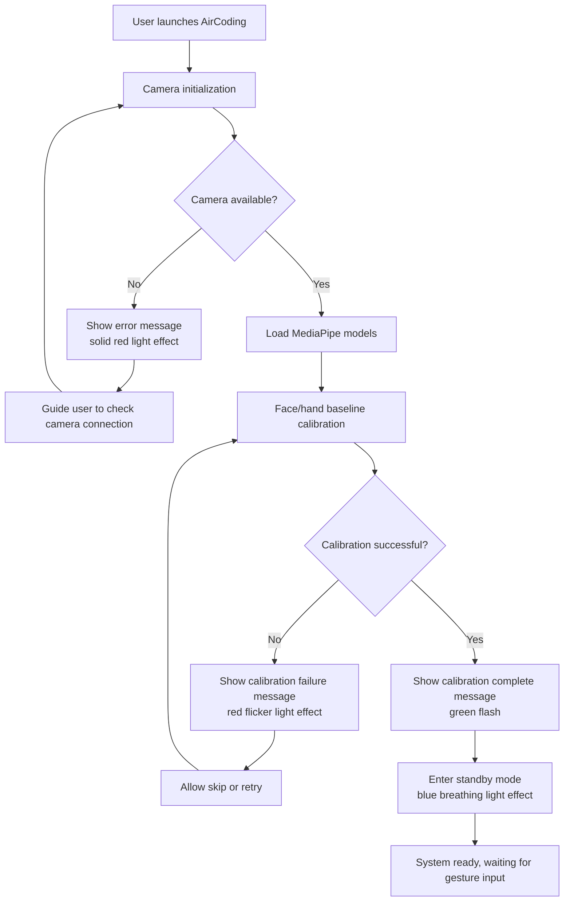
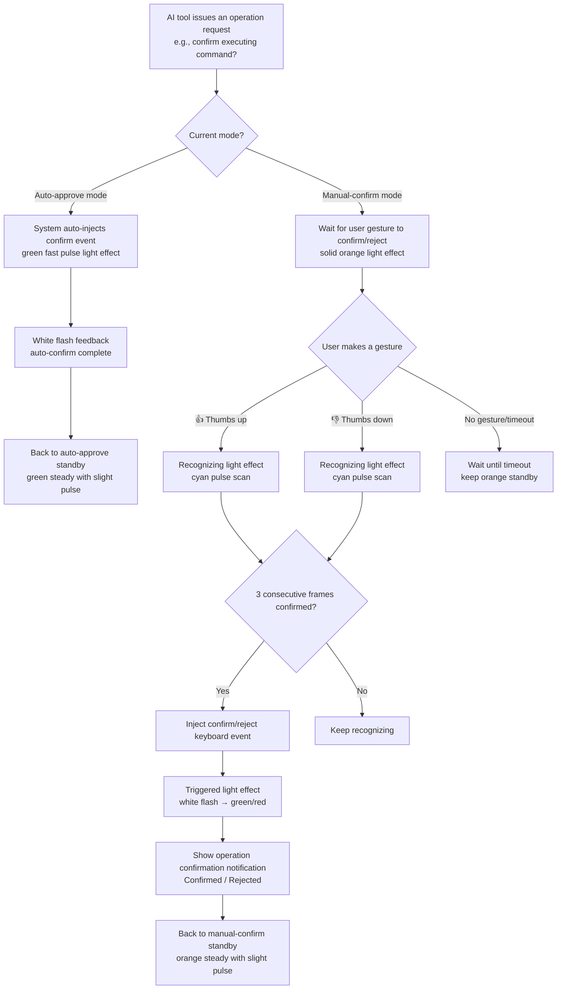
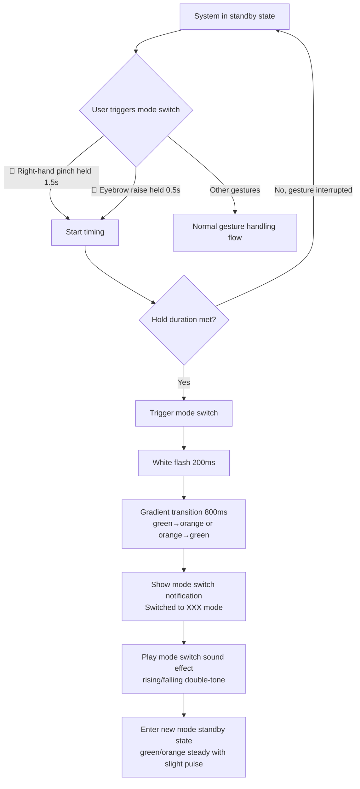
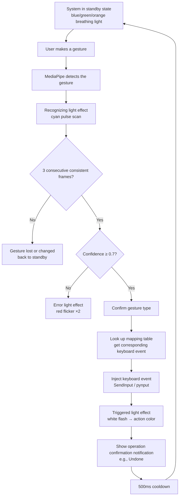
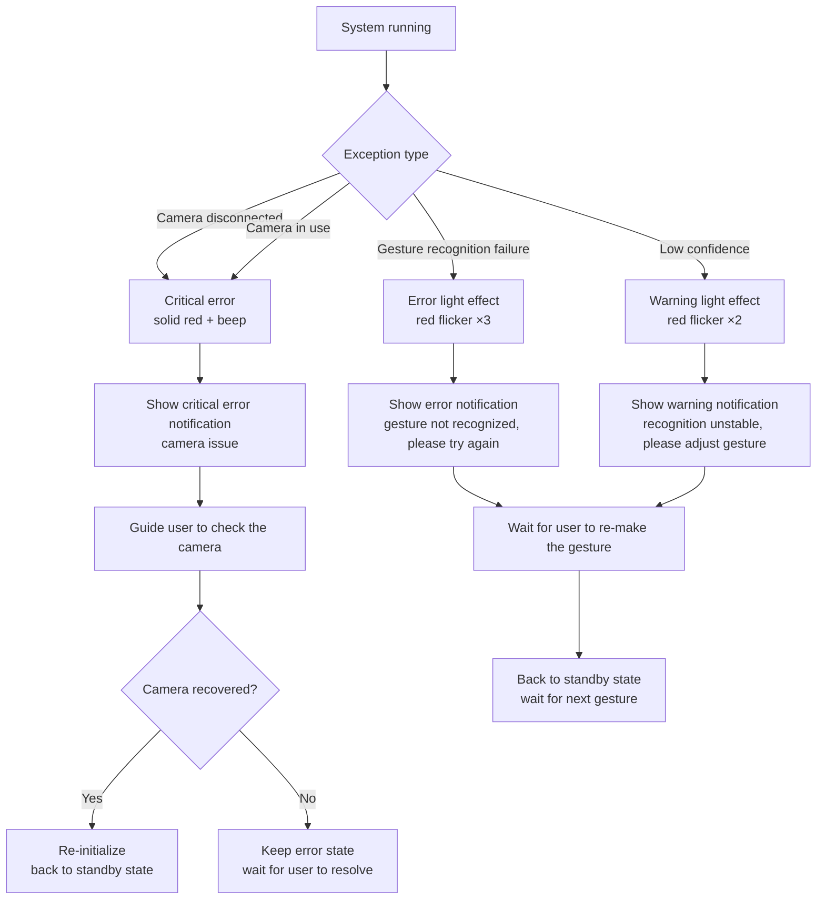

# AirCoding Product Requirements Document

> **Version**: v3.1 | **Date**: 2025-07-27 | **Status**: Condensed edition (focused on Vibe Coding + voice input core)
>
> **Core positioning**: AirCoding's **core feature** activates voice input in the currently active AI software via the "phone-call" gesture (thumb near ear, pinky near mouth), letting users start talking to AI hands-free with a single gesture. It additionally provides AI interaction controls such as confirm/reject/mode switching, complemented by on-screen light effects and visual feedback. Full text input is still done with the physical keyboard.
>
> **Launch compatibility**: WorkBuddy, Doubao

---

## Table of Contents

- [1. Project Information](#1-project-information)
- [2. Product Definition](#2-product-definition)
- [3. Requirements Breakdown](#3-requirements-breakdown)
- [4. Gesture and Expression Mapping Design](#4-gesture-and-expression-mapping-design-core-deliverable)
- [5. Light Effect and Notification Design](#5-light-effect-and-notification-design-key-chapter)
- [6. Interaction Flow Definition](#6-interaction-flow-definition)
- [7. Functional Boundaries](#7-functional-boundaries)
- [8. Non-Functional Requirements](#8-non-functional-requirements)
- [9. Open Questions](#9-open-questions)

---

## 1. Project Information

| Item | Content |
|------|------|
| **Language** | Chinese (Simplified) |
| **Programming Language** | Python (MediaPipe + PySide6 + pynput) |
| **Project Name** | `aircoding` |
| **Platform** | Windows 10 (1903+) / Windows 11 |
| **Reference Product** | OpenAI AhaKey-X1 (hardware keyboard for AI interaction) |
| **Original Requirement Restated** | Inspired by OpenAI's vibe coding AI keyboard (AhaKey-X1), the user wants a pure-software virtual application "AirCoding" for Windows. AirCoding is not a full keyboard replacement but an AI interaction control panel — it recognizes a small set of gestures and facial expressions via camera, triggering AI-interaction-specific functions (confirm/reject/mode switch/quick actions), complemented by on-screen light effects and visual feedback. Full text input is still done with the physical keyboard. |

### 1.1 Comparison with AhaKey-X1

| Dimension | AhaKey-X1 (Hardware) | AirCoding (Software) |
|------|-------------------|------------------|
| **Form factor** | Physical hardware (4 keys + 1 toggle + microphone) | Pure software application |
| **Input method** | Physical keys/toggle | Camera-based gesture and expression recognition |
| **Feedback** | LED light effects | On-screen virtual light effects + visual feedback |
| **Function triggering** | Key electrical signals | System-level keyboard event injection (SendInput) |
| **Core feature** | Talk key (press to talk to AI) | Phone-call gesture → activate AI voice input hotkey |
| **Other features** | Confirm/reject/auto-approve toggle/custom | Confirm/reject/auto-approve toggle/custom + extended shortcuts |
| **Voice capability** | Built-in microphone, hardware-level voice recording | No built-in speech recognition; activates the AI software's own voice input |
| **Compatibility** | Requires AI software support | Compatible with all hotkey-capable AI software (WorkBuddy, Doubao, etc.) |
| **Positioning** | Dedicated AI interaction control device | Dedicated AI interaction control panel (no extra hardware) |

---

## 2. Product Definition

### 2.1 Product Goals

1. **Hands-free voice input activation (core)**: With the "phone-call" gesture (thumb near ear, pinky near mouth), users activate the current AI software's voice input hotkey for a zero-contact, zero-hardware "talk to AI" experience — AirCoding's flagship feature, the equivalent of AhaKey-X1's talk key
2. **AI interaction control with zero hardware barrier**: No additional hardware purchase; the built-in camera alone delivers AhaKey-X1-level AI interaction control (confirm/reject/mode switch/quick actions)
3. **Immersive light effect feedback**: A carefully designed on-screen virtual light effect system provides instant, intuitive, ceremony-like status feedback, letting users "see" every interaction
4. **Vibe Coding productivity**: In AI-assisted development scenarios, reduce frequent hand movement between keyboard and mouse; use hands-free gestures for high-frequency operations like voice input, confirm/reject, and undo

### 2.2 User Stories

| # | Role | Story |
|---|------|------|
| US-1 | Vibe Coding developer | As a Vibe Coding developer, I want to activate WorkBuddy/Doubao voice input with the "phone-call" gesture, so that I don't need to memorize hotkeys or move my hand to the keyboard — raise my hand and talk to AI, staying in the coding flow |
| US-2 | Vibe Coding developer | As a Vibe Coding developer, I want to quickly confirm AI operation requests with a thumbs-up, so that I can approve without moving my hand to the keyboard |
| US-3 | AI tool user | As an AI tool user, I want to toggle auto-approve/manual-confirm mode with an eyebrow raise, so that I can batch-approve quickly when I trust the AI and switch back to one-by-one confirmation when I need to be careful |
| US-4 | Content creator | As a content creator, I want to trigger common shortcuts with gestures (e.g., Ctrl+Z undo, Ctrl+C/V copy/paste), so that I can control efficiently during demos or from a distance |
| US-5 | Product manager | As a product manager, I want to intuitively understand the system state through visual light effects (standby/recognizing/recording/triggered/error), so that I can instantly sense the system's response without staring at text |
| US-6 | Privacy-conscious user | As a privacy-conscious user, I want all camera data to be processed locally and never transmitted, so that I can use the app without worrying about privacy leaks |

---

## 3. Requirements Breakdown

### 3.1 Core Features

#### 3.1.1 Voice Input Activation (the product's soul, corresponding to AhaKey-X1's talk key)

| Feature | AhaKey Equivalent | Description | Priority |
|------|-------------|------|--------|
| **Voice input activation** | Talk key | The user makes the "phone-call" gesture (thumb near ear, pinky near mouth); the system injects the current AI software's voice input hotkey to start voice recording. Making the gesture again or lowering the hand stops recording | **P0** |

**Launch-compatible AI software and hotkey configurations**:

| AI Software | Voice Input Hotkey | Hotkey Source | Notes |
|---------|-------------|----------|------|
| **WorkBuddy** | `Ctrl+D` | WorkBuddy client → Settings → Shortcuts → Voice Input | WorkBuddy desktop voice input hotkey; user-customizable in settings |
| **Doubao** | `Alt+D` | Doubao client → Settings → Shortcuts → Voice Chat | Doubao desktop has built-in voice chat; `Alt+D` invokes voice chat |
| **Generic mode** | User-defined | Settings panel → AI tool configuration | Users can manually configure voice input hotkeys for any AI software |

**Auto-detection mechanism**:
- On startup, scans foreground processes and matches against the preset AI software list (WorkBuddy, Doubao, etc.)
- When multiple AI software run simultaneously, uses the most recently active foreground AI window
- Users can manually switch the current target AI software in the settings panel
- Supports "follow foreground window" mode: automatically uses the hotkey of the AI software corresponding to the currently focused window

#### 3.1.2 AI Interaction Controls (corresponding to AhaKey-X1's other keys)

The following features correspond to AhaKey-X1's confirm key, reject key, toggle, and custom key:

| Feature | AhaKey Equivalent | Description | Priority |
|------|-------------|------|--------|
| **Confirm operation** | Confirm key | When AI requests approval, the user makes a confirm gesture, injecting Y/Enter/confirm-button click event | P0 |
| **Reject operation** | Reject key | When AI requests approval, the user makes a reject gesture, injecting N/Escape/reject-button event | P0 |
| **Auto-approve/manual-confirm toggle** | Toggle | Toggle mode: in auto-approve mode the system auto-injects confirm events; in manual-confirm mode every operation requires a user gesture confirmation | P0 |
| **Custom quick action** | Custom key | Users can bind one gesture to a custom keyboard shortcut (e.g., Ctrl+S, Alt+Tab) | P1 |

### 3.2 Extended Features (Common Vibe Coding Shortcut Operations)

The following features cover high-frequency shortcuts in Vibe Coding and AI conversations, triggered directly by gestures without moving the hand to the physical keyboard:

| Feature | Keyboard Event | Use Case | Priority |
|------|----------|----------|--------|
| **Enter confirm** | `Enter` | Confirm dialogs, send messages, submit input | P0 |
| **Escape cancel** | `Escape` | Cancel dialogs, close popups, interrupt AI generation | P0 |
| **Ctrl+Z undo** | `Ctrl+Z` | Undo AI modifications, roll back operations | P0 |
| **Ctrl+C copy** | `Ctrl+C` | Copy selected text/code | P1 |
| **Ctrl+V paste** | `Ctrl+V` | Paste clipboard content | P1 |

### 3.3 Light Effects and Information Notifications (Core Product Differentiator)

This is the core differentiating capability that sets AirCoding apart from ordinary gesture recognition tools; see [Chapter 5](#5-light-effect-and-notification-design-key-chapter) for details.

| Feature | Description | Priority |
|------|------|--------|
| **Virtual light effect system** | Replaces AhaKey-X1's LED light effects with on-screen breathing, pulsing, flashing, and error flicker effects | P0 |
| **Status indicators** | Visual indicators for standby, recognizing, triggered, error, and mode states | P0 |
| **Gesture recognition visualization** | Real-time display of the currently recognized gesture icon and name | P0 |
| **Current mode display** | Prominently shows whether auto-approve mode or manual-confirm mode is active | P0 |
| **Operation confirmation notification** | Shows the operation name after a gesture triggers successfully (e.g., "Undone", "Copied") | P1 |
| **Confidence display** | Shows the confidence percentage of the current gesture recognition | P2 |
| **Privacy preview visualization** | Shows no real video; uses a face schematic avatar + hand skeleton diagram instead, helping users adjust position | P0 |

### 3.4 Usage Scenarios

| Scenario | Description | Core Operations |
|------|------|----------|
| **Vibe Coding** | Developers give instructions to AIs like Claude/Cursor/Copilot; after the AI generates code it frequently requests approval (execute commands, modify files). Users quickly confirm/reject with gestures and activate voice input with the phone-call gesture | Voice input, confirm, reject, mode switch, Ctrl+Z |
| **AI conversation interaction** | When chatting with AIs like ChatGPT/DeepSeek/WorkBuddy/Doubao, use gestures to trigger voice input, Enter to send, and Escape to interrupt | Voice input, Enter, Escape |
| **Remote review** | Review AI operations from the couch/while walking, without returning to the computer | Voice input, confirm, reject, mode switch |

### 3.5 Feature Module List (By Priority)

| Priority | Module | Description |
|--------|------|------|
| **P0** | Camera management and frame capture | Camera initialization, resolution configuration (720p+), frame loop (10fps to reduce load) |
| **P0** | Gesture recognition engine | MediaPipe Hands integration, 21-point landmark parsing, gesture classifier (fist/open palm/thumbs up/pinch/scissor/phone-call hand shape); single-hand recognition priority mode (only recognizes the first detected hand) |
| **P0** | Facial expression recognition engine | MediaPipe Face Mesh integration, 468-point landmark parsing, eyebrow raise detection, ear/mouth localization (for hand-face position determination of the phone-call gesture) |
| **P0** | **Voice input activation module** | Phone-call gesture detection (hand shape + hand-face relative position), hotkey injection, recording state management |
| **P0** | **AI software detection and hotkey configuration** | Foreground process scan, AI software matching (WorkBuddy/Doubao), hotkey config management, target software switching |
| **P0** | Gesture-keyboard mapping engine | Gesture/expression-to-keyboard-event mapping configuration, false-trigger prevention logic (3 consecutive frames confirmation @10fps ≈ 300ms) |
| **P0** | Keyboard event injection | Windows SendInput wrapper, single-key and combo key injection (pynput/ctypes) |
| **P0** | Virtual light effect system | On-screen light effect rendering engine, state-effect mapping, animation system (breathing/pulse/flash/flicker/wave pulse) |
| **P0** | **Privacy preview visualization** | Shows no real video; uses a face schematic avatar + hand skeleton diagram instead, displaying detected face position and gesture posture |
| **P0** | **Gesture threshold self-calibration** | Recognition threshold parameters fine-tunable; supports self-calibration mode (captures user baseline data to auto-set thresholds) |
| **P0** | **Onboarding flow** | On first use, guides the user through each gesture one by one, with real-time feedback and pass/fail determination |
| **P0** | **Lighting robustness handling** | Image pre-processing for day/night/backlight scenarios (histogram equalization, adaptive exposure compensation) |
| **P0** | Floating control panel | Screen overlay UI, virtual light effect area, status indicators, gesture visualization (emoji + name), mode indicator, recording status indicator |
| **P0** | State machine management | Standby/recognizing/recording/triggered/error state transitions, mode state (auto/manual) management |
| **P0** | Auto-approval mode | In auto-approve mode, detects AI requests via UI monitoring and auto-injects confirm events |
| **P1** | Custom quick action configuration | Users can bind one gesture to a custom keyboard shortcut |
| **P1** | Operation confirmation notification | Floating notification showing the operation name after a gesture triggers |
| **P1** | Settings panel | Sensitivity adjustment, confirmation delay configuration, light effect toggle, panel position/opacity configuration, AI software hotkey configuration |
| **P1** | Calibration flow | First-use gesture baseline capture and lighting adaptation |
| **P2** | Confidence display | Display of gesture recognition confidence percentage |
| **P0** | Privacy preview visualization | Face schematic avatar + hand skeleton diagram (not real video) |
| **P2** | Light effect themes | Multiple light effect themes/color scheme options |
| **P2** | Gesture statistics | Usage frequency statistics, recognition accuracy analysis |

---

## 4. Gesture and Expression Mapping Design (Core Deliverable)

### 4.1 Design Principles

| Principle | Description |
|------|------|
| **Phone-call gesture = voice input (core)** | The "phone-call" gesture (thumb near ear + pinky near mouth) is AirCoding's signature gesture, mapped to activating the current AI software's voice input hotkey |
| **Gestures trigger actions** | Gestures trigger instantaneous actions (e.g., confirm, undo, voice input); trigger upon being made |
| **Expressions switch modes** | Facial expressions handle mode switching and modifiers (e.g., auto/manual toggle); require hold duration to prevent false triggers |
| **Intuitive and memorable** | Each gesture has an intuitive association with its function (e.g., phone call = speak, thumbs up = confirm, thumbs down = reject, fist = Enter "seal the deal") |
| **Left/right hand division** | The right hand handles primary operations (voice input + AI interaction + navigation + editing); the left hand handles auxiliary operations (copy/paste/custom) |
| **False-trigger prevention** | Gestures must be consistent for 3 consecutive frames (~300ms @10fps) to trigger; the phone-call gesture must be held 0.5s; expressions held 0.5s |
| **Single-hand recognition priority** | By default only recognizes the first detected hand (single-hand mode), avoiding interference from simultaneous two-hand recognition; optional two-hand mode |
| **Single-hand usable** | All P0 core features are usable with one hand; left-hand features are enhancements |

### 4.2 Mapping Architecture Overview

```
┌─────────────────────────────────────────────────────────────┐
│               Expression Layer (Mode Switch)                │
│      Eyebrow raise held 0.5s → toggle auto/manual mode      │
└──────────────────────────┬──────────────────────────────────┘
                           │
┌──────────────────────────▼──────────────────────────────────┐
│       Single-Hand Gesture Layer — Core (Voice Input)        │
│      🤙 Phone call (thumb near ear + pinky near mouth)      │
│              → activate AI voice input hotkey               │
└──────────────────────────┬──────────────────────────────────┘
                           │
┌──────────────────────────▼──────────────────────────────────┐
│              Gesture Layer — Actions (Primary)              │
│     👍Confirm   👎Reject   ✊Enter   ✋Escape   ✌️Undo      │
│                       🤏 Mode switch                        │
└──────────────────────────┬──────────────────────────────────┘
                           │
┌──────────────────────────▼──────────────────────────────────┐
│         Left-Hand Gesture Layer (Auxiliary Actions)         │
│       ✊ Copy(Ctrl+C)   ✋ Paste(Ctrl+V)   ✌️ Custom        │
└──────────────────────────┬──────────────────────────────────┘
                           │
┌──────────────────────────▼──────────────────────────────────┐
│         Keyboard Event Injection (SendInput/pynput)         │
│    Voice input hotkey / single key / combo key → Windows    │
│            system-level keyboard event injection            │
└─────────────────────────────────────────────────────────────┘
```

### 4.3 Complete Gesture/Expression Mapping Table

#### 4.3.0 Voice Input Activation Gesture (Product Core — corresponding to AhaKey-X1's talk key)

| # | Feature | Gesture | Detailed Description | Keyboard Event | Recognition Key Points (landmark features) | False-trigger Prevention | Priority |
|---|------|------|-------------|----------|------------------------|--------|--------|
| 0 | **Voice input activation** | 🤙 Phone call | Either hand makes the "phone-call" gesture: thumb near the ear, pinky near the mouth. Thumb and pinky extended, other three fingers curled. The hand must be near the face (thumb tip near the ear landmark, pinky tip near the mouth landmark) | Current AI software's voice input hotkey (WorkBuddy: configurable / Doubao: `Alt+D`) | **Hand**: thumb(4) and pinky(20) extended, index(8)/middle(12)/ring(16) curled; **Face positioning**: distance between thumb tip(4) and ear landmark (234 left ear / 454 right ear) < threshold, and distance between pinky tip(20) and mouth landmark (13/14) < threshold; **Hand-face distance**: distance between palm center(0) and nose tip(1) within a reasonable range | Hold 0.5s | **P0** |

> **Recognition algorithm details**:
> 1. **Track hand and face simultaneously**: MediaPipe Hands + Face Mesh run in parallel
> 2. **Hand shape check**: thumb and pinky extended (fingertip-to-palm distance > threshold), index/middle/ring curled
> 3. **Hand-face relative position check**:
>    - Normalized distance between thumb tip (landmark 4) and ear landmark (left ear 234 / right ear 454) < 0.10
>    - Normalized distance between pinky tip (landmark 20) and mouth landmark (upper lip 13 / lower lip 14) < 0.10
>    - Distance between palm center (landmark 0) and face center within 0.15~0.40 (ensures the hand is beside the face rather than elsewhere)
> 4. **Left/right hand compatible**: thumb near the left ear for the left hand, right ear for the right hand; when both hands make the gesture simultaneously, confidence is boosted
> 5. **Sustained confirmation**: triggers after the gesture is held for 0.5 seconds, avoiding false triggers while raising the hand to the face
>
> **Why the "phone-call" gesture**:
> - A globally recognized "call/talk" gesture, intuitively tied to voice input
> - Requires the hand to reach a specific position near the face, naturally preventing false triggers (unlikely to occur accidentally during daily use)
> - The gesture naturally brings the hand to the mouth, visually forming the body language of "talking to AI"
> - Corresponds to AhaKey-X1's "talk key" — press to talk; AirCoding replaces the physical key with the "phone-call" gesture

#### 4.3.1 Right-Hand Gestures — AI Interaction Core (corresponding to AhaKey-X1's keys)

| # | Feature | Gesture | Detailed Description | Keyboard Event | Recognition Key Points (landmark features) | False-trigger Prevention | Priority |
|---|------|------|-------------|----------|------------------------|--------|--------|
| 1 | **Confirm operation** | 👍 Thumbs up | Right fist with the thumb pointing straight up | `Y` or `Enter` (configurable) | Thumb tip (landmark 4) above the thumb MCP joint (landmark 2); thumb direction vector y-component negative (pointing up); other four fingers curled (fingertip-to-palm distance < threshold) | 3 consecutive frames | P0 |
| 2 | **Reject operation** | 👎 Thumbs down | Right fist with the thumb pointing down | `N` or `Escape` (configurable) | Thumb tip (landmark 4) below the thumb MCP joint (landmark 2); thumb direction vector y-component positive (pointing down); other four fingers curled | 3 consecutive frames | P0 |
| 3 | **Auto-approve/manual-confirm toggle** | 🤏 Pinch + hold | Right thumb tip and index fingertip pinched together, held for 1.5 seconds | Toggle mode state | Distance between thumb tip (landmark 4) and index tip (landmark 8) < 0.05 (normalized coordinates); middle/ring/pinky naturally curled or extended | Hold 1.5s | P0 |

> **Note**: AhaKey-X1 uses a physical toggle to switch modes (push up = auto-approve, push down = manual confirm). AirCoding uses the "pinch + hold" gesture to toggle, with light effect color changes (green ↔ orange) clearly indicating the current mode. The 1.5s pinch hold both prevents false triggers and simulates the ceremony of "flicking a toggle".

#### 4.3.2 Right-Hand Gestures — Quick Actions

| # | Feature | Gesture | Detailed Description | Keyboard Event | Recognition Key Points (landmark features) | False-trigger Prevention | Priority |
|---|------|------|-------------|----------|------------------------|--------|--------|
| 4 | **Enter** | ✊ Fist | All five fingers curled into a fist | `Enter` | Distances from the five fingertips (landmark 8,12,16,20) to palm center (landmark 0) all < threshold; no finger extended | 3 consecutive frames | P0 |
| 5 | **Escape** | ✋ Open palm | All five fingers extended and spread, palm facing the camera | `Escape` | All five fingers extended (fingertip-to-palm distance > threshold); palm facing the camera (normal vector z-component negative) | 3 consecutive frames | P0 |
| 6 | **Ctrl+Z undo** | ✌️ Scissor | Index and middle fingers extended and spread in a V shape, other fingers curled | `Ctrl` + `Z` | Index(8) and middle(12) extended, ring(16) and pinky(20) curled; angle between index and middle > 15° | 3 consecutive frames | P0 |

> **Removed gestures**: Ctrl+Y redo, arrow keys (↑↓←→), Tab switching — focused on core Vibe Coding scenarios to reduce gesture learning cost. Users can bind any shortcut via the "custom quick action" gesture slot.

#### 4.3.3 Left-Hand Gestures — Auxiliary Operations (active in two-hand mode)

| # | Feature | Gesture | Detailed Description | Keyboard Event | Recognition Key Points (landmark features) | False-trigger Prevention | Priority |
|---|------|------|-------------|----------|------------------------|--------|--------|
| 13 | **Ctrl+C copy** | ✊ Left fist | Left hand all five fingers curled into a fist ("grab" action) | `Ctrl` + `C` | Left hand detected; distances from the five fingertips to palm center all < threshold | 3 consecutive frames | P1 |
| 14 | **Ctrl+V paste** | ✋ Left open palm | Left hand five fingers extended and spread, palm facing the camera ("release" action) | `Ctrl` + `V` | Left hand detected; all five fingers extended; palm facing the camera | 3 consecutive frames | P1 |
| 15 | **Custom quick action** | ✌️ Left scissor | Left index and middle fingers extended in a V shape | User-defined | Left hand detected; index(8)/middle(12) extended, others curled | 3 consecutive frames | P1 |

> **Left/right hand detection**: MediaPipe Hands supports the `multi_handedness` attribute to distinguish left/right hands. The system tracks both hands by default; right-hand gestures take priority over left-hand gestures (when both hands make gestures simultaneously, the right hand wins).

#### 4.3.4 Facial Expressions — Mode Switching

| # | Feature | Expression | Detailed Description | Effect | Recognition Key Points (landmark features) | False-trigger Prevention | Priority |
|---|------|------|-------------|------|------------------------|--------|--------|
| 16 | **Auto-approve ↔ manual-confirm toggle** | 🤨 Eyebrow raise | Both eyebrows raised simultaneously, held for 0.5 seconds | Toggle mode | Vertical displacement of the inner eyebrows (landmark 55,285) and outer eyebrows (landmark 105,334) above the baseline ≥ threshold; sustained ≥ 0.5s | Hold 0.5s | P0 |

> **Eyebrow raise detection algorithm**: capture the baseline eyebrow position at startup → compute the real-time vertical displacement of eyebrow landmarks from the baseline → when the displacement exceeds the threshold and persists for 0.5 seconds → trigger mode switch. The baseline auto-updates every 5 minutes to adapt to natural head movement.

### 4.4 Mapping Quick Reference Card

For easy memorization, the following quick reference card is provided (can be embedded in the settings panel or printed and posted next to the screen):

```
┌────────────────────────┬──────────────────────────────────────┐
│                  AirCoding · Gesture Card                     │
├────────────────────────┼──────────────────────────────────────┤
│ ★ Core gesture         │ Left-hand gestures (auxiliary)       │
│ (voice input)          │                                      │
│ 🤙 Phone call → Voice  │ ✊ Fist      → Ctrl+C Copy           │
│ (thumb near ear +      │ ✋ Open      → Ctrl+V Paste          │
│ pinky near mouth)      │ ✌️ Scissor   → Custom shortcut       │
├────────────────────────┼──────────────────────────────────────┤
│ Primary gestures       │ Facial expressions (mode switch)     │
│ (actions)              │ 🤨 Eyebrow raise held 0.5s           │
├────────────────────────┼──────────────────────────────────────┤
│ 👍 Thumbs up  → Confirm│ → auto/manual toggle                 │
│ 👎 Thumbs down → Reject│                                      │
│ ✊ Fist       → Enter  │                                      │
│ ✋ Open       → Escape │                                      │
│ ✌️ Scissor    → Ctrl+Z │                                      │
│ 🤏 Pinch hold → Mode   │                                      │
│ switch                 │                                      │
└────────────────────────┴──────────────────────────────────────┘
```

### 4.5 False-Trigger Prevention Mechanisms Summary

| Mechanism | Parameter | Description |
|------|------|------|
| **Inter-frame consistency** | 3 consecutive consistent frames (~300ms @10fps) | A gesture must be recognized as the same category for 3 consecutive frames to trigger, filtering transient misdetections |
| **Expression sustained confirmation** | Hold 0.5s | The eyebrow raise must persist for 0.5s to trigger a mode switch |
| **Pinch hold confirmation** | Hold 1.5s | The pinch gesture for mode switching must be held 1.5s, avoiding confusion with the pinch used for quick actions |
| **Cooldown** | 500ms after trigger | The same gesture won't re-trigger within 500ms, preventing repeated firing |
| **Confidence threshold** | ≥ 0.7 | Gestures below 0.7 confidence don't trigger and show a "Recognizing" status |
| **Phone-call gesture sustained confirmation** | Hold 0.5s | The "phone-call" gesture for voice input must be held 0.5s, ensuring the hand reaches the face and stabilizes before triggering |
| **Baseline adaptation** | Updated every 5 minutes | The facial expression baseline auto-updates every 5 minutes, adapting to natural head movement |

### 4.6 Gesture Emoji Mapping

Each gesture/expression is assigned a dedicated emoji for the UI panel display, operation confirmation notifications, and gesture labels in the privacy preview. The style stays consistent (preferring Unicode standard emojis; custom SVG icons used only where no emoji exists):

| # | Feature | Emoji | Source | Notes |
|---|------|-------|------|------|
| 0 | Voice input activation | 🤙 | Unicode standard emoji | "Phone-call" gesture, intuitively tied to voice input |
| 1 | Confirm operation | 👍 | Unicode standard emoji | Thumbs up, globally recognized "OK/confirm" |
| 2 | Reject operation | 👎 | Unicode standard emoji | Thumbs down, "no/reject" |
| 3 | Mode switch (pinch) | 🤏 | Unicode standard emoji | Pinch gesture |
| 4 | Enter | ✊ | Unicode standard emoji | Fist, "seal/commit" |
| 5 | Escape | ✋ | Unicode standard emoji | Open palm, "stop/cancel" |
| 6 | Ctrl+Z undo | ✌️ | Unicode standard emoji | Scissor (V shape), tied to "Victory/rollback" |
| 7 | Ctrl+C copy | ✊ | Unicode standard emoji (left hand) | Left fist, "grab/extract" |
| 8 | Ctrl+V paste | ✋ | Unicode standard emoji (left hand) | Left open palm, "release/drop" |
| 9 | Custom shortcut | ✌️ | Unicode standard emoji (left hand) | Left scissor |
| 10 | Mode switch (eyebrow) | 🤨 | Unicode standard emoji | "Raised eyebrow" expression, intuitively tied to "switch/doubt" |

> **Custom icons**: all current gestures have corresponding Unicode standard emojis, so no new custom icons are needed for now. If future gestures lack an emoji, consistent custom SVG icons will be used (line style, rounded endpoints, sized to match system emoji).

### 4.7 Gesture Threshold Self-Calibration and Onboarding

#### 4.7.1 Fine-Tunable Threshold Parameters

| Parameter | Default | Adjustable Range | Description |
|------|--------|----------|------|
| Finger extended threshold | 0.5 | 0.3~0.8 | Fingertip-to-palm normalized distance above this value = extended |
| Finger curled threshold | 0.3 | 0.2~0.5 | Fingertip-to-palm normalized distance below this value = curled |
| Thumb direction threshold | 0.15 | 0.10~0.25 | Thumb direction vector y-component absolute value above this = up/down |
| Phone-call hand-face distance threshold | 0.10 | 0.06~0.15 | Normalized distance threshold for thumb-ear and pinky-mouth |
| Eyebrow raise displacement threshold | Dynamic | Adaptive | Baseline captured at startup; triggers when displacement exceeds baseline + stddev × 1.5 |
| Confidence threshold | 0.7 | 0.5~0.9 | MediaPipe gesture classification confidence below this doesn't trigger |

#### 4.7.2 Self-Calibration Mode

Users can start the self-calibration flow from the settings panel:
1. The system guides the user through each gesture in turn (hold each for 3 seconds)
2. Collects multiple frames of data and computes the mean and standard deviation of each landmark distance/angle
3. Automatically sets the recognition threshold for each gesture (mean ± 2 × standard deviation)
4. Saves to a user-specific profile, overriding the default thresholds

#### 4.7.3 Onboarding Flow

Onboarding starts automatically on first launch:
1. **Welcome page**: introduces the AirCoding concept and core gesture (phone call → voice input)
2. **Learn one by one**: guides the user through each gesture in priority order
   - The screen shows the gesture emoji + action description + real-time hand skeleton in the privacy preview
   - Real-time feedback after the user makes a gesture (green ✓ passed / red ✗ not recognized)
   - A gesture "passes" after 3 consecutive correct recognitions
3. **Completion summary**: shows the learned gesture list and quick reference card; can be re-entered anytime from settings

---

## 5. Light Effect and Notification Design (Key Chapter)

> This chapter covers AirCoding's core differentiator from ordinary gesture recognition tools. AhaKey-X1's LED light effects are its signature experience; AirCoding aims to deliver an equal or richer light effect feedback on screen.

### 5.1 Virtual Light Effect Design

#### 5.1.1 Light Effect State Machine

The system has **7 core light effect states**, each with a specific color, animation, and duration:

| State | Trigger Condition | Color | Hex | Animation Effect | Duration |
|------|----------|------|------|----------|----------|
| **Standby (STANDBY)** | System ready, no gesture input | Soft blue | `#4A90D9` | Breathing: brightness slowly transitions 20%→60%→20%, 3-second cycle | Continuous, until a gesture is detected |
| **Recognizing (RECOGNIZING)** | Gesture detected but not yet confirmed (3-frame confirmation in progress) | Cyan | `#00E5FF` | Pulse scan: the light band quickly scans outward from the center, 0.8-second cycle | Continuous, until the gesture is confirmed or times out |
| **Voice recording (RECORDING)** | Phone-call gesture triggered, AI voice input activated | Magenta | `#FF2D55` | Wave pulse: sound-wave-like pulsing, the light band pulses to the rhythm, 0.6-second cycle | Continuous, until the hand is moved away or the gesture is repeated to stop |
| **Triggered (TRIGGERED)** | Gesture confirmed, keyboard event injected | White flash → action color | `#FFFFFF` → action color | Flash burst: 200ms full-white highlight, then gradient to the action color and fade out | 600ms |
| **Error (ERROR)** | Recognition failure, low confidence, repeated false triggers | Red | `#FF3B30` | Fast flicker: 3 quick red flashes, 200ms apart | 1.2s |
| **Auto-approve mode (AUTO)** | Standby state while in auto-approve mode | Green | `#34C759` | Steady with slight pulse: 60% brightness with slight pulsing (5% amplitude), 4-second cycle | Continuous |
| **Manual-confirm mode (MANUAL)** | Standby state while in manual-confirm mode | Orange | `#FF9500` | Steady with slight pulse: 60% brightness with slight pulsing (5% amplitude), 4-second cycle | Continuous |

#### 5.1.2 Action Trigger Colors (the subsequent color of the Triggered state)

After different actions trigger, the flash fades out into the corresponding action color, providing additional semantic feedback:

| Action Type | Action Color | Hex | Semantics |
|----------|--------|------|------|
| **Voice input activation** | Magenta | `#FF2D55` | Recording/speaking |
| Confirm operation | Green | `#34C759` | Approved/allowed |
| Reject operation | Red | `#FF3B30` | Rejected/denied |
| Enter | Cyan | `#00E5FF` | Confirm/submit |
| Escape | Orange | `#FF9500` | Cancel/exit |
| Ctrl+Z undo | Purple | `#AF52DE` | Rollback |
| Ctrl+C copy | Yellow | `#FFCC00` | Extract |
| Ctrl+V paste | Yellow-green | `#30D158` | Place |
| Mode switch | Gradient (orange ↔ green) | — | State transition |
| Custom | Gray-white | `#E5E5EA` | Generic |

#### 5.1.3 Mode Switch Light Effect Transition

The light effect transition animation during mode switching (ceremony-oriented design):

```
Current mode standby light effect (green/orange steady with slight pulse)
        ↓ mode switch gesture detected (pinch held 1.5s / eyebrow raised 0.5s)
    Full white flash (200ms)
        ↓
    Gradient transition (800ms): old color → new color
    Green  ──→ Orange (switch to manual confirm)
    Orange ──→ Green (switch to auto-approve)
        ↓
    New mode standby light effect (orange/green steady with slight pulse)
```

#### 5.1.4 Auto-Approval Mode Light Effects

In auto-approve mode, when the system auto-injects confirm events, the light effects behave specially:

| Sub-state | Light Effect | Description |
|--------|------|------|
| Waiting for AI request | Green steady with slight pulse | The system is in auto-approve mode, ready to auto-confirm at any time |
| AI request detected | Green fast pulse (0.4s period) | The system detected an AI request and is about to auto-confirm |
| Auto-confirm injection | Green flash → white flash | Flash feedback while auto-injecting the confirm event |
| Auto-confirm complete | Back to green steady with slight pulse | Resumes standby after completion |

### 5.2 On-Screen UI Design

#### 5.2.1 Floating Control Panel Layout

The floating control panel is AirCoding's main interface, designed with inspiration from AhaKey-X1's physical form, mapped onto virtual controls:

```
┌─────────────────────────────────────────────────────────────┐
│  ◉ Virtual light effect ring         [—] Minimize  [×] Close│
│  ┌───────────────────────────────────────────────────────┐  │
│  │          🤙  ← current gesture icon (large)           │  │
│  │        "Phone call · Voice input [WorkBuddy]"         │  │
│  │                                                       │  │
│  │            Confidence: ████████████░░░ 85%            │  │
│  └───────────────────────────────────────────────────────┘  │
│                                                             │
│  ┌─────────────┐   ┌─────────────────────────────────────┐  │
│  │  Mode state │   │  🟢 Auto-approve / 🟠 Manual confirm│  │
│  └─────────────┘   └─────────────────────────────────────┘  │
│                                                             │
│  ┌─────────────────────────────────────────────────────┐    │
│  │  ★ 🤙 Voice input  [WorkBuddy ▼]  🎙️ Recording     │    │
│  └─────────────────────────────────────────────────────┘    │
│                                                             │
│ [👍Confirm] [👎Reject] [✊Enter] [✋Esc] [✌️Undo] [⚙️Custom]│
│ [⚙️Settings]                                                │
│                                                             │
│  🔒 Privacy preview (face avatar + hand skeleton,           │
│     not real video)                                         │
└─────────────────────────────────────────────────────────────┘
```

> **Voice input area**: The middle of the panel has a dedicated voice input area, prominently showing the current target AI software (WorkBuddy/Doubao, switchable via dropdown) and a recording status indicator (🎙️ Recording / ⏹️ Standby). This area shows a magenta wave animation background while recording.
>
> **Privacy preview area**: The bottom of the panel shows a privacy-safe preview — **no real camera video**; instead a schematic visualization:
> - **When a face is detected**: shows a simplified face schematic avatar at the corresponding position (dots for eyes, lines for eyebrows and mouth), with position and size following the real face
> - **When a hand is detected**: shows a hand skeleton diagram at the corresponding position (21 landmark connections), labeled with the recognized gesture emoji and name
> - **When nothing is detected**: shows "Please move your hand/face into the camera range"
> - This approach provides real-time feedback to help users adjust position while completely avoiding privacy leaks from real video and the need for image optimization

#### 5.2.2 Panel Component Description

| Component | Description | Priority |
|------|------|--------|
| **Virtual light effect ring** | Ring/strip light effect area at the top of the panel; shows effects based on system state (breathing/pulse/flash/flicker/steady) | P0 |
| **Current gesture icon** | Large icon showing the currently recognized gesture (e.g., ✊ ✋ 👍), with the gesture name and function below | P0 |
| **Confidence progress bar** | Horizontal progress bar showing recognition confidence percentage; shows an orange warning below 70% | P2 |
| **Mode status indicator** | Prominent mode label: 🟢 Auto-approve mode (green background) / 🟠 Manual-confirm mode (orange background) | P0 |
| **Function button area** | Virtual button grid; each button shows the corresponding gesture icon and function name; buttons highlight/flash when their gesture triggers | P0 |
| **Privacy preview visualization** | No real camera feed; uses a face schematic avatar (dot eyes + line brows/mouth) and hand skeleton diagram (21-point landmark connections), positions following actual detection, helping users adjust gesture position | P0 |
| **Settings entry** | Gear icon opens the settings panel | P1 |

#### 5.2.3 Panel Behavior

| Behavior | Description |
|------|------|
| **Default position** | Bottom-right corner of the screen, 20px from the edges |
| **Draggable** | Users can drag the panel anywhere; position is remembered |
| **Resizable** | Three sizes supported: small/medium/large |
| **Opacity** | 85% opaque by default, adjustable (50%-100%), returns to 100% on hover |
| **Auto-hide** | Optional: after 5 minutes of inactivity, fades to a small icon; expands on hover or when a gesture is detected |
| **Always on top** | Always displayed above other windows |
| **Multi-monitor** | Can choose which monitor to display on |

### 5.3 Information Notification Design

#### 5.3.1 Operation Confirmation Notifications

After a gesture triggers successfully, a floating notification card appears slightly below the center of the screen and fades out after 500ms:

| Triggered Action | Notification Content | Icon |
|----------|----------|------|
| **Voice input activation** | 🎙️ Voice input activated [WorkBuddy/Doubao] | 🎙️ |
| **Voice input stopped** | Voice input stopped | ⏹️ |
| Confirm operation | Confirmed | ✅ |
| Reject operation | Rejected | ❌ |
| Enter | Enter | ↵ |
| Escape | Cancelled | ✕ |
| Ctrl+Z | Undone | ↶ |
| Ctrl+C | Copied | 📋 |
| Ctrl+V | Pasted | 📋 |
| Mode switch → auto-approve | Switched to auto-approve mode | 🟢 |
| Mode switch → manual-confirm | Switched to manual-confirm mode | 🟠 |
| Custom | [Custom action name] | ⚙️ |

#### 5.3.2 Error Notifications

| Error Type | Notification Content | Light Effect | Sound |
|----------|----------|------|------|
| Gesture recognition failure | Gesture not recognized, please try again | Red flicker ×3 | Low "beep" |
| Low confidence | Recognition unstable, please adjust the gesture | Red flicker ×2 | — |
| Camera not detected | No camera detected, please check the connection | Solid red | Error beep |
| Camera in use | Camera is being used by another application | Solid red | Error beep |
| Calibration failure | Calibration failed, please try again | Red flicker ×3 | Low "beep" |

#### 5.3.3 Mode Switch Notifications

| Event | Notification Content | Light Effect | Sound |
|------|----------|------|------|
| Switch to auto-approve | Switched to auto-approve mode — AI requests will be auto-confirmed | White flash → green gradient | Rising double-tone |
| Switch to manual-confirm | Switched to manual-confirm mode — every operation requires manual confirmation | White flash → orange gradient | Falling double-tone |

#### 5.3.4 System Status Notifications

| Event | Notification Content | Light Effect |
|------|----------|------|
| Startup success | AirCoding ready | Blue breathing light on |
| Camera initializing | Initializing camera... | Blue slow blink |
| Calibrating | Please sit naturally; collecting baseline... | Blue pulse |
| Calibration complete | Calibration complete, ready to use | Green flash ×1 |
| Paused | AirCoding paused | Light effects off |
| Resumed | AirCoding resumed | Blue breathing light on |

---

## 6. Interaction Flow Definition

### 6.1 Startup Flow



### 6.2 Voice Input Activation Flow (Core Product Flow)

```mermaid
flowchart TD
    A[System in standby state<br/>blue/green/orange breathing light] --> B[User makes phone-call gesture<br/>thumb near ear + pinky near mouth]
    B --> C[MediaPipe detects hand and face simultaneously]
    C --> D{Hand shape check passed?}
    D -->|No| E[Back to standby state]
    D -->|Yes| F{Hand-face position check passed?<br/>thumb near ear + pinky near mouth}
    F -->|No| E
    F -->|Yes| G[Recognizing light effect<br/>cyan pulse scan]
    G --> H{Held for 0.5 seconds?}
    H -->|No, gesture interrupted| E
    H -->|Yes| I[Detect current target AI software<br/>WorkBuddy/Doubao/custom]
    I --> J[Inject corresponding voice input hotkey<br/>WorkBuddy: configurable / Doubao: Alt+D]
    J --> K[Triggered light effect<br/>white flash → magenta]
    K --> L[Enter recording state<br/>magenta wave pulse light effect]
    L --> M[Show notification<br/>🎙️ Voice input activated]
    M --> N{User lowers hand or makes the gesture again?}
    N -->|No| L
    N -->|Yes| O[Inject hotkey again to stop recording<br/>or auto-timeout stop]
    O --> P[Stop light effect<br/>show "Voice input stopped"]
    P --> A
```

### 6.3 AI Interaction Flow



### 6.4 Mode Switch Flow



### 6.5 Quick Action Flow



### 6.6 Error Handling Flow



---

## 7. Functional Boundaries

### 7.1 In Scope

| Category | Content |
|------|------|
| **Voice input activation (core)** | Activates the current AI software's voice input hotkey via the "phone-call" gesture; launch-compatible with WorkBuddy and Doubao |
| **AI interaction control** | Confirm/reject AI operation requests, auto-approve/manual-confirm mode switching |
| **A few shortcuts** | Enter, Escape, Ctrl+Z, Ctrl+C, Ctrl+V (5 shortcuts total) |
| **Custom quick actions** | Users can bind one gesture to a custom keyboard shortcut |
| **AI software hotkey configuration** | Supports configuring voice input hotkeys for multiple AI software; auto-detects the foreground AI window |
| **Light effect feedback** | 7 core light effect states + 12 action trigger colors + mode switch transition animations + recording wave effect |
| **Privacy preview** | No real video; uses a face schematic avatar + hand skeleton diagram instead |
| **Gesture threshold self-calibration** | Recognition thresholds fine-tunable; supports auto-calibration and onboarding |
| **Lighting robustness** | Supports day/night/backlight scenarios with built-in image pre-processing |
| **Visual feedback** | Floating control panel, gesture emoji visualization, mode indicator, operation confirmation notifications, recording status indicator |
| **Information notifications** | Operation confirmation, error notifications, mode switch notifications, system status notifications, voice input status notifications |

### 7.2 Out of Scope

| Category | Content | Reason |
|------|------|------|
| **Full keyboard mapping** | No complete keyboard mapping for A-Z, 0-9, F1-F12, symbols | AirCoding is an AI interaction control panel, not a typing keyboard; full text input is done with the physical keyboard |
| **Text input** | No text/letter/number/symbol input | Same as above; full text input is done with the physical keyboard |
| **Mouse control** | No cursor movement, clicking, dragging, or other mouse operations | Focused on AI interaction control to avoid feature creep; mouse control requires a completely different interaction paradigm |
| **Speech recognition engine** | No built-in speech recognition capability | AirCoding only activates the AI software's own voice input feature (hotkey injection); speech-to-text is handled by the AI software |
| **AI agent features** | No AI code generation, AI conversation, or other AI capabilities themselves | AirCoding is a control panel, not an AI engine; it collaborates with other AI tools through keyboard events |
| **Gesture custom editor** | No user-recording/training of new gestures | Can be considered in P2; currently offers a predefined gesture set + custom keyboard mapping |

### 7.3 Performance Metrics

| Metric | Target | Description |
|------|--------|------|
| **End-to-end latency** | ≤ 400ms | Full-chain latency from the user making a gesture to keyboard event injection completion (3-frame confirmation @10fps = 300ms + 100ms processing) |
| **Recognition accuracy** | ≥ 90% | Accuracy of predefined gestures across lighting conditions (day/night/backlight) |
| **Frame rate** | 10 fps | Camera capture and MediaPipe processing frame rate (low frame rate reduces load while meeting gesture recognition needs) |
| **Gesture confirmation time** | ≤ 300ms | Time required for 3 consecutive frames of confirmation (3 frames / 10fps) |
| **CPU usage** | ≤ 10% | Single-core usage (excluding UI rendering); 10fps low frame rate significantly reduces CPU load |
| **Memory usage** | ≤ 300MB | Including MediaPipe models and UI |
| **Startup time** | ≤ 3s | From launch to standby state |

### 7.4 Environment Constraints

| Constraint | Requirement | Description |
|------|------|------|
| **Lighting conditions** | Day/night/backlight all supported | Built-in lighting robustness handling (histogram equalization, adaptive exposure compensation); works across 50~10000 lux; degrades gracefully with a warning under extreme backlight |
| **Camera** | 720p+ resolution, 10fps capture | Built-in or external USB cameras; resolution prioritized over frame rate |
| **Face distance** | 40-80cm | Recommended distance range from the face to the camera |
| **Hand distance** | 30-60cm | Recommended distance range from the hand to the camera |
| **Background** | Keep it simple | Avoid complex gesture-like patterns or frequently moving objects in the background |
| **Desk space** | Gesture activity area approximately 40cm × 30cm | Users need enough desk space to make gestures |

### 7.5 Compatibility

| Category | Compatibility Range |
|------|----------|
| **Operating system** | Windows 10 (1903+) / Windows 11 |
| **AI tools (launch)** | **WorkBuddy** (configurable voice hotkey), **Doubao** (Alt+D voice chat) |
| **AI tools (compatible)** | All AI tools that interact through keyboard events: Claude (Web/Desktop), ChatGPT (Web/Desktop), DeepSeek, Cursor, GitHub Copilot, Windsurf, etc. (user-configurable hotkeys) |
| **Standard applications** | All Windows applications that accept keyboard input (via SendInput keyboard event injection) |
| **Multi-monitor** | Multi-monitor environments supported; panel display position selectable |
| **High DPI** | Supports Windows scaling settings (100%/125%/150%/200%) |

---

## 8. Non-Functional Requirements

### 8.1 Performance

| Requirement | Metric | Acceptance Criteria |
|------|------|----------|
| End-to-end latency | ≤ 400ms | P95 latency from gesture to keyboard event injection (3-frame confirmation @10fps) |
| Recognition accuracy | ≥ 90% | Correct recognition rate over 100 trials per predefined gesture across 4 lighting scenarios (day/night/backlight) |
| Processing frame rate | 10 fps | Sustained frame rate for camera capture + MediaPipe inference (low frame rate reduces load) |
| CPU usage | ≤ 10% (single core) | Peak CPU usage during normal operation (10fps low frame rate significantly reduces CPU load) |
| Memory usage | ≤ 300MB | Including MediaPipe model loading and UI rendering |
| Startup time | ≤ 3s | From double-click launch to standby state |

### 8.2 Privacy

| Requirement | Description |
|------|------|
| **Local processing** | All camera frame capture, processing, and recognition happen locally; no video data is transmitted over the network |
| **Zero network dependency** | MediaPipe models load locally; no network connection required at runtime (except the initial model download) |
| **No data storage** | Camera frames exist only in memory and are discarded immediately after processing; no video, images, or frame data are saved |
| **No cloud services** | No cloud APIs are called for gesture/expression recognition |
| **Privacy preview** | The preview panel shows no real video; a face schematic avatar and hand skeleton diagram are used instead, avoiding image privacy leaks and extra image optimization needs |
| **Permission transparency** | At startup, clearly informs the user of the camera usage purpose; provides the ability to pause/exit the camera at any time |
| **Privacy statement** | A privacy statement is provided in the settings panel, detailing how data is handled |

### 8.3 Accessibility

| Requirement | Description |
|------|------|
| **Single-hand support** | All P0 core features (voice input/confirm/reject/Enter/Escape/Ctrl+Z/mode switch) are achievable with one hand; single-hand recognition mode by default, only recognizing the first detected hand |
| **Adjustable gesture sensitivity** | Sensitivity slider provided to accommodate different hand sizes and movement amplitudes |
| **Threshold self-calibration** | Auto-calibration mode: captures user baseline data and auto-sets gesture recognition thresholds |
| **Onboarding** | On first use, guides the user through each gesture one by one, with real-time feedback and pass/fail determination |
| **Adjustable confirmation delay** | Confirmation frames (default 3) and hold durations (default 0.5s/1.5s) are customizable |
| **Left/right hand mirroring** | Supports mirror-swapping left and right hand functions for left-handed users |
| **Disable light effects** | Allows turning off light effect animations, keeping only textual status prompts (for light-sensitive users) |
| **Audio feedback** | Key operations provide audio feedback as a supplement to visual feedback |
| **High contrast** | The UI supports high-contrast mode to ensure text readability in bright environments |

### 8.4 Reliability

| Requirement | Description |
|------|------|
| **Exception recovery** | Auto-detects camera disconnection and re-initializes automatically on recovery |
| **No crashes** | Runs continuously for 8 hours without crashes or memory leaks |
| **Graceful degradation** | Reduces the frame rate under poor lighting but keeps running, showing a warning rather than crashing |
| **Config persistence** | User settings, custom shortcuts, panel position, etc., are persisted |

---

## 9. Open Questions (Resolved)

| # | Question | Decision | Notes |
|---|------|------|------|
| Q1 | How should the specific keys for confirm/reject gestures be configured? | **Default Y/Enter + N/Escape** | Confirm injects `Y` or `Enter`; reject injects `N` or `Escape`; users can customize per AI tool in settings |
| Q2 | How to detect AI requests in auto-approve mode? | **UI monitoring** | Detects AI requests by monitoring specific UI elements (e.g., appearance of dialogs/confirm buttons), rather than timed injection, to avoid false triggers |
| Q3 | How to handle multiple simultaneous gestures? | **Single-hand recognition priority** | By default only recognizes the first detected hand (single-hand mode), avoiding interference from simultaneous two-hand recognition; optional two-hand mode |
| Q4 | Do we need to support non-standard gestures (e.g., gloved hands)? | **Not for now** | V1 doesn't support non-standard gestures; noted in the environment constraints |
| Q5 | Does the floating control panel need touch support? | **Not for now** | V1 has no touch support, focused on gesture/expression interaction channels |
| Q6 | Should both mode-switch methods be kept? | **Both kept** | Pinch held 1.5s (used when the hand is in front of the camera) + eyebrow raise held 0.5s (used when the hand isn't in front of the camera); the two are complementary |
| Q7 | Is a "talk key" feature needed? | **Implemented (core feature)** | Activates the AI software's voice input hotkey via the "phone-call" gesture; no built-in speech recognition, activates the AI software's own voice feature |
| Q8 | Is the arrow-key approach reliable? | **No arrow keys for now** | Removed arrow-key gestures, focused on core Vibe Coding scenarios |

---

> **End of Document**
>
> This PRD defines the complete product requirements for AirCoding as an AI interaction control panel (v3.1 condensed edition). Core feature: **phone-call gesture → voice input activation** (compatible with WorkBuddy/Doubao). A total of 11 gesture/expression actions (not a full keyboard), 7 light effect states, 10fps low frame rate, privacy preview (no real video), lighting robustness handling, threshold self-calibration + onboarding. Tech stack: Python + MediaPipe + PySide6 + pynput; all processing is local, zero hardware barrier.
